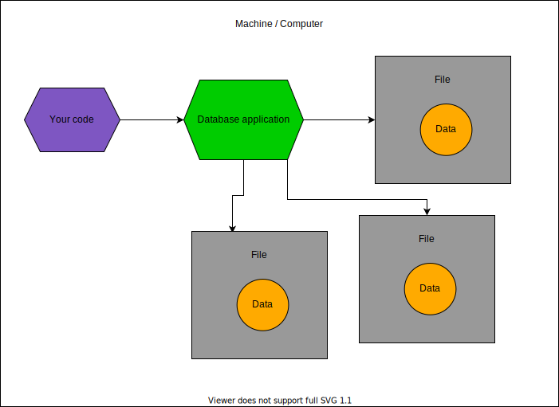

# 数据库简介

/// info

你是经验丰富的开发者，对数据库已经了如指掌吗？🤓

那么你可以直接跳到接下来的部分。

///

如果你对数据库并不是完全了解，这里有一个快速概述。

之后你随时可以自行深入学习更多内容。

但这部分内容足以帮助你开始使用数据库，并通过 **SQLModel** 提高生产力。🚀

## 什么是数据库

那么，什么是数据库？

**数据库** 是一种以结构化和高效方式存储和管理数据的系统。

/// tip

"数据库" 通常会缩写为 **"DB"**。

///

关于数据库的信息非常丰富，可能会变得非常技术性和学术化。这里我会为你快速概述一些核心概念。

我还会简单介绍不同类型的数据库，包括 **SQLModel** 未涵盖的数据库类型（如 "NoSQL" 数据库）。

## 为什么要使用数据库

刚开始编程时，可能 **不太明显** 为什么在程序代码之外另设一个数据库是个 **好主意**。我们先从这个问题说起。

/// tip

如果你已经明白这个问题，直接跳到下面的下一节吧。👇

///

在你的代码中已经有 **变量**、**字典**、**列表**等，这些都能以某种方式存储 **数据**。那为什么还需要单独的数据库呢？

如果仔细观察，你会发现代码是 **静态的**，一旦运行后，程序的状态并不会真正随着时间发生变化。当然，你会频繁更改代码以增加功能等，但一旦启动 Python 运行代码，程序就会保持启动时的状态。即便代码改了，程序也只有在 **重新运行** 后才会发生变化。

而且，即使你在程序运行中更改了变量，一旦程序结束，这些存储在 **内存** 中的数据就会 **消失**。🔥

大多数情况下，你的程序目标是处理程序 **外部** 的某些数据：

- 它可能只是将 **文件** 从一个地方移到另一个地方。
- 或者从用户的 **终端** 获取数据并以不同方式显示。
- 又或者是一个 **Web API**，获取数据并以某种方式处理。

在很多情况下，数据 **来源于程序外部** 或 **最终会流向程序外部**（例如，显示在屏幕上、写入文件等）。

在许多情况下，你需要程序能够 **创建** 并存储数据、**读取** 数据、**更新** 数据、**删除** 数据等。

你当然可以通过代码读取和写入文件来实现，这种方法在简单场景中是可行的。但对于稍微复杂一点的系统，这种策略效率并不高。你还需要应对许多 **陷阱**，如数据同步、数据安全存储等问题。

数据库专为 **解决这些问题** 而设计，使得处理数据的过程更加高效，并且与代码相对独立。✨

## 如何与数据库交互

数据库有许多类型。

### 单文件数据库

数据库可以是一个单独的文件，名为 `heroes.db`，通过代码以非常高效的方式进行管理。一个例子是 SQLite，稍后会详细介绍。


### 服务器数据库

数据库也可以是运行在服务器上的系统，作为应用程序处理多个文件，并以优化的格式存储数据。

就像 Web 服务器，但它使用自定义且高效的方式进行通信。这是最常见的数据库交互方式。

在这种情况下，您的代码将与该服务器应用程序进行通信，而不是直接读取或修改文件。

数据库可能位于不同的服务器/机器上：


或者数据库也可能位于同一服务器/机器上：



这些类型的数据库最重要的方面是，**您的代码不会直接读取或修改**包含数据的文件。

相反，您的代码与数据库应用程序通信，由该数据库应用程序实际读取和修改其数据文件。这是因为该数据库应用程序通常**比您的代码更高效**。

一些像 **PostgreSQL**、**MySQL** 或 **MongoDB** 这样的数据库就是按这种方式工作的例子。

### 分布式服务器

在某些情况下，数据库甚至可以是运行在不同机器上的一组服务器应用程序，它们协同工作并相互通信，以提高效率并处理更多数据。

在这种情况下，您的代码将与运行在不同机器上的一个或多个服务器应用程序进行通信。


大多数作为服务器应用程序的数据库也以某种方式支持多个服务器。

拥有分布式系统也会带来额外的挑战，因此您很可能首先会与单个服务器应用程序或基于单一文件的数据库交互。

## SQL 数据库

我们已经讨论了与数据库交互的不同方式以及它们如何处理文件等内容。这些内容适用于大多数或所有数据库。

但还有另一种非常重要的数据库分类方式。如你所想，数据库有许多类型，每个组别中有很多不同的数据库。但通常它们可以分为两个大类：“SQL 数据库”和“非 SQL 数据库”。

稍后我们将解释为什么会有“SQL”这个名字，但首先，我们来了解一下这是什么。

### SQLModel 用于 SQL 数据库

**SQLModel** 是一个帮助你与 **SQL 数据库** 交互的工具。

它对 **非 SQL 数据库** 的帮助不大。不过，我还是会在这里简单介绍一下它们。

## SQL 数据库的发明

很久以前，一些聪明的人意识到，存储数据的一种很好的方式是将数据放入不同的表中。

“表”在这里指的是像电子表格一样的网格结构，包含不同的列和行。

每一行代表一个特定的项或 **记录**。每一列代表该记录的一个特定属性或字段。

### 一个大表格的示例

假设我们需要存储一些关于英雄的数据。

如果我们使用一个单一的表格来存储我们的英雄，可能会像这样：

<table>
<tr>
<th>id</th><th>name</th><th>secret_name</th><th>age</th><th>team</th><th>headquarters</th>
</tr>
<tr>
<td>1</td><td>Deadpond</td><td>Dive Wilson</td><td>null</td><td>Z-Factor</td><td>Sister Margaret's Bar</td>
</tr>
<tr>
<td>2</td><td>Spider-Boy</td><td>Pedro Parqueador</td><td>null</td><td>Preventers</td><td>Sharp Tower</td>
</tr>
<tr>
<td>3</td><td>Rusty-Man</td><td>Tommy Sharp</td><td>48</td><td>Preventers</td><td>Sharp Tower</td>
</tr>
</table>

这可能是我们使用一个单一表格时的样子，例如一个单独的电子表格。

但是这样有一些问题。我们来看看其中的一些问题。

#### 单一表格的问题

假设他们决定将“Sharp Tower”更名为“Preventers Tower”。

现在，我们需要在两个地方更新这个名称。

如果我们的代码开始在一个地方更新这个名称，突然发生停电，计算机关机了呢？

我们可能会得到不一致的信息，一处显示“Preventers Tower”，另一处却显示“Sharp Tower”：

<table>
<tr>
<th>id</th><th>name</th><th>secret_name</th><th>age</th><th>team</th><th>headquarters</th>
</tr>
<tr>
<td>1</td><td>Deadpond</td><td>Dive Wilson</td><td>null</td><td>Z-Force</td><td>Sister Margaret's Bar</td>
</tr>
<tr>
<td>2</td><td>Spider-Boy</td><td>Pedro Parqueador</td><td>null</td><td>Preventers</td><td>Preventers Tower ✅</td>
</tr>
<tr>
<td>3</td><td>Rusty-Man</td><td>Tommy Sharp</td><td>48</td><td>Preventers</td><td>Sharp Tower 🚨</td>
</tr>
</table>

现在，假设我们需要添加一个新的英雄叫“Mahjong”，并且她属于“Z-Force”团队。

我们可能会忘记团队的名称，结果把“Mahjong”添加到一个无效的团队名称中，例如“Y-Force”。

<table>
<tr>
<th>id</th><th>name</th><th>secret_name</th><th>age</th><th>team</th><th>headquarters</th>
</tr>
<tr>
<td>1</td><td>Deadpond</td><td>Dive Wilson</td><td>null</td><td>Z-Force</td><td>Sister Margaret's Bar</td>
</tr>
<tr>
<td>2</td><td>Spider-Boy</td><td>Pedro Parqueador</td><td>null</td><td>Preventers</td><td>Preventers Tower</td>
</tr>
<tr>
<td>3</td><td>Rusty-Man</td><td>Tommy Sharp</td><td>48</td><td>Preventers</td><td>Sharp Tower</td>
</tr>
<tr>
<td>4</td><td>Mahjong</td><td>Neena Thurgirl</td><td>31</td><td>Y-Force 🚨</td><td>Sister Margaret's Bar</td>
</tr>
</table>

如果一个英雄属于两个团队呢？我们就没有简单的方法将这个信息放入一个大的表格中了。

### 多个表格

但这些问题和其他一些问题可以通过将数据存储在多个表格中来更好地解决。

因此，除了将所有数据存储在一个表格中外，我们还可以为英雄和团队分别创建一个表格，并且有一种方法将它们连接起来。

团队的表格可以像这样：

<table>
<tr>
<th>id</th><th>name</th><th>headquarters</th>
</tr>
<tr>
<td>1</td><td>Preventers</td><td>Sharp Tower</td>
</tr>
<tr>
<td>2</td><td>Z-Force</td><td>Sister Margaret's Bar</td>
</tr>
</table>

现在，英雄的表格几乎看起来与之前相同。但是请记住，我们之前提到过，需要一种方法将两个表格连接起来？

英雄的表格现在将有一个额外的列 `team_id`。该列显示每一行（每个英雄）与他们所属团队之间的关系。

<table>
<tr>
<th>id</th><th>name</th><th>secret_name</th><th>age</th><th>team_id ✨</th>
</tr>
<tr>
<td>1</td><td>Deadpond</td><td>Dive Wilson</td><td>null</td><td>2 ✨</td>
</tr>
<tr>
<td>2</td><td>Spider-Boy</td><td>Pedro Parqueador</td><td>null</td><td>1 ✨</td>
</tr>
<tr>
<td>3</td><td>Rusty-Man</td><td>Tommy Sharp</td><td>48</td><td>1 ✨</td>
</tr>
</table>

#### 标识 - 主键

在上面的示例中，每一行都有一个 <abbr title='abbreviated from the word "identification", in many cases written as "ID"'>`id`</abbr>。每个 ID 在表中都是唯一的，用来标识该特定行。

这些 SQL 数据库要求有一种独特的方式来标识表中的每一行。它可以是唯一的列组合，但通常它只是一个单独的列。这被称为表的 "**主键**"。

**主键** 通常是单列，通常只是数据库自动生成的整数，并且在许多情况下，列的名称就是 `id`。

这个 **主键**，在本例中就是 `id` 列，必须在每个表中是唯一的。但是两个不同的表格可以有相同的 ID。例如，上面两个表格都使用 ID `2`，一个用于“**Z-Force**”团队，另一个用于“**Spider-Boy**”英雄，但只要每个表中只有一个，就没有问题。

#### 关系 - 外键

每个表格中的行都有一个唯一的 **主键**（在我们的示例中是单列 `id`）。

例如，团队表格中的 ID `1` 代表团队 `Preventers`，而 ID `2` 代表团队 `Z-Force`。

由于这些 **主键** ID 可以唯一标识团队表格中的每一行，现在我们可以在英雄的表格中引用这些 ID。


因此，在英雄的表格中，我们使用 `team_id` 列来定义与团队外部表格的关系。英雄表格中的每个 `team_id` 列值都将与团队表格中一行的 `id` 列值相同。

在英雄表格中，我们有一个 **主键**，即 `id`。但我们还有一个额外的列 `team_id`，它引用了外部表格中的 **键**。这也有一个技术术语，`team_id` 被称为 "**外键**"。

### 关系和关系型数据库

这些表格的技术性和学术性术语是 "**关系**"。

你在谈论这些数据库时，可能会经常听到这个术语。

这个术语的意义并不是你在英语中使用的“与某事相关”的意思，尽管这些表格之间实际上是“相关”的。

技术术语 **关系** 只是指每一个表格。

正因为这个技术术语，这些 **SQL 数据库** 也被称为 **关系型数据库**（事实上，这是技术上正确的术语）。但它仍然只是指由多个表格组成的数据库。

### SQL - 语言

在发展出如何将数据存储在多个表格中的这些思想后，他们还创建了一种 **语言**，可以用来与这些数据库进行交互。

这种语言叫做 **SQL**，它的名字来自于 **Structured Query Language**（结构化查询语言）。

然而，这种语言不仅仅用于 *查询* 数据。它也用于创建记录/行、更新它们、删除它们，以及操作数据库、创建表格等。

所有这些处理多个表格的数据库都支持这种语言，这也是它们被称为 **SQL 数据库** 的原因。尽管，每个数据库在支持的 SQL 语言上有些小的变化（*方言*）。

假设存储英雄数据的表格叫做 `hero` 表格。一个查询所有数据的 SQL 查询可能如下所示：

```SQL
SELECT *
FROM hero;
```

这个 SQL 查询将返回如下表格：

<table>
<tr>
<th>id</th><th>name</th><th>secret_name</th><th>age</th><th>team_id</th>
</tr>
<tr>
<td>1</td><td>Deadpond</td><td>Dive Wilson</td><td>null</td><td>2</td>
</tr>
<tr>
<td>2</td><td>Spider-Boy</td><td>Pedro Parqueador</td><td>null</td><td>1</td>
</tr>
<tr>
<td>3</td><td>Rusty-Man</td><td>Tommy Sharp</td><td>48</td><td>1</td>
</tr>
</table>

### SQLModel for SQL

**SQLModel** 是一个库，帮助你使用常规 Python 对象编写 Python 代码，然后它将这些代码转换为发送到 **SQL 数据库** 的 **SQL** 语句。

接下来，它接收数据并将其转化为 Python 对象，方便你继续在代码中使用。

在接下来的部分，我将告诉你更多关于 SQL、SQLModel、如何使用它们以及它们之间的关系。

/// info | 技术细节

SQLModel 是基于 SQLAlchemy 构建的。它实际上就是 <a href="https://www.sqlalchemy.org/" class="external-link" target="_blank">SQLAlchemy</a> 和 <a href="https://pydantic-docs.helpmanual.io/" class="external-link" target="_blank">Pydantic</a> 的结合，外加一些方便的功能。

///

## NoSQL 数据库

虽然 SQL 数据库是最古老且最常用的数据库类型，但还有另一类（非常有趣的）类型，即 **NoSQL 数据库**。

**NoSQL 数据库** 包括许多不同的子类型，包括键值存储、文档存储、图数据库等。

**SQLModel** 只能帮助你处理 SQL 数据库。所以，文档的其余部分将集中讨论 SQL 数据库。
