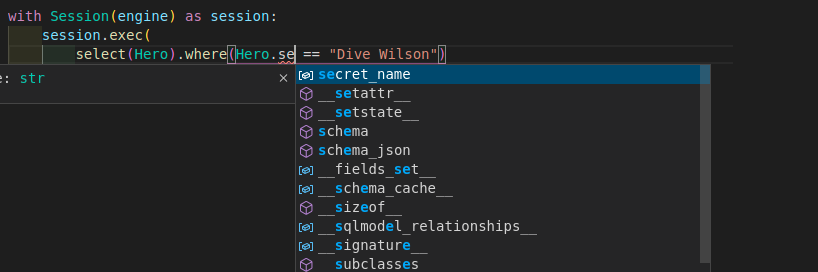
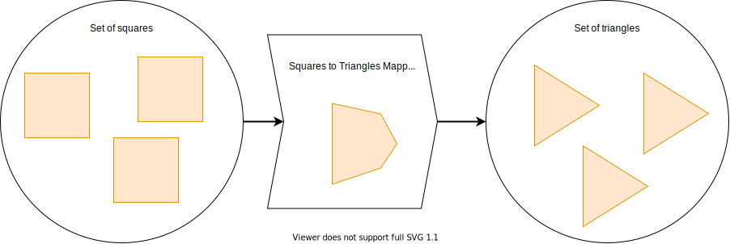

# 数据库与代码（ORM）

在这里，我将告诉你 **SQLModel** 如何与数据库交互，为什么你会想使用它（或者类似的工具），以及它如何与 SQL 相关联。

## 代码中的 SQL 内联

让我们来看一个简单的 SQL 查询示例，用于获取 `hero` 表中的所有数据：

```SQL
SELECT *
FROM hero;
```

这个 SQL 查询将返回如下表格：

<table>
<tr>
<th>id</th><th>name</th><th>secret_name</th><th>age</th><th>team_id</th>
</tr>
<tr>
<td>1</td><td>Deadpond</td><td>Dive Wilson</td><td>null</td><td>2</td>
</tr>
<tr>
<td>2</td><td>Spider-Boy</td><td>Pedro Parqueador</td><td>null</td><td>1</td>
</tr>
<tr>
<td>3</td><td>Rusty-Man</td><td>Tommy Sharp</td><td>48</td><td>1</td>
</tr>
</table>

这个 SQL 语言有一个小 **警告**。它并不是为了与像 Python 这样的编程语言中的普通代码混合使用而设计的。🚨

所以，如果你在使用 Python，最简单的方法是将 SQL 代码放在字符串中，并将该字符串直接发送到数据库。

```Python
statement = "SELECT * FROM hero;"

results = database.execute(statement)
```

但在这种情况下，你将没有编辑器支持、内联错误提示、自动补全等功能。因为对编辑器来说，SQL 语句只是一个文本字符串。如果发生错误，编辑器将无法提供帮助。😔

更重要的是，在大多数情况下，你将发送带有修改和参数的 SQL 字符串。例如，要获取某个 *特定项目 ID* 的数据，或某个 *日期范围* 的数据等。

而且，在大多数情况下，你的代码用来查询或修改数据库中的数据的参数，某种程度上是来自外部用户。

例如，看看这个 SQL 查询：

```SQL
SELECT *
FROM hero
WHERE id = 2;
```

它使用了参数 `2`。这个数字 `2` 可能是某种方式通过用户输入得到的。

用户可能以某种方式告诉你的应用程序：

> 嘿，我想获取 ID 为：

```SQL
2
```

查询结果将是这个表格（只有一行数据）：

<table>
<tr>
<th>id</th><th>name</th><th>secret_name</th><th>age</th><th>team_id</th>
</tr>
<tr>
<td>2</td><td>Spider-Boy</td><td>Pedro Parqueador</td><td>null</td><td>1</td>
</tr>
</table>

### SQL 注入

假设你的代码将外部用户提供的内容直接放入 SQL 字符串中，然后发送给数据库。代码可能是这样的：

```Python
# 永远不要这样做！🚨 继续阅读。

user_id = input("请输入用户 ID: ")

statement = f"SELECT * FROM hero WHERE id = {user_id};"

results = database.execute(statement)
```

如果外部用户实际上是攻击者，他们可能会发送一个恶意的 SQL 字符串，做一些可怕的事情，比如删除所有记录。这就叫做 "**SQL 注入**"。

例如，假设这个新攻击者用户说：

> 嘿，我想获取 ID 为：

```SQL
2; DROP TABLE hero
```

然后，上面那个将用户输入放入 SQL 的代码实际上会将以下内容发送到数据库：

```SQL
SELECT * FROM hero WHERE id = 2; DROP TABLE hero;
```

看看在末尾添加的部分。那是另一个完整的 SQL 语句：

```SQL
DROP TABLE hero;
```

这就是你告诉数据库在 SQL 中删除整个 `hero` 表的方式。

<a href="https://theuselessweb.site/nooooooooooooooo/" class="external-link" target="_blank">不！！！</a> 我们失去了所有 `hero` 表中的数据！💥😱

### SQL 数据清理

确保外部用户发送的内容在 SQL 字符串中使用时是安全的过程称为 **数据清理**。

**SQLModel**（得益于 SQLAlchemy）默认提供了这个功能。许多其他类似的工具也会提供该功能以及许多其他特性。

现在你准备好欣赏来自 <a href="https://xkcd.com/327/" class="external-link" target="_blank">xkcd的笑话</a>：


## 使用 SQLModel 进行 SQL 操作

使用 **SQLModel**，你不再直接编写 SQL 语句，而是使用 Python 类和对象与数据库交互。

例如，你可以通过以下代码向数据库请求 ID 为 `2` 的英雄：

```Python
user_id = input("请输入用户 ID: ")

session.exec(
    select(Hero).where(Hero.id == user_id)
).all()
```

如果用户提供了这个 ID：

```SQL
2
```

...结果将是以下表格（仅一行）：

<table>
<tr>
<th>id</th><th>name</th><th>secret_name</th><th>age</th><th>team_id</th>
</tr>
<tr>
<td>2</td><td>Spider-Boy</td><td>Pedro Parqueador</td><td>null</td><td>1</td>
</tr>
</table>

### 防止 SQL 注入

如果用户是攻击者，并试图将以下内容作为“ID”发送：

```SQL
2; DROP TABLE hero
```

那么 **SQLModel** 会将其转换为字面字符串 `"2; DROP TABLE hero"`。

然后，它会告诉 SQL 数据库尝试查找具有该确切 ID 的记录，而不是注入攻击。

最终 SQL 语句中的差异是微妙的，但它完全改变了含义：

```SQL
SELECT * FROM hero WHERE id = "2; DROP TABLE hero;";
```

/// tip

注意双引号 (`"`) 将其变为字符串，而不是更多的原始 SQL。

///

数据库将不会找到任何具有该 ID 的记录：

```SQL
"2; DROP TABLE hero;"
```

然后，数据库会返回一个空表格作为结果，因为它没有找到任何具有该 ID 的记录。

接着你的代码将继续执行，并平静地告诉用户没有找到任何内容。

但我们从未删除过 `hero` 表。🎉

/// info

当然，也有其他方法可以进行 SQL 数据清理，而无需使用像 **SQLModel** 这样的工具，但这仍然是你默认得到的一个很好的特性。

///

### 编辑器支持

再看一下上面的 Python 代码片段。

因为我们使用的是 **标准 Python 类和对象**，所以你的编辑器将能够为你提供自动补全、内联错误等功能。

例如，假设你想要查询数据库，查找一个基于秘密身份的英雄。

也许你不记得你是如何命名该列的。可能是：

* `secret_identity`?

...还是：

* `secretidentity`?

...或者：

* `private_name`?
* `secret_name`?
* `secretname`?

如果你在代码中的 SQL 字符串里键入这些，编辑器 **无法帮助你**：

```SQL
statement = "SELECT * FROM hero WHERE secret_identity = 'Dive Wilson';"

results = database.execute(statement)
```

...编辑器会把它看作一个 **长字符串**，其中有一些文本，并且 **无法自动补全** 或检测 `secret_identity` 中的错误。

但如果你使用常见的 Python 类和对象，编辑器将能够帮助你：

```Python
database.execute(
    select(Hero).where(Hero.secret_name == "Dive Wilson")
).all()
```

{class="shadow"}

## ORM 和 SQL

像 **SQLModel**（当然还有 SQLAlchemy）这样的库，它们通过类和对象在 SQL 和代码之间进行转换，称为 **ORM**。

**ORM** 代表 **对象关系映射器**（Object-Relational Mapper）。

这是一个非常常见的术语，但它也源自相当技术性和 **学术性** 的概念 👩‍🎓：

* **对象**：指的是使用类和实例的代码，通常称为“面向对象编程”，这就是“**对象**”部分的来源。

例如，这个类就是属于那种 **面向对象编程** 的一部分：

```Python
class Hero(SQLModel):
    id: Optional[int] = Field(default=None, primary_key=True)
    name: str
    secret_name: str
    age: Optional[int] = None
```

* **关系**：指的是 **SQL 数据库**。记住它们也被称为 **关系型数据库**，因为每个表也被称为“**关系**”？这就是“**关系**”部分的来源。

例如，这个 **关系** 或表：

<table>
<tr>
<th>id</th><th>name</th><th>secret_name</th><th>age</th><th>team_id</th>
</tr>
<tr>
<td>1</td><td>Deadpond</td><td>Dive Wilson</td><td>null</td><td>2</td>
</tr>
<tr>
<td>2</td><td>Spider-Boy</td><td>Pedro Parqueador</td><td>null</td><td>1</td>
</tr>
<tr>
<td>3</td><td>Rusty-Man</td><td>Tommy Sharp</td><td>48</td><td>1</td>
</tr>
</table>

* **映射器**：这个词来源于数学，当有某些东西能够从一个集合转换到另一个集合时，这个过程称为“**映射函数**”。这就是 **映射器** 的来源。



我们也可以写一个 **映射函数**，将 *小写字母的集合* 转换为 *大写字母的集合*，像这样：

```Python
def map_lower_to_upper(value: str):
    return value.upper()
```

这实际上是一个简单的想法，但却有一个非常学术和数学的名称。😅

因此，**ORM** 是一个将 SQL 和代码之间相互转换的库，且全部使用类和对象。

除了 **SQLModel**，还有许多其他 ORM 可用，你可以在 [替代方案、灵感和比较](alternatives.md){.internal-link target=_blank} 中了解更多。

## SQL 表名

/// info | 技术背景

这是 SQL 纯粹主义者的背景知识。你可以跳过这一部分。😉

///

在使用纯 SQL 时，通常会将表命名为复数形式。因此，表会命名为 `heroes` 而不是 `hero`，因为它可能包含多行，每行代表一个英雄。

然而，**SQLModel** 和许多其他类似工具可以根据你的代码自动生成表名，正如你在本教程稍后会看到的那样。

但是，这个名称是从类名派生出来的。通常的做法是为类使用 **单数** 名称（例如 `class Hero`，而不是 `class Heroes`）。为类使用单数名称（如 `class Hero`）还能让你的代码更加直观。

你会看到 **你自己的代码** 比内部表名要多得多，因此保持类/代码命名规范比 SQL 命名规范可能更合适。

所以，为了保持一致性，我将继续使用 **SQLModel** 生成的相同表名。

/// tip

你也可以覆盖表名。你可以在高级用户指南中了解更多内容。
