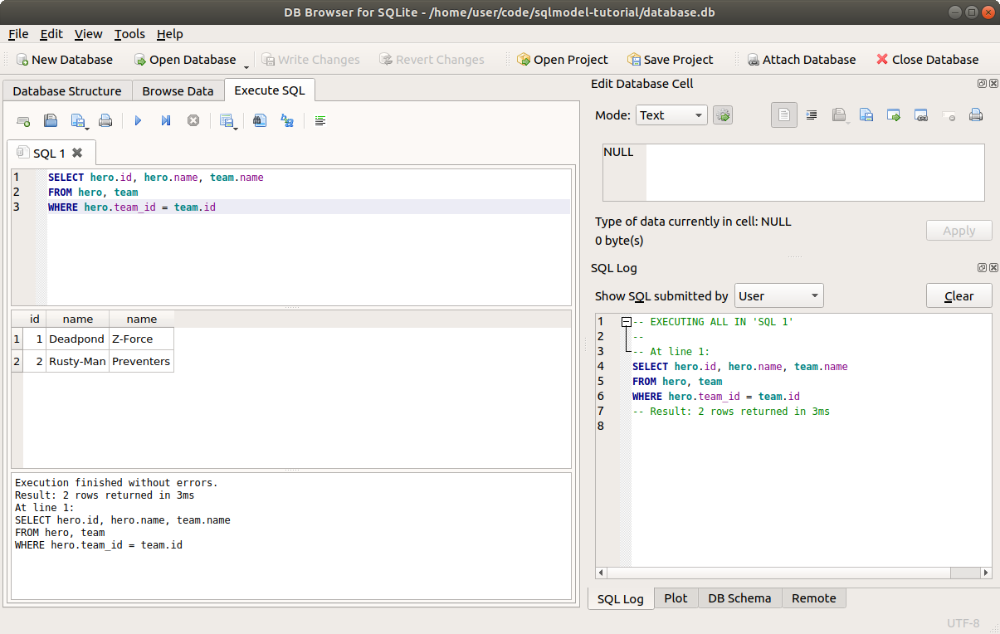
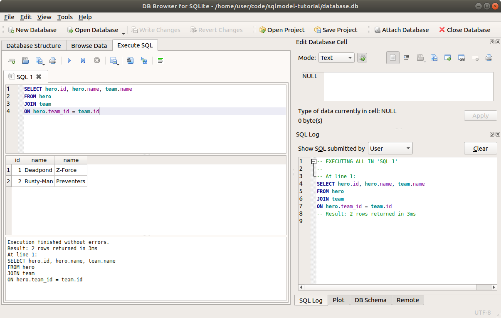
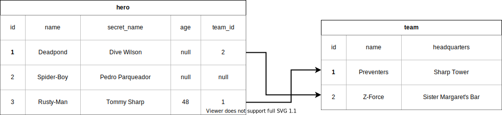

# 读取关联数据

现在我们在两个表中都有了一些数据，让我们来选择那些已关联的数据。

`team` 表包含以下数据：

<table>
<tr>
<th>id</th><th>name</th><th>headquarters</th>
</tr>
<tr>
<td>1</td><td>Preventers</td><td>Sharp Tower</td>
</tr>
<tr>
<td>2</td><td>Z-Force</td><td>Sister Margaret's Bar</td>
</tr>
</table>

而 `hero` 表包含以下数据：

<table>
<tr>
<th>id</th><th>name</th><th>secret_name</th><th>age</th><th>team_id</th>
</tr>
<tr>
<td>1</td><td>Deadpond</td><td>Dive Wilson</td><td>null</td><td>2</td>
</tr>
<tr>
<td>2</td><td>Rusty-Man</td><td>Tommy Sharp</td><td>48</td><td>1</td>
</tr>
<tr>
<td>3</td><td>Spider-Boy</td><td>Pedro Parqueador</td><td>null</td><td>null</td>
</tr>
</table>

我们将继续使用前面示例中的代码，并在其基础上添加更多内容。

/// details | 👀 完整文件预览

//// tab | Python 3.10+

```Python
{!./docs_src/tutorial/connect/insert/tutorial001_py310.py!}
```

////

//// tab | Python 3.7+

```Python
{!./docs_src/tutorial/connect/insert/tutorial001.py!}
```

////

///

## 使用 SQL 选择关联数据

让我们先来看一下在选择关联数据时 SQL 是如何工作的。这也是 SQL 数据库真正强大的地方。

如果您没有 `database.db` 文件，可以运行我们之前编写的程序（或者从上面的预览中复制它）来创建它。

现在打开 **DB Browser for SQLite** 并打开 `database.db` 文件。

要选择关联数据，我们使用与之前相同的关键词，但现在我们要连接两个表。

让我们获取每个英雄的 `id`、`name` 和所在团队的 `name`：

```SQL
SELECT hero.id, hero.name, team.name
FROM hero, team
WHERE hero.team_id = team.id
```

/// info

由于我们有两个名为 `name` 的列，一个属于 `hero`，另一个属于 `team`，我们可以通过表名前缀加点符号来显式指定它们的来源。

///

请注意，现在在 `WHERE` 部分，我们不是将某个列与字面值进行比较（例如 `hero.name = "Deadpond"`），而是将两个列进行比较。

这意味着大致如下：

> 嘿，SQL 数据库 👋，请帮我选择一些数据。
>
> 我先告诉你我需要哪些列：
>
> * `hero` 表的 `id`
> * `hero` 表的 `name`
> * `team` 表的 `name`
>
> 我要你从 `hero` 和 `team` 两个表中获取这些数据。
>
> 并且，我不希望你将每个英雄和所有团队进行组合。相反，请为每个英雄检查所有可能的团队，但是只返回 `WHERE` 条件匹配的记录，也就是 `hero.team_id` 和 `team.id` 相等的记录。

如果我们执行这个 SQL，它将返回如下表格：

<table>
<tr>
<th>id</th><th>name</th><th>name</th>
</tr>
<tr>
<td>1</td><td>Deadpond</td><td>Z-Force</td>
</tr>
<tr>
<td>2</td><td>Rusty-Man</td><td>Preventers</td>
</tr>
</table>

你可以在 **DB Browser for SQLite** 中尝试执行这个查询：



/// note

等一下，**Spider-Boy** 怎么了？😱

他没有团队，因此他的 `team_id` 在数据库中是 `NULL`。而这个 SQL 查询是在将 `team_id` 中的 `NULL` 与 `team` 表中的所有 `id` 字段进行比较。

由于没有 `id` 为 `NULL` 的团队，它没有找到匹配项。

不过，我们稍后将看到如何使用 `LEFT JOIN` 来解决这个问题。

///

## 使用 **SQLModel** 选择关联数据

现在让我们使用 SQLModel 来做相同的选择操作。

我们将创建一个函数 `select_heroes()`，就像之前那样，但这次我们将操作两个表。

还记得 SQLModel 的 `select()` 函数吗？它可以接受多个参数。

因此，我们可以传递 `Hero` 和 `Team` 模型类。同时，我们还可以在 `.where()` 部分使用它们的列：

//// tab | Python 3.10+

```Python hl_lines="5"
# Code above omitted 👆

{!./docs_src/tutorial/connect/select/tutorial001_py310.py[ln:61-63]!}

# Code below omitted 👇
```

////

//// tab | Python 3.7+

```Python hl_lines="5"
# Code above omitted 👆

{!./docs_src/tutorial/connect/select/tutorial001.py[ln:63-65]!}

# Code below omitted 👇
```

////

/// details | 👀 完整文件预览

//// tab | Python 3.10+

```Python
{!./docs_src/tutorial/connect/select/tutorial001_py310.py!}
```

////

//// tab | Python 3.7+

```Python
{!./docs_src/tutorial/connect/select/tutorial001.py!}
```

////

///

请注意，在使用 `==` 进行比较时，我们正在使用 `Hero.team_id` 和 `Team.id` 的类属性。

这将生成适当的 **表达式** 对象，该对象将转换为正确的 SQL，等同于我们之前看到的 SQL 示例。

现在我们可以执行它并获取 `results` 对象。

由于我们使用了带有两个模型的 `select`，因此我们将收到这两个模型的实例元组，因此可以自然地在 `for` 循环中迭代它们：

//// tab | Python 3.10+

```Python hl_lines="7"
# Code above omitted 👆

{!./docs_src/tutorial/connect/select/tutorial001_py310.py[ln:61-66]!}

# Code below omitted 👇
```

////

//// tab | Python 3.7+

```Python hl_lines="7"
# Code above omitted 👆

{!./docs_src/tutorial/connect/select/tutorial001.py[ln:63-68]!}

# Code below omitted 👇
```

////

/// details | 👀 完整文件预览

//// tab | Python 3.10+

```Python
{!./docs_src/tutorial/connect/select/tutorial001_py310.py!}
```

////

//// tab | Python 3.7+

```Python
{!./docs_src/tutorial/connect/select/tutorial001.py!}
```

////

///

在 `for` 循环中的每一次迭代，我们都会得到一个包含 `Hero` 类实例和 `Team` 类实例的元组。

在这个 `for` 循环中，我们将它们分别赋值给变量 `hero` 和 `team`。

/// info

在 **SQLModel** 的背后有大量的研究、设计和工作，目的是提供最佳的开发者体验。

在编辑器中，您应该能够对 `hero` 和 `team` 都获得自动补全和内联错误提示。 🎉

///

## 添加到主函数

和往常一样，我们必须记得将这个新的 `select_heroes()` 函数添加到 `main()` 函数中，以确保在从命令行调用程序时，它会被执行。

//// tab | Python 3.10+

```Python hl_lines="6"
# Code above omitted 👆

{!./docs_src/tutorial/connect/select/tutorial001_py310.py[ln:69-72]!}

# Code below omitted 👇
```

////

//// tab | Python 3.7+

```Python hl_lines="6"
# Code above omitted 👆

{!./docs_src/tutorial/connect/select/tutorial001.py[ln:71-74]!}

# Code below omitted 👇
```

////

/// details | 👀 完整文件预览

//// tab | Python 3.10+

```Python
{!./docs_src/tutorial/connect/select/tutorial001_py310.py!}
```

////

//// tab | Python 3.7+

```Python
{!./docs_src/tutorial/connect/select/tutorial001.py!}
```

////

///

## 运行程序

现在我们可以运行程序，看看它是如何显示每个英雄及其对应的队伍的：

<div class="termy">

```console
$ python app.py

// Previous output omitted 😉

// Get the heroes with their teams
2021-08-09 08:55:50,682 INFO sqlalchemy.engine.Engine SELECT hero.id, hero.name, hero.secret_name, hero.age, hero.team_id, team.id AS id_1, team.name AS name_1, team.headquarters
FROM hero, team
WHERE hero.team_id = team.id
2021-08-09 08:55:50,682 INFO sqlalchemy.engine.Engine [no key 0.00015s] ()

// Print the first hero and team
Hero: id=1 secret_name='Dive Wilson' team_id=2 name='Deadpond' age=None Team: headquarters='Sister Margaret's Bar' id=2 name='Z-Force'

// Print the second hero and team
Hero: id=2 secret_name='Tommy Sharp' team_id=1 name='Rusty-Man' age=48 Team: headquarters='Sharp Tower' id=1 name='Preventers'
2021-08-09 08:55:50,682 INFO sqlalchemy.engine.Engine ROLLBACK
```

</div>

## 使用 SQL 的 `JOIN` 连接表

上面提到的 SQL 查询有一种替代语法，使用 `JOIN` 关键字而不是 `WHERE`。

这是使用 `WHERE` 的版本：

```SQL
SELECT hero.id, hero.name, team.name
FROM hero, team
WHERE hero.team_id = team.id
```

这是使用 `JOIN` 的替代版本：

```SQL
SELECT hero.id, hero.name, team.name
FROM hero
JOIN team
ON hero.team_id = team.id
```

两者是等价的。SQL 代码的差异在于，替代版本中，我们没有将 `team` 直接放到 `FROM` 部分（也叫做 `FROM` 子句），而是添加了一个 `JOIN`，并将 `team` 表放在那里。

然后，我们没有使用 `WHERE` 来指定条件，而是使用了 `ON` 关键字，因为 `ON` 是与 `JOIN` 一起使用的。🤷

因此，这第二种版本的意思是：

> 嘿，SQL 数据库 👋，请帮我 `SELECT` 一些数据吧。
>
> 我会先告诉你我需要哪些列：
>
> * `hero` 表的 `id`
> * `hero` 表的 `name`
> * `team` 表的 `name`
>
> 到这里和之前一样，哈哈。
>
> 现在，我希望你从 `hero` 表开始获取数据。
>
> 然后，为了获取剩余的数据，我希望你 `JOIN` 上 `team` 表。
>
> 我希望你将这两个表通过 `ON` 连接，连接条件是 `hero.team_id` 的值与 `team.id` 的值相等。
>
> 我是不是已经说过这些了？感觉我在重复自己 🤔

这将返回与之前相同的表：

<table>
<tr>
<th>id</th><th>name</th><th>name</th>
</tr>
<tr>
<td>1</td><td>Deadpond</td><td>Z-Force</td>
</tr>
<tr>
<td>2</td><td>Rusty-Man</td><td>Preventers</td>
</tr>
</table>

同样的结果，在 **DB Browser for SQLite** 中也可以看到：



/// tip

如果结果是一样的，为什么还要使用这种方式呢？

这个 `JOIN` 在稍后会变得非常有用，尤其是在我们需要获取 Spider-Boy 的数据时，即使他没有队伍。

///

## 在 **SQLModel** 中连接表

和使用 `select()` 时可以用 `.where()` 一样，SQLModel 也提供了 `.join()`。

在 SQLModel（实际上是 SQLAlchemy）中，当使用 `.join()` 时，由于我们在创建模型时已经声明了外键（`foreign_key`），因此不需要手动指定 `ON` 部分，SQLModel 会自动推断出来：

//// tab | Python 3.10+

```Python hl_lines="5"
# 代码上方省略 👆

{!./docs_src/tutorial/connect/select/tutorial002_py310.py[ln:61-66]!}

# 代码下方省略 👇
```

////

//// tab | Python 3.7+

```Python hl_lines="5"
# 代码上方省略 👆

{!./docs_src/tutorial/connect/select/tutorial002.py[ln:63-68]!}

# 代码下方省略 👇
```

////

/// details | 👀 完整文件预览

//// tab | Python 3.10+

```Python
{!./docs_src/tutorial/connect/select/tutorial002_py310.py!}
```

////

//// tab | Python 3.7+

```Python
{!./docs_src/tutorial/connect/select/tutorial002.py!}
```

////

///

请注意，我们仍然在 `select(Hero, Team)` 中包括了 `Team`，因为我们仍然希望访问这些数据。

这与之前的示例是等价的。

如果我们在命令行中运行它，输出将是：

<div class="termy">

```console
$ python app.py

// 上方的输出省略 😉

// 使用自动 `ON` 的 `JOIN` 进行查询
INFO Engine SELECT hero.id, hero.name, hero.secret_name, hero.age, hero.team_id, team.id AS id_1, team.name AS name_1, team.headquarters
FROM hero JOIN team ON team.id = hero.team_id
INFO Engine [no key 0.00032s] ()

// 打印第一个英雄和团队
Hero: id=1 secret_name='Dive Wilson' team_id=2 name='Deadpond' age=None Team: headquarters='Sister Margaret's Bar' id=2 name='Z-Force'

// 打印第二个英雄和团队
Hero: id=2 secret_name='Tommy Sharp' team_id=1 name='Rusty-Man' age=48 Team: headquarters='Sharp Tower' id=1 name='Preventers'

```

</div>

## 使用 SQL 和 `LEFT OUTER`（可能是 `JOIN`）连接表

在使用 `JOIN` 时，你可以想象从 `FROM` 部分开始，你将一个表放在 **左** 侧的一个假想空间中。

然后，你希望另一个表来连接结果。

你将第二个表放在那个假想空间的 **右** 侧。

接着，你告诉数据库用哪个条件来连接这两个表并返回结果。

但默认情况下，只有满足条件的左侧和右侧的行才会被返回。


在上面的这个表的例子 👆，它会返回所有英雄，因为每个英雄都有一个 `team_id`，所以每个英雄都可以和 `team` 表连接：

<table>
<tr>
<th>id</th><th>name</th><th>name</th>
</tr>
<tr>
<td>1</td><td>Deadpond</td><td>Z-Force</td>
</tr>
<tr>
<td>2</td><td>Rusty-Man</td><td>Preventers</td>
</tr>
<tr>
<td>3</td><td>Spider-Boy</td><td>Preventers</td>
</tr>
</table>

### 外键为 `NULL`

但是，在我们上面代码中使用的数据库里，**Spider-Boy** 没有团队，`team_id` 的值是 `NULL`。

因此，无法将 **Spider-Boy** 的行与 `team` 表中的任何行连接：



运行我们之前使用的相同 SQL，结果表格将不包括 **Spider-Boy** 😱：

<table>
<tr>
<th>id</th><th>name</th><th>name</th>
</tr>
<tr>
<td>1</td><td>Deadpond</td><td>Z-Force</td>
</tr>
<tr>
<td>2</td><td>Rusty-Man</td><td>Preventers</td>
</tr>
</table>

### 在 `LEFT OUTER` 中包含所有内容

在这种情况下，如果我们希望即使没有团队的英雄也能包含在结果中，我们可以扩展之前的 SQL，使用 `JOIN` 并在 `JOIN` 前加上 `LEFT OUTER`：

```SQL hl_lines="3"
SELECT hero.id, hero.name, team.name
FROM hero
LEFT OUTER JOIN team
ON hero.team_id = team.id
```

这个 `LEFT OUTER` 部分告诉数据库，即使那些行会被排除在外，也要保留第一个表中的所有内容，即放在 **左** 侧的表。所以我们希望它包含那些 **OUTER** 行。在这个例子中，就是所有有或没有团队的英雄。

这样就能返回以下结果，包括 **Spider-Boy** 🎉：

<table>
<tr>
<th>id</th><th>name</th><th>name</th>
</tr>
<tr>
<td>1</td><td>Deadpond</td><td>Z-Force</td>
</tr>
<tr>
<td>2</td><td>Rusty-Man</td><td>Preventers</td>
</tr>
<tr>
<td>3</td><td>Spider-Boy</td><td>null</td>
</tr>
</table>

/// tip

这个查询和之前的查询唯一不同的就是那个额外的 `LEFT OUTER`。

///

另外，这里有一种 SQL 变体，你可以写成 `LEFT OUTER JOIN` 或者直接写 `LEFT JOIN`，它们是一样的。

## 在 **SQLModel** 中使用 `LEFT OUTER` 连接表

现在让我们在 **SQLModel** 中复现相同的查询。

`.join()` 方法有一个参数 `isouter=True`，我们可以使用它来使 `JOIN` 成为 `LEFT OUTER JOIN`：

//// tab | Python 3.10+

```Python hl_lines="5"
# Code above omitted 👆

{!./docs_src/tutorial/connect/select/tutorial003_py310.py[ln:61-66]!}

# Code below omitted 👇
```

////

//// tab | Python 3.7+

```Python hl_lines="5"
# Code above omitted 👆

{!./docs_src/tutorial/connect/select/tutorial003.py[ln:63-68]!}

# Code below omitted 👇
```

////

/// details | 👀 完整文件预览

//// tab | Python 3.10+

```Python
{!./docs_src/tutorial/connect/select/tutorial003_py310.py!}
```

////

//// tab | Python 3.7+

```Python
{!./docs_src/tutorial/connect/select/tutorial003.py!}
```

////

///

如果我们运行它，输出将是：

<div class="termy">

```console
$ python app.py

// 之前的输出省略 😉

// 使用 LEFT OUTER JOIN 进行 SELECT
INFO Engine SELECT hero.id, hero.name, hero.secret_name, hero.age, hero.team_id, team.id AS id_1, team.name AS name_1, team.headquarters
FROM hero LEFT OUTER JOIN team ON team.id = hero.team_id

INFO Engine [no key 0.00051s] ()

// 打印第一个英雄和团队
Hero: id=1 secret_name='Dive Wilson' team_id=2 name='Deadpond' age=None Team: headquarters='Sister Margaret's Bar' id=2 name='Z-Force'
// 打印第二个英雄和团队
Hero: id=2 secret_name='Tommy Sharp' team_id=1 name='Rusty-Man' age=48 Team: headquarters='Sharp Tower' id=1 name='Preventers'
// 打印第三个英雄和团队，我们包括了 Spider-Boy 🎉
Hero: id=3 secret_name='Pedro Parqueador' team_id=None name='Spider-Boy' age=None Team: None
```

</div>

## `select()` 中的内容

你可能会想，为什么我们将 `Team` 放在 `select()` 中，而不是仅仅放在 `.join()` 中？

然后，为什么我们没有在 `.join()` 中包括 `Hero` 呢？🤔

在 SQLModel（实际上是 SQLAlchemy）中，所有这些函数和工具都试图**模拟**如何使用 **SQL** 语言进行操作。

记得 [`SELECT` 定义了获取的列，`WHERE` 定义了如何过滤它们吗？](../where.md#select-and-where){.internal-link target=_blank}。

这同样适用于这里，但使用的是 `JOIN` 和 `ON`。

### 仅选择英雄数据但连接团队数据

如果我们只把 `Team` 放在 `.join()` 中，而不放在 `select()` 函数中，那么我们就无法获取 `team` 数据。

但是我们仍然可以使用它来**过滤**行数据。🤓

我们甚至可以在 `.join()` 后添加一些额外的 `.where()` 来进一步过滤数据，例如只返回某个团队的英雄：

//// tab | Python 3.10+

```Python hl_lines="5"
# Code above omitted 👆

{!./docs_src/tutorial/connect/select/tutorial004_py310.py[ln:61-66]!}

# Code below omitted 👇
```

////

//// tab | Python 3.7+

```Python hl_lines="5"
# Code above omitted 👆

{!./docs_src/tutorial/connect/select/tutorial004.py[ln:63-68]!}

# Code below omitted 👇
```

////

/// details | 👀 完整文件预览

//// tab | Python 3.10+

```Python
{!./docs_src/tutorial/connect/select/tutorial004_py310.py!}
```

////

//// tab | Python 3.7+

```Python
{!./docs_src/tutorial/connect/select/tutorial004.py!}
```

////

///

在这里，我们使用 `.where()` 进行**过滤**，只获取属于 **Preventers** 团队的英雄。

但我们仍然只请求英雄的数据，而不是他们的团队数据。

如果我们运行这段代码，输出将是：

<div class="termy">

```console
$ python app.py

// 仅选择英雄数据
INFO Engine SELECT hero.id, hero.name, hero.secret_name, hero.age, hero.team_id
// 但仍然与团队表连接
FROM hero JOIN team ON team.id = hero.team_id
// 并使用 WHERE 进行过滤，只获取 Preventers 团队的英雄
WHERE team.name = ?
INFO Engine [no key 0.00066s] ('Preventers',)

// 我们使用团队进行过滤，但只获取英雄数据
Preventer Hero: id=2 secret_name='Tommy Sharp' team_id=1 name='Rusty-Man' age=48
```

</div>

### 包括 `Team`

通过将 `Team` 放入 `select()` 中，我们告诉 **SQLModel** 和数据库，我们也希望获取团队数据。

//// tab | Python 3.10+

```Python hl_lines="5"
# Code above omitted 👆

{!./docs_src/tutorial/connect/select/tutorial005_py310.py[ln:61-66]!}

# Code below omitted 👇
```

////

//// tab | Python 3.7+

```Python hl_lines="5"
# Code above omitted 👆

{!./docs_src/tutorial/connect/select/tutorial005.py[ln:63-68]!}

# Code below omitted 👇
```

////

/// details | 👀 完整文件预览

//// tab | Python 3.10+

```Python
{!./docs_src/tutorial/connect/select/tutorial005_py310.py!}
```

////

//// tab | Python 3.7+

```Python
{!./docs_src/tutorial/connect/select/tutorial005.py!}
```

////

///

如果我们运行这段代码，它将输出：

<div class="termy">

```console
$ python app.py

// 选择英雄和团队数据
INFO Engine SELECT hero.id, hero.name, hero.secret_name, hero.age, hero.team_id, team.id AS id_1, team.name AS name_1, team.headquarters
// 将英雄与团队表连接
FROM hero JOIN team ON team.id = hero.team_id
// 使用 WHERE 过滤，仅获取 Preventers 团队的英雄
WHERE team.name = ?
INFO Engine [no key 0.00018s] ('Preventers',)

// 打印英雄和团队
Preventer Hero: id=2 secret_name='Tommy Sharp' team_id=1 name='Rusty-Man' age=48 Team: headquarters='Sharp Tower' id=1 name='Preventers'
```

</div>

我们仍然需要使用 `.join()`，因为如果不这样做，它会计算所有可能的英雄和团队的组合，例如将 **Rusty-Man** 和 **Preventers** 组合在一起，也会将 **Rusty-Man** 和 **Z-Force** 组合在一起，这显然是错误的。

## 关系属性

在这里，我们一直在直接使用纯粹的类模型，但在后面的章节中，我们还将看到如何使用 **关系属性** ，这使我们能够以更接近 Python 对象代码的方式与数据库交互。

我们还将看到如何以不同的、更加简洁的方式加载它们的数据，从而实现与这里相同的效果。 ✨
