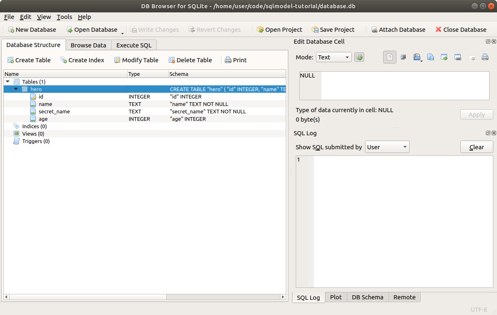

# 使用 SQL 创建表

让我们开始吧！

我们将：

* 使用 **DB Browser for SQLite** 创建一个 SQLite 数据库
* 使用 **DB Browser for SQLite** 在数据库中创建一个表

我们稍后会添加数据。现在，我们将创建数据库和第一个表结构。

我们将创建一个表来存储以下数据：

<table>
<tr>
<th>id</th><th>name</th><th>secret_name</th><th>age</th>
</tr>
<tr>
<td>1</td><td>Deadpond</td><td>Dive Wilson</td><td>null</td>
</tr>
<tr>
<td>2</td><td>Spider-Boy</td><td>Pedro Parqueador</td><td>null</td>
</tr>
<tr>
<td>3</td><td>Rusty-Man</td><td>Tommy Sharp</td><td>48</td>
</tr>
</table>

## 创建数据库

**SQLModel** 和 SQLAlchemy 基于 SQL。

它们的设计旨在通过 Python 类和对象帮助你使用 SQL。但理解 SQL 总是非常有用的。

因此，让我们从一个简单的纯 SQL 示例开始。

打开 **DB Browser for SQLite**。

点击 <kbd>New Database</kbd> 按钮。


会弹出一个对话框。进入你创建的 [项目目录](./index.md#create-a-project){.internal-link target=_blank}，并将文件保存为 `database.db`。

/// tip

SQLite 数据库文件通常以 `.db` 扩展名保存。有时也会使用 `.sqlite`。

///

## 创建表

完成此操作后，它可能会提示你立即创建一个新表。

如果没有提示，点击 <kbd>Create Table</kbd> 按钮。


然后，你将看到创建新表的对话框。

现在，创建一个名为 `hero` 的新表，包含以下列：

* `id`：一个 `INTEGER` 类型的字段，将作为 **主键**（勾选 `PK` ✅）。
* `name`：一个 `TEXT` 类型的字段，应该为 `NOT NULL`（勾选 `NN` ✅），所以它应该始终有一个值。
* `secret_name`：一个 `TEXT` 类型的字段，应该为 `NOT NULL`（勾选 `NN` ✅）。
* `age`：一个 `INTEGER` 类型的字段，可以为 `NULL`，因此你不需要勾选其他任何选项。


点击 <kbd>OK</kbd> 创建表。

当你点击 <kbd>Add</kbd> 按钮并添加信息时，它会创建并更新执行创建表的 SQL 语句：

```{ .sql .annotate }
CREATE TABLE "hero" ( --(1)
  "id"  INTEGER, --(2)
  "name"  TEXT NOT NULL, --(3)
  "secret_name" TEXT NOT NULL, --(4)
  "age" INTEGER, --(5)
  PRIMARY KEY("id") --(6)
); --(7)
```

1. 创建一个名为 `hero` 的表。注意，这个表的列在括号 "`(`" 内声明，从这里开始。
2. `id` 列，类型为 `INTEGER`。它被声明为主键，位于最后。
3. `name` 列，类型为 `TEXT`，并且它必须始终有一个值，`NOT NULL`。
4. `secret_name` 列，类型为 `TEXT`，同样是 `NOT NULL`。
5. `age` 列，类型为 `INTEGER`。这个列没有 `NOT NULL`，所以它可以为 `NULL`。
6. 这个表的主键是 `id` 列。
7. 这是 SQL 表的结束部分，最后一个括号 "`)`" 和分号 "`;`" 表示 SQL 语句的结束。这个 SQL 字符串可能还会包含其他 SQL 语句。

现在你将看到它出现在表的列表中，且包含我们指定的列。🎉


剩下的步骤是点击 <kbd>Write Changes</kbd> 保存更改到文件。


之后，新表将保存在 `./database.db` 文件中。

## 确认表的创建

让我们确认它是否已保存。

首先点击 <kbd>Close Database</kbd> 按钮关闭数据库。


然后点击 <kbd>Open Database</kbd> 按钮重新打开数据库，选择相同的 `./database.db` 文件。


你将再次看到我们创建的相同表。



## 使用 SQL 再次创建表

现在，为了了解 SQL 是如何工作的，让我们用 SQL 再次创建表。

再次点击 <kbd>Close Database</kbd> 按钮。

删除项目目录中的 `./database.db` 文件。

然后再次点击 <kbd>New Database</kbd>。

再次将文件保存为 `database.db`。

这一次，如果你看到创建新表的对话框，只需点击 <kbd>Cancel</kbd> 按钮关闭它。

现在，切换到 <kbd>Execute SQL</kbd> 标签。

写下之前步骤中生成的相同 SQL：

```SQL
CREATE TABLE "hero" (
  "id"  INTEGER,
  "name"  TEXT NOT NULL,
  "secret_name" TEXT NOT NULL,
  "age" INTEGER,
  PRIMARY KEY("id")
);
```

然后点击 "Execute all" <kbd>▶</kbd> 按钮。


你将看到 "execution finished successfully" 的提示信息。


如果你回到 <kbd>Database Structure</kbd> 标签，你会看到你确实再次创建了相同的表。


## 进一步学习 SQL

在本教程中，我将继续向你展示一些 SQL 的小片段。你不需要成为 SQL 专家就能使用 **SQLModel**。

但是，如果你感兴趣并希望快速了解 SQL，我推荐你阅读 SQLite 的可视化文档，链接在这里：<a href="https://www.sqlite.org/lang.html" class="external-link" target="_blank">SQL As Understood By SQLite</a>。

你可以从 <a href="https://www.sqlite.org/lang_createtable.html" class="external-link" target="_blank">`CREATE TABLE`</a> 开始。

当然，你也可以选择参加完整的 SQL 课程或阅读有关 SQL 的书籍，但你不需要比我在本教程中解释的内容更多，就能开始高效地使用 **SQLModel**。🤓

## 小结

我们学习了如何使用 **DB Browser for SQLite** 通过可视化用户界面与 SQLite 数据库文件进行交互。

我们还了解了如何直接向 SQLite 数据库写入 SQL 语句。这在验证数据库数据是否正确、调试等方面非常有用。

在接下来的章节中，我们将开始使用 **SQLModel** 与数据库交互，并且我们将继续同时使用 **DB Browser for SQLite** 来查看底层的数据库。🔍
