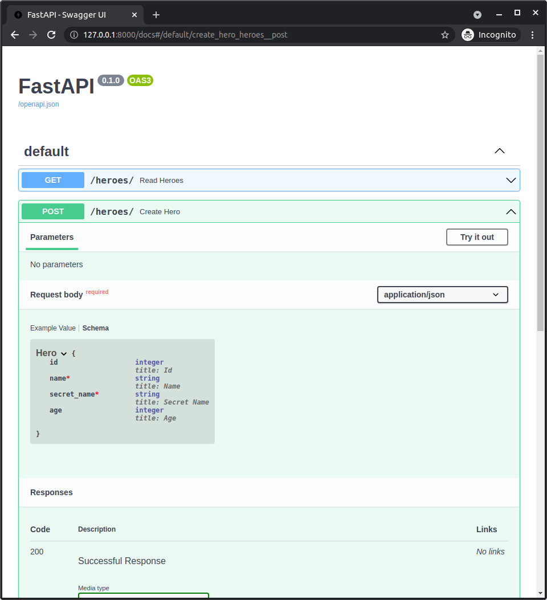
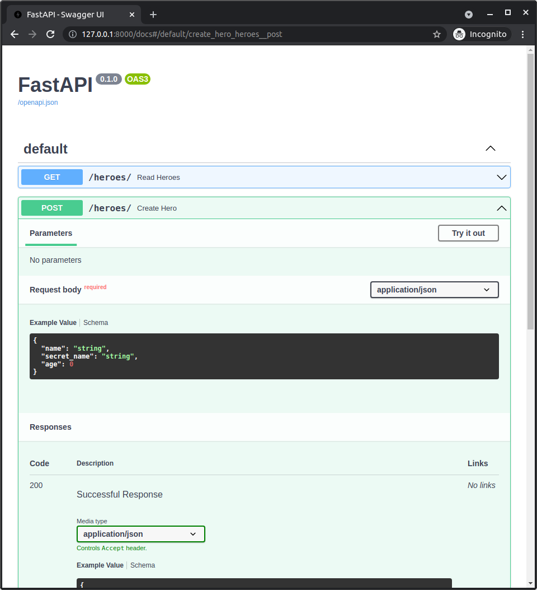
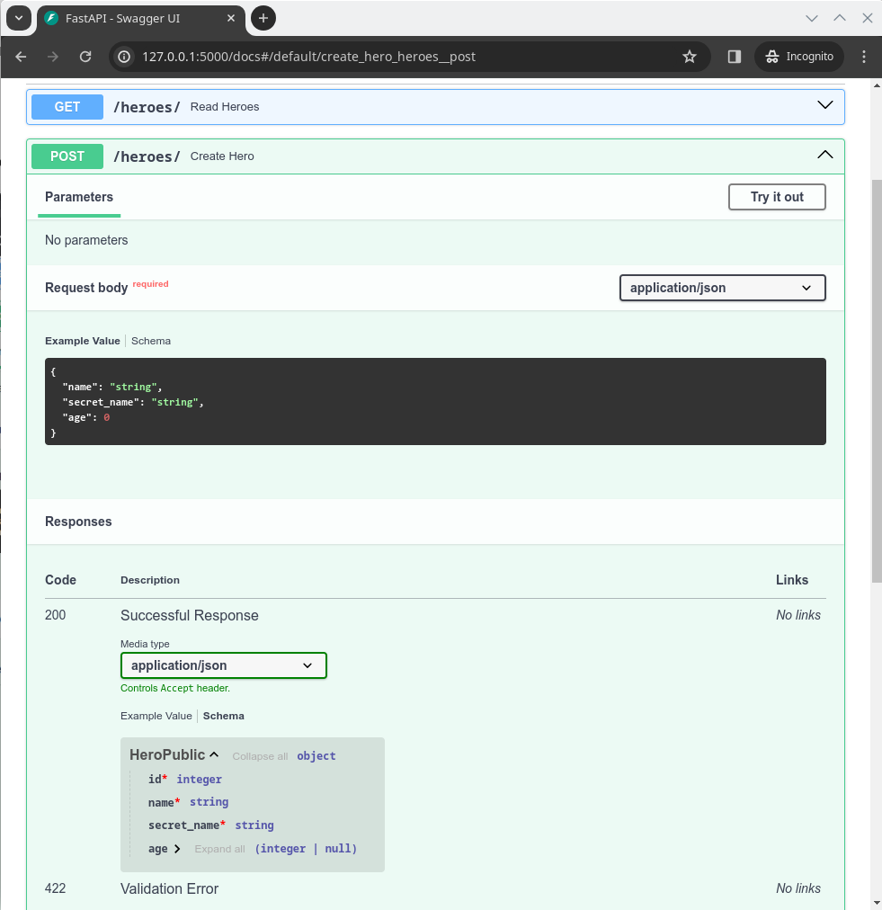

# FastAPI 中的多个模型

我们一直在使用相同的 `Hero` 模型来声明我们在 API 中接收的数据的 schema、数据库中的表模型以及我们在响应中发送回的数据的 schema。

但在大多数情况下，这些模型之间会有一些细微的差别。我们将使用多个模型来解决这个问题。

在这里，你将看到 **SQLModel** 的主要和最强大的特性。😎

## 审查创建 schema

让我们从审查文档 UI 中自动生成的 schema 开始。

对于输入，我们有：


如果我们仔细观察，会看到它显示客户端 *可能* 会在请求的 JSON 正文中发送一个 `id` 字段。

这意味着客户端可能会尝试使用数据库中已经存在的另一个英雄的 ID。

这不是我们想要的。

我们希望客户端只发送创建新英雄所需的数据：

* `name`
* `secret_name`
* 可选的 `age`

我们希望 `id` 由数据库自动生成，因此我们不希望客户端发送该字段。

稍后我们将看到如何解决这个问题。

## 审查响应 schema

现在让我们审查文档 UI 中我们发送给客户端的响应 schema。

如果你点击小标签 <kbd>Schema</kbd>，而不是 <kbd>Example Value</kbd>，你将看到如下内容：



让我们来看一下详细内容。

带有红色星号（<span style="color: #ff0000;">*</span>）的字段是“必填项”。

这意味着我们的 API 应用必须在响应中返回这些字段：

* `name`
* `secret_name`

`age` 是可选的，我们不必返回它，或者它可以是 `None`（在 JSON 中是 `null`），但 `name` 和 `secret_name` 是必填的。

这里有个奇怪的地方，`id` 目前似乎也是“可选的”。🤔

这是因为在我们的 **SQLModel** 类中，我们声明 `id` 为 `Optional[int]`，因为它在内存中可以是 `None`，直到我们将其保存到数据库中，最终获取实际的 ID。

但在响应中，我们始终发送来自数据库的模型，因此它 **总是有一个 ID**。所以响应中的 `id` 应该声明为必填项。

这意味着我们的应用承诺，如果它发送一个英雄，它肯定会有一个带有值的 `id`，而不会是 `None`。

### 为什么为响应定义契约很重要

API 的最终目标是让一些 **客户端使用它**。

这些客户端可以是前端应用、命令行程序、图形用户界面、移动应用、其他后端应用等。

这些客户端编写的代码依赖于我们 API 告诉他们他们 **需要发送** 什么，以及他们 **可以期待接收到** 什么。

让双方非常清楚，将使与 API 交互变得更加容易。

在大多数情况下，开发该 API 客户端的开发者 **也将是你自己**，所以通过声明这些请求和响应的 schema，你是在 **为未来的自己做好准备**。😉

### 那么，为什么需要 `id` 字段是必填的呢？

现在，为什么在响应中将 **`id` 字段标记为“可选”**，而实际上它总是必需的呢？

例如，**自动生成的客户端**（无论是其他语言还是 Python 中的客户端）会声明该字段 `id` 是可选的。

然后，使用这些客户端的开发者将不得不在他们的代码中随时检查 `id` 是否为 `None`，然后才能在任何地方使用它。

这将导致许多不必要的检查和 **不必要的代码**，这些本可以通过正确声明 schema 来避免。😔

要让这些代码知道响应中的 `id` 是必需的，并且 **永远有一个值**，会简单得多。

让我们也解决这个问题。🤓

## 多个英雄模型

因此，我们希望拥有一个 `Hero` 模型来声明 **数据库中的数据**：

* `id`，创建时可选，数据库中必填
* `name`，必填
* `secret_name`，必填
* `age`，可选

但我们还希望有一个 `HeroCreate` 模型，用于声明我们在 **创建** 新英雄时希望接收的数据，几乎与 `Hero` 相同，唯一的区别是 `id`，因为 `id` 是由数据库自动生成的：

* `name`，必填
* `secret_name`，必填
* `age`，可选

另外，我们还想有一个 `HeroPublic` 模型，包含 `id` 字段，但这次我们将其注解为 `id: int`，而不是 `id: Optional[int]`，以明确表示在从客户端 **读取** 响应时 `id` 字段是必填的：

* `id`，必填
* `name`，必填
* `secret_name`，必填
* `age`，可选

## 具有重复字段的多个模型

解决这个问题的最简单方法可能是创建 **多个模型**，每个模型包含所有相应的字段：

//// tab | Python 3.10+

```Python hl_lines="5-9  12-15  18-22"
# 这能解决问题，但下面有更好的选择 🚨

# 以上代码已省略 👆

{!./docs_src/tutorial/fastapi/multiple_models/tutorial001_py310.py[ln:5-22]!}

# 以下代码已省略 👇
```

////

//// tab | Python 3.9+

```Python hl_lines="5-9  12-15  18-22"
# 这能解决问题，但下面有更好的选择 🚨

# 以上代码已省略 👆

{!./docs_src/tutorial/fastapi/multiple_models/tutorial001_py39.py[ln:7-24]!}

# 以下代码已省略 👇
```

////

//// tab | Python 3.7+

```Python hl_lines="5-9  12-15  18-22"
# 这能解决问题，但下面有更好的选择 🚨

# 以上代码已省略 👆

{!./docs_src/tutorial/fastapi/multiple_models/tutorial001.py[ln:7-24]!}

# 以下代码已省略 👇
```

////

/// details | 👀 完整文件预览

//// tab | Python 3.10+

```Python
{!./docs_src/tutorial/fastapi/multiple_models/tutorial001_py310.py!}
```

////

//// tab | Python 3.9+

```Python
{!./docs_src/tutorial/fastapi/multiple_models/tutorial001_py39.py!}
```

////

//// tab | Python 3.7+

```Python
{!./docs_src/tutorial/fastapi/multiple_models/tutorial001.py!}
```

////

///

这里有一个重要的细节，也许是 **SQLModel** 中最重要的特性：只有 `Hero` 模型声明了 `table = True`。

这意味着类 `Hero` 代表数据库中的 **表**。它既是一个 **Pydantic** 模型，也是一个 **SQLAlchemy** 模型。

但 `HeroCreate` 和 `HeroPublic` 没有 `table = True`。它们只是 **数据模型**，仅仅是 **Pydantic** 模型。它们不会与数据库一起使用，而仅用于声明 API 的数据 schema（或其他用途）。

这也意味着 `SQLModel.metadata.create_all()` 不会为 `HeroCreate` 和 `HeroPublic` 创建数据库表，因为它们没有 `table = True`，这正是我们想要的。🚀

/// tip

我们将改进此代码，以避免重复字段，但现在我们可以继续使用这些模型进行学习。

///

## 使用多个模型创建英雄

现在让我们看看如何在 FastAPI 应用程序中使用这些新模型。

首先，让我们检查现在创建英雄的过程：

//// tab | Python 3.10+

```Python hl_lines="3-4  6"
# 上面的代码已省略 👆

{!./docs_src/tutorial/fastapi/multiple_models/tutorial001_py310.py[ln:44-51]!}

# 下面的代码已省略 👇
```

////

//// tab | Python 3.9+

```Python hl_lines="3-4  6"
# 上面的代码已省略 👆

{!./docs_src/tutorial/fastapi/multiple_models/tutorial001_py39.py[ln:46-53]!}

# 下面的代码已省略 👇
```

////

//// tab | Python 3.7+

```Python hl_lines="3-4  6"
# 上面的代码已省略 👆

{!./docs_src/tutorial/fastapi/multiple_models/tutorial001.py[ln:46-53]!}

# 下面的代码已省略 👇
```

////

/// details | 👀 完整文件预览

//// tab | Python 3.10+

```Python
{!./docs_src/tutorial/fastapi/multiple_models/tutorial001_py310.py!}
```

////

//// tab | Python 3.9+

```Python
{!./docs_src/tutorial/fastapi/multiple_models/tutorial001_py39.py!}
```

////

//// tab | Python 3.7+

```Python
{!./docs_src/tutorial/fastapi/multiple_models/tutorial001.py!}
```

////

///

让我们详细看看。

现在我们使用类型注解 `HeroCreate` 来表示请求 JSON 数据中的 `hero` 参数，这是在 **路径操作函数** 中使用的。

//// tab | Python 3.10+

```Python hl_lines="3"
# 上面的代码已省略 👆

{!./docs_src/tutorial/fastapi/multiple_models/tutorial001_py310.py[ln:45]!}

# 下面的代码已省略 👇
```

////

//// tab | Python 3.9+

```Python hl_lines="3"
# 上面的代码已省略 👆

{!./docs_src/tutorial/fastapi/multiple_models/tutorial001_py39.py[ln:47]!}

# 下面的代码已省略 👇
```

////

//// tab | Python 3.7+

```Python hl_lines="3"
# 上面的代码已省略 👆

{!./docs_src/tutorial/fastapi/multiple_models/tutorial001.py[ln:47]!}

# 下面的代码已省略 👇
```

////

然后，我们使用 `Hero.model_validate()` 创建一个新的 `Hero` 实例（这是实际的 **表** 模型，用于将数据保存到数据库）。

`.model_validate()` 方法从另一个对象（具有属性或字典）读取数据，并创建该类的新实例，在这里是 `Hero`。

在这种情况下，我们有一个 `HeroCreate` 实例，它存储在 `hero` 变量中。这是一个具有属性的对象，因此我们使用 `.model_validate()` 来读取这些属性。

/// tip

在 **SQLModel** 的 `0.0.14` 版本之前，你会使用 `.from_orm()` 方法，但该方法现在已被弃用，应该使用 `.model_validate()` 代替。

///

现在我们可以创建一个新的 `Hero` 实例（即数据库中的实例），并使用 `HeroCreate` 实例中的数据将其存入变量 `db_hero`。

//// tab | Python 3.10+

```Python hl_lines="3"
# 上面的代码已省略 👆

{!./docs_src/tutorial/fastapi/multiple_models/tutorial001_py310.py[ln:47]!}

# 下面的代码已省略 👇
```

////

//// tab | Python 3.9+

```Python hl_lines="3"
# 上面的代码已省略 👆

{!./docs_src/tutorial/fastapi/multiple_models/tutorial001_py39.py[ln:49]!}

# 下面的代码已省略 👇
```

////

//// tab | Python 3.7+

```Python hl_lines="3"
# 上面的代码已省略 👆

{!./docs_src/tutorial/fastapi/multiple_models/tutorial001.py[ln:49]!}

# 下面的代码已省略 👇
```

////

然后我们只需将其 `add` 到 **session** 中，`commit` 并 `refresh` 它，最后返回刚刚刷新的 `db_hero` 变量，它包含刚刷新过的 `Hero` 实例。

由于它刚刚被刷新，因此它的 `id` 字段已设置为从数据库中获取的新 ID。

现在，当我们返回它时，FastAPI 会使用 `response_model`（即 `HeroPublic`）对数据进行验证：

//// tab | Python 3.10+

```Python hl_lines="3"
# 上面的代码已省略 👆

{!./docs_src/tutorial/fastapi/multiple_models/tutorial001_py310.py[ln:44]!}

# 下面的代码已省略 👇
```

////

//// tab | Python 3.9+

```Python hl_lines="3"
# 上面的代码已省略 👆

{!./docs_src/tutorial/fastapi/multiple_models/tutorial001_py39.py[ln:46]!}

# 下面的代码已省略 👇
```

////

//// tab | Python 3.7+

```Python hl_lines="3"
# 上面的代码已省略 👆

{!./docs_src/tutorial/fastapi/multiple_models/tutorial001.py[ln:46]!}

# 下面的代码已省略 👇
```

////

这将验证我们承诺返回的所有数据，并删除我们未声明的任何数据。

/// tip

这种过滤可能非常重要，并且是一个很好的安全功能，例如确保过滤掉私人数据、加密密码等。

你可以在 <a href="https://fastapi.tiangolo.com/tutorial/response-model/" class="external-link" target="_blank">FastAPI 关于响应模型的文档</a> 中了解更多。

///

特别地，它将确保 `id` 字段存在并且确实是一个整数（而不是 `None`）。

## 共享字段

但仔细观察，我们可以看到这些模型有很多 **重复的信息**。

所有 **这三个模型** 都声明了它们共享一些 **公共字段**，这些字段看起来完全一样：

* `name`，必填
* `secret_name`，必填
* `age`，可选

然后它们声明了其他一些字段，其中有一些差异（在这种情况下，只有关于 `id` 的差异）。

我们希望 **尽可能避免重复的信息**。

这很重要，比如，未来如果我们决定 **重构代码** 并重命名某个字段（列）。例如，将 `secret_name` 改为 `secret_identity`。

如果这些字段在多个模型中都有重复，我们很容易忘记更新其中的一个。但如果我们 **避免重复**，就只有一个地方需要更新。✨

现在让我们来改进这一点。🤓

## 使用继承的多个模型

这就是你发现的 **SQLModel** 中的最大特点。💎

这些模型中的每一个，都是 **数据模型**，或者是数据模型和 **表模型** 的结合体。

因此，使用 **SQLModel** 创建不代表数据库表的模型是完全可能的。

更重要的是，我们可以使用继承来避免这些模型中的重复信息。

我们可以看到它们都共享一些 **基础** 字段：

* `name`，必填
* `secret_name`，必填
* `age`，可选

所以让我们创建一个 **基础** 模型 `HeroBase`，让其他模型可以继承它：

//// tab | Python 3.10+

```Python hl_lines="3-6"
# 上面的代码已省略 👆

{!./docs_src/tutorial/fastapi/multiple_models/tutorial002_py310.py[ln:5-8]!}

# 下面的代码已省略 👇
```

////

//// tab | Python 3.9+

```Python hl_lines="3-6"
# 上面的代码已省略 👆

{!./docs_src/tutorial/fastapi/multiple_models/tutorial002_py39.py[ln:7-10]!}

# 下面的代码已省略 👇
```

////

//// tab | Python 3.7+

```Python hl_lines="3-6"
# 上面的代码已省略 👆

{!./docs_src/tutorial/fastapi/multiple_models/tutorial002.py[ln:7-10]!}

# 下面的代码已省略 👇
```

////

/// details | 👀 完整文件预览

//// tab | Python 3.10+

```Python
{!./docs_src/tutorial/fastapi/multiple_models/tutorial002_py310.py!}
```

////

//// tab | Python 3.9+

```Python
{!./docs_src/tutorial/fastapi/multiple_models/tutorial002_py39.py!}
```

////

//// tab | Python 3.7+

```Python
{!./docs_src/tutorial/fastapi/multiple_models/tutorial002.py!}
```

////

///

正如你所看到的，这不是一个 **表模型**，它没有 `table = True` 配置。

但是现在我们可以创建 **继承它的其他模型**，它们将共享这些字段，就好像它们在各自的模型中声明过一样。

### `Hero` **表模型**

让我们从唯一的 **表模型** `Hero` 开始：

//// tab | Python 3.10+

```Python hl_lines="9-10"
# 上面的代码已省略 👆

{!./docs_src/tutorial/fastapi/multiple_models/tutorial002_py310.py[ln:5-12]!}

# 下面的代码已省略 👇
```

////

//// tab | Python 3.9+

```Python hl_lines="9-10"
# 上面的代码已省略 👆

{!./docs_src/tutorial/fastapi/multiple_models/tutorial002_py39.py[ln:7-14]!}

# 下面的代码已省略 👇
```

////

//// tab | Python 3.7+

```Python hl_lines="9-10"
# 上面的代码已省略 👆

{!./docs_src/tutorial/fastapi/multiple_models/tutorial002.py[ln:7-14]!}

# 下面的代码已省略 👇
```

////

/// details | 👀 完整文件预览

//// tab | Python 3.10+

```Python
{!./docs_src/tutorial/fastapi/multiple_models/tutorial002_py310.py!}
```

////

//// tab | Python 3.9+

```Python
{!./docs_src/tutorial/fastapi/multiple_models/tutorial002_py39.py!}
```

////

//// tab | Python 3.7+

```Python
{!./docs_src/tutorial/fastapi/multiple_models/tutorial002.py!}
```

////

///

请注意，`Hero` 现在不是继承自 `SQLModel`，而是继承自 `HeroBase`。

现在我们只直接声明一个字段，即 `id`，它是 `Optional[int]` 类型，并且是一个 `primary_key`。

尽管我们没有 **显式声明** 其他字段，因为它们是继承而来的，所以它们也属于这个 `Hero` 模型的一部分。

当然，所有这些字段将成为数据库中生成的 `hero` 表的列。

这些继承的字段也将出现在 **自动补全** 和 **内联错误** 中，例如在编辑器里等。

### 列和多模型继承

请注意，父模型 `HeroBase` 不是 **表模型**，但我们仍然可以使用 `Field(index=True)` 来声明 `name` 和 `age` 字段。

//// tab | Python 3.10+

```Python hl_lines="4  6  9"
# 上面的代码已省略 👆

{!./docs_src/tutorial/fastapi/multiple_models/tutorial002_py310.py[ln:5-12]!}

# 下面的代码已省略 👇
```

////

//// tab | Python 3.9+

```Python hl_lines="4  6  9"
# 上面的代码已省略 👆

{!./docs_src/tutorial/fastapi/multiple_models/tutorial002_py39.py[ln:7-14]!}

# 下面的代码已省略 👇
```

////

//// tab | Python 3.7+

```Python hl_lines="4  6  9"
# 上面的代码已省略 👆

{!./docs_src/tutorial/fastapi/multiple_models/tutorial002.py[ln:7-14]!}

# 下面的代码已省略 👇
```

////

/// details | 👀 完整文件预览

//// tab | Python 3.10+

```Python
{!./docs_src/tutorial/fastapi/multiple_models/tutorial002_py310.py!}
```

////

//// tab | Python 3.9+

```Python
{!./docs_src/tutorial/fastapi/multiple_models/tutorial002_py39.py!}
```

////

//// tab | Python 3.7+

```Python
{!./docs_src/tutorial/fastapi/multiple_models/tutorial002.py!}
```

////

///

这不会影响父 **数据模型** `HeroBase`。

但是，一旦子模型 `Hero`（实际的 **表模型**）继承了这些字段，它将在数据库中创建表时使用这些字段配置来创建索引。

### `HeroCreate` **数据模型**

现在让我们看看 `HeroCreate` 模型，它将用于定义在 API 中创建新英雄时我们想要接收的数据。

这部分比较有趣：

//// tab | Python 3.10+

```Python hl_lines="13-14"
# 上面的代码已省略 👆

{!./docs_src/tutorial/fastapi/multiple_models/tutorial002_py310.py[ln:5-16]!}

# 下面的代码已省略 👇
```

////

//// tab | Python 3.9+

```Python hl_lines="13-14"
# 上面的代码已省略 👆

{!./docs_src/tutorial/fastapi/multiple_models/tutorial002_py39.py[ln:7-18]!}

# 下面的代码已省略 👇
```

////

//// tab | Python 3.7+

```Python hl_lines="13-14"
# 上面的代码已省略 👆

{!./docs_src/tutorial/fastapi/multiple_models/tutorial002.py[ln:7-18]!}

# 下面的代码已省略 👇
```

////

/// details | 👀 完整文件预览

//// tab | Python 3.10+

```Python
{!./docs_src/tutorial/fastapi/multiple_models/tutorial002_py310.py!}
```

////

//// tab | Python 3.9+

```Python
{!./docs_src/tutorial/fastapi/multiple_models/tutorial002_py39.py!}
```

////

//// tab | Python 3.7+

```Python
{!./docs_src/tutorial/fastapi/multiple_models/tutorial002.py!}
```

////

///

这里发生了什么？

我们需要创建的字段与 `HeroBase` 模型中的字段 **完全相同**。所以我们不需要添加任何内容。

因为在创建新类时我们不能留下空白，但是我们又不想添加任何字段，所以我们使用了 `pass`。

这意味着除了它被命名为 `HeroCreate` 并继承自 `HeroBase` 之外，这个类没有其他特殊的地方。

作为替代方案，我们也可以直接在 API 代码中使用 `HeroBase`，而不是 `HeroCreate`，但是它会在自动文档 UI 中显示为 "`HeroBase`" 名称，这可能会让客户端 **困惑**。相反，"`HeroCreate`" 更明确地表明了它的用途。

此外，我们可以轻松地决定未来在创建新英雄时希望接收 **更多数据**，除了 `HeroBase` 中的数据（例如，密码），现在我们已经有了这个类来添加这些额外字段。

### `HeroPublic` **数据模型**

现在让我们看看 `HeroPublic` 模型。

这个模型只是声明了在从 API 读取英雄数据时，`id` 字段是必需的，因为从 API 读取的英雄数据会来自数据库，而在数据库中，英雄数据将始终具有 ID。

//// tab | Python 3.10+

```Python hl_lines="17-18"
# 上面的代码已省略 👆

{!./docs_src/tutorial/fastapi/multiple_models/tutorial002_py310.py[ln:5-20]!}

# 下面的代码已省略 👇
```

////

//// tab | Python 3.9+

```Python hl_lines="17-18"
# 上面的代码已省略 👆

{!./docs_src/tutorial/fastapi/multiple_models/tutorial002_py39.py[ln:7-22]!}

# 下面的代码已省略 👇
```

////

//// tab | Python 3.7+

```Python hl_lines="17-18"
# 上面的代码已省略 👆

{!./docs_src/tutorial/fastapi/multiple_models/tutorial002.py[ln:7-22]!}

# 下面的代码已省略 👇
```

////

/// details | 👀 完整文件预览

//// tab | Python 3.10+

```Python
{!./docs_src/tutorial/fastapi/multiple_models/tutorial002_py310.py!}
```

////

//// tab | Python 3.9+

```Python
{!./docs_src/tutorial/fastapi/multiple_models/tutorial002_py39.py!}
```

////

//// tab | Python 3.7+

```Python
{!./docs_src/tutorial/fastapi/multiple_models/tutorial002.py!}
```

////

///

## 回顾更新后的文档 UI

FastAPI 代码与之前相同，我们仍然使用 `Hero`、`HeroCreate` 和 `HeroPublic`。但现在，我们通过继承定义它们，使代码更加智能。

所以，我们可以直接跳转到文档 UI，看看它们在更新后的数据下是怎样展示的。

### 创建英雄的文档 UI

让我们看看创建英雄的新 UI：



很棒！现在它显示创建一个英雄时，我们只需传入 `name`、`secret_name` 和可选的 `age`。

我们不再传入 `id`。

### 含有英雄响应的文档 UI

现在，我们可以稍微向下滚动，查看响应模式：



现在我们可以看到，`id` 是必需字段，它有一个红色的星号（<span style="color: #f00;">*</span>）。

如果我们查看 **读取英雄** 的 *路径操作* 模式，它也会显示更新后的模式。

## 继承和表模型

我们刚刚看到这些模型的继承功能有多强大。

这是一个非常简单的例子，可能看起来有点…… meh。😅

但现在想象一下，你的表中有 **10 或 20 列**。而且你必须为所有的 **数据模型** 复制所有这些信息……这时就更能明显看出，通过继承避免信息重复是多么有用。

现在，这种灵活性可能让人觉得不太清楚 **何时使用继承**，以及该用继承做什么。

这里有几个经验法则，可以帮助你做出判断。

### 仅从数据模型继承

只从 **数据模型** 继承，不要从 **表模型** 继承。

这有助于避免混淆，并且没有任何理由需要从 **表模型** 继承。

如果你觉得需要从 **表模型** 继承，那么不如创建一个仅作为 **数据模型** 并包含所有字段的 **基类**，例如 `HeroBase`。

然后从那个仅作为 **数据模型** 的 **基类** 继承，用于其他任何 **数据模型** 和 **表模型**。

### 避免重复 - 保持简洁

你可能会觉得需要有一个深刻的理由来决定从某个模型继承，因为“某种神秘的方式”它们区分了不同的概念……之类的。

在某些情况下，你可以使用一些 **简单的区分**，比如创建数据、读取、更新等模型。如果这些区分快速而直观，那就好，直接使用它们。💯

否则，不用过于担心深刻的概念理由来区分模型，只需尽量 **避免重复** 并保持代码足够简洁，易于理解即可。

如果你发现两个模型之间有很多 **重叠**，那么你可以通过基类来 **避免一些重复**。

但是，如果为了避免一些重复，最终却形成了一个复杂的继承树，那么可能 **更简单** 的做法是直接重复其中一些字段，这样可能更容易理解和维护。

做任何你认为更容易 **理解**、**编程**、**维护** 和 **未来重构** 的事情。🤓

记住，继承和 **SQLModel** 以及其他任何工具，都是为了 **帮助你提高生产力**，这是它们的主要目标之一。如果某样东西没有达到这个目的（例如：重复过多、复杂度过高），那么就改变它。🚀

## 总结

你可以使用 **SQLModel** 来声明多个模型：

* 有些模型可以仅是 **数据模型**。它们也会是 **Pydantic** 模型。
* 有些模型 *也* 可以是 **表模型**（除了已经是 **数据模型**）通过配置 `table = True`。它们也会是 **Pydantic** 模型和 **SQLAlchemy** 模型。

只有 **表模型** 会在数据库中创建表。

所以，你可以使用所有其他的 **数据模型** 来验证、转换、过滤和记录应用程序数据的模式。✨

你可以使用继承来 **避免信息和代码重复**。😎

并且你可以直接在 **FastAPI** 中使用所有这些模型。🚀
