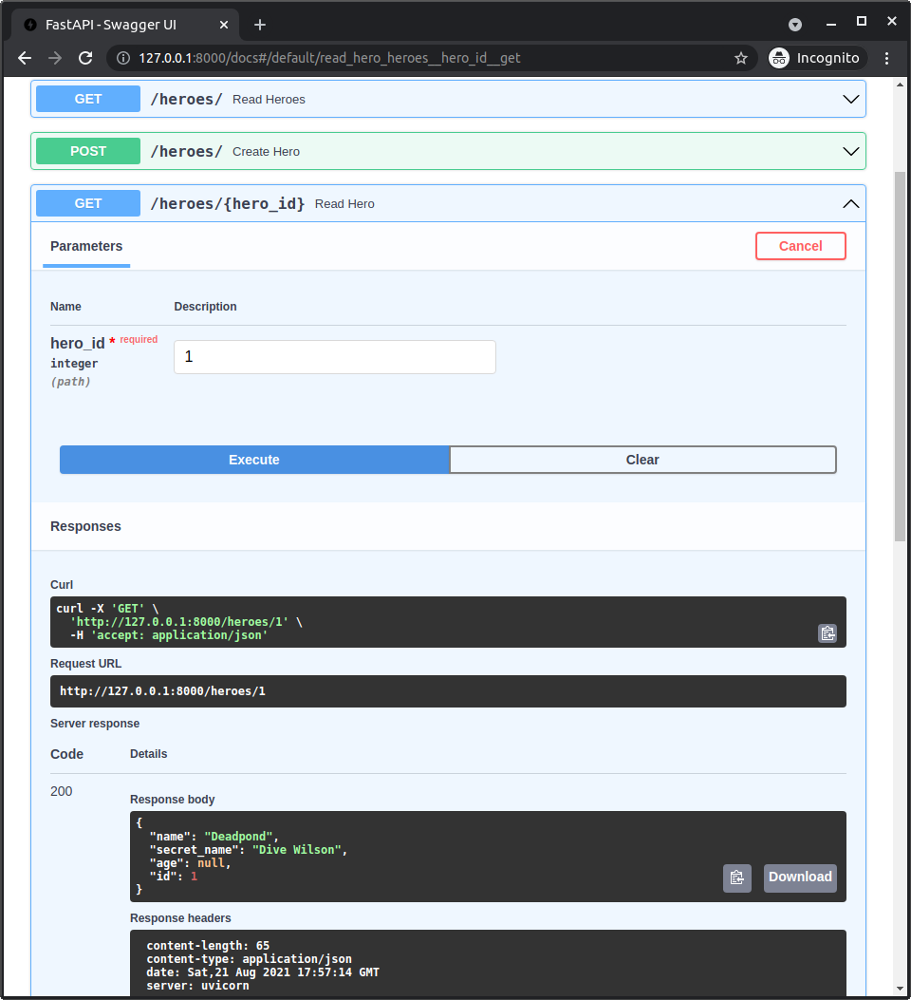

# 使用 FastAPI 读取单个模型

现在我们向 **FastAPI** 应用程序添加一个 *路径操作* 来读取单个模型。

## 读取单个英雄的路径操作

我们将添加一个新的 *路径操作* 来读取单个英雄。

我们希望根据 `id` 获取英雄，所以我们将使用一个 **路径参数** `hero_id`。

/// 信息

如果你需要刷新一下 *路径参数* 的工作原理，包括它们的数据验证，请查阅 <a href="https://fastapi.tiangolo.com/tutorial/path-params/" class="external-link" target="_blank">FastAPI 文档中的路径参数部分</a>。

///

//// tab | Python 3.10+

```Python hl_lines="6"
{!./docs_src/tutorial/fastapi/read_one/tutorial001_py310.py[ln:1-2]!}

# 这里的代码省略 👈

{!./docs_src/tutorial/fastapi/read_one/tutorial001_py310.py[ln:59-65]!}
```

////

//// tab | Python 3.9+

```Python hl_lines="8"
{!./docs_src/tutorial/fastapi/read_one/tutorial001_py39.py[ln:1-4]!}

# 这里的代码省略 👈

{!./docs_src/tutorial/fastapi/read_one/tutorial001_py39.py[ln:61-67]!}
```

////

//// tab | Python 3.7+

```Python hl_lines="8"
{!./docs_src/tutorial/fastapi/read_one/tutorial001.py[ln:1-4]!}

# 这里的代码省略 👈

{!./docs_src/tutorial/fastapi/read_one/tutorial001.py[ln:61-67]!}
```

////

/// details | 👀 完整文件预览

//// tab | Python 3.10+

```Python
{!./docs_src/tutorial/fastapi/read_one/tutorial001_py310.py!}
```

////

//// tab | Python 3.9+

```Python
{!./docs_src/tutorial/fastapi/read_one/tutorial001_py39.py!}
```

////

//// tab | Python 3.7+

```Python
{!./docs_src/tutorial/fastapi/read_one/tutorial001.py!}
```

////

///

例如，要获取 ID 为 `2` 的英雄，我们会发送一个 `GET` 请求到：

```
/heroes/2
```

## 错误处理

然后，因为 FastAPI 已经确保 `hero_id` 是一个有效的整数，所以我们可以直接使用它与 `Hero.get()` 来尝试根据该 ID 获取一个英雄。

但如果该整数不是数据库中任何英雄的 ID，它将找不到任何内容，并且变量 `hero` 将是 `None`。

因此，我们需要在 `if` 语句中检查它，如果是 `None`，则抛出一个 `HTTPException`，并返回 `404` 状态码。

为了使用它，我们首先从 `fastapi` 导入 `HTTPException`。

这将让客户端知道他们可能在请求时犯了一个错误，请求了一个不存在于数据库中的英雄。

//// tab | Python 3.10+

```Python hl_lines="1  9-11"
{!./docs_src/tutorial/fastapi/read_one/tutorial001_py310.py[ln:1-2]!}

# Code here omitted 👈

{!./docs_src/tutorial/fastapi/read_one/tutorial001_py310.py[ln:59-65]!}
```

////

//// tab | Python 3.9+

```Python hl_lines="3  11-13"
{!./docs_src/tutorial/fastapi/read_one/tutorial001_py39.py[ln:1-4]!}

# Code here omitted 👈

{!./docs_src/tutorial/fastapi/read_one/tutorial001_py39.py[ln:61-67]!}
```

////

//// tab | Python 3.7+

```Python hl_lines="3  11-13"
{!./docs_src/tutorial/fastapi/read_one/tutorial001.py[ln:1-4]!}

# Code here omitted 👈

{!./docs_src/tutorial/fastapi/read_one/tutorial001.py[ln:61-67]!}
```

////

/// details | 👀 完整文件预览

//// tab | Python 3.10+

```Python
{!./docs_src/tutorial/fastapi/read_one/tutorial001_py310.py!}
```

////

//// tab | Python 3.9+

```Python
{!./docs_src/tutorial/fastapi/read_one/tutorial001_py39.py!}
```

////

//// tab | Python 3.7+

```Python
{!./docs_src/tutorial/fastapi/read_one/tutorial001.py!}
```

////

///

## 返回英雄

然后，如果该英雄存在，我们就返回它。

由于我们使用了 `response_model` 并指定了 `HeroPublic`，所以它会被验证、文档化等。

//// tab | Python 3.10+

```Python hl_lines="6  12"
{!./docs_src/tutorial/fastapi/read_one/tutorial001_py310.py[ln:1-2]!}

# 这里的代码省略 👈

{!./docs_src/tutorial/fastapi/read_one/tutorial001_py310.py[ln:59-65]!}
```

////

//// tab | Python 3.9+

```Python hl_lines="8  14"
{!./docs_src/tutorial/fastapi/read_one/tutorial001_py39.py[ln:1-4]!}

# 这里的代码省略 👈

{!./docs_src/tutorial/fastapi/read_one/tutorial001_py39.py[ln:61-67]!}
```

////

//// tab | Python 3.7+

```Python hl_lines="8  14"
{!./docs_src/tutorial/fastapi/read_one/tutorial001.py[ln:1-4]!}

# 这里的代码省略 👈

{!./docs_src/tutorial/fastapi/read_one/tutorial001.py[ln:61-67]!}
```

////

/// details | 👀 完整文件预览

//// tab | Python 3.10+

```Python
{!./docs_src/tutorial/fastapi/read_one/tutorial001_py310.py!}
```

////

//// tab | Python 3.9+

```Python
{!./docs_src/tutorial/fastapi/read_one/tutorial001_py39.py!}
```

////

//// tab | Python 3.7+

```Python
{!./docs_src/tutorial/fastapi/read_one/tutorial001.py!}
```

////

///

## 查看文档 UI

然后我们可以进入文档 UI，查看新的 *路径操作*。



## 总结

你可以结合 **FastAPI** 的功能，如自动路径参数验证，通过 ID 获取模型。
