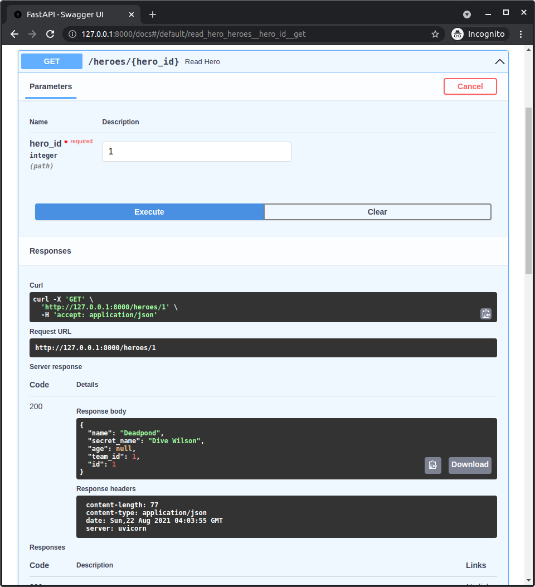
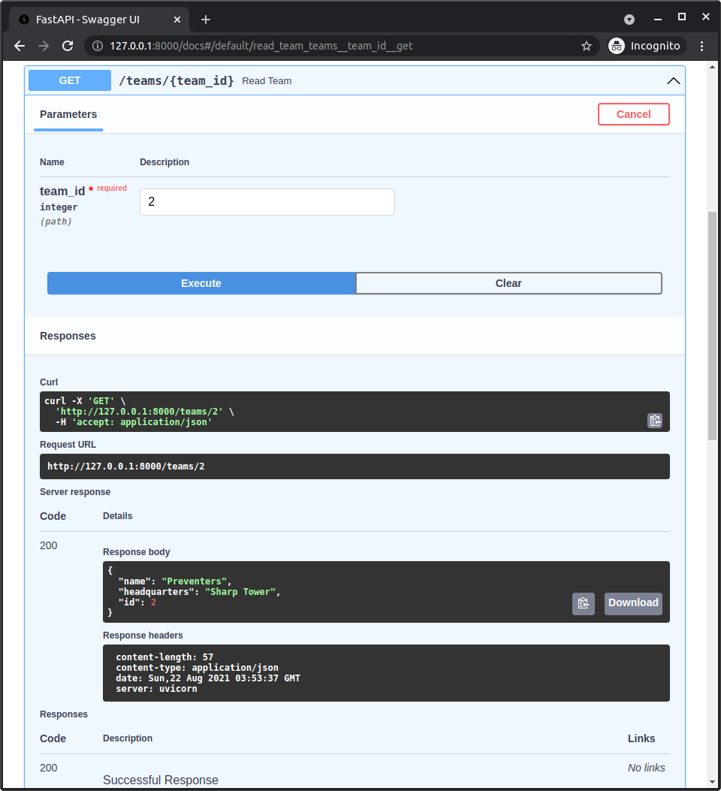
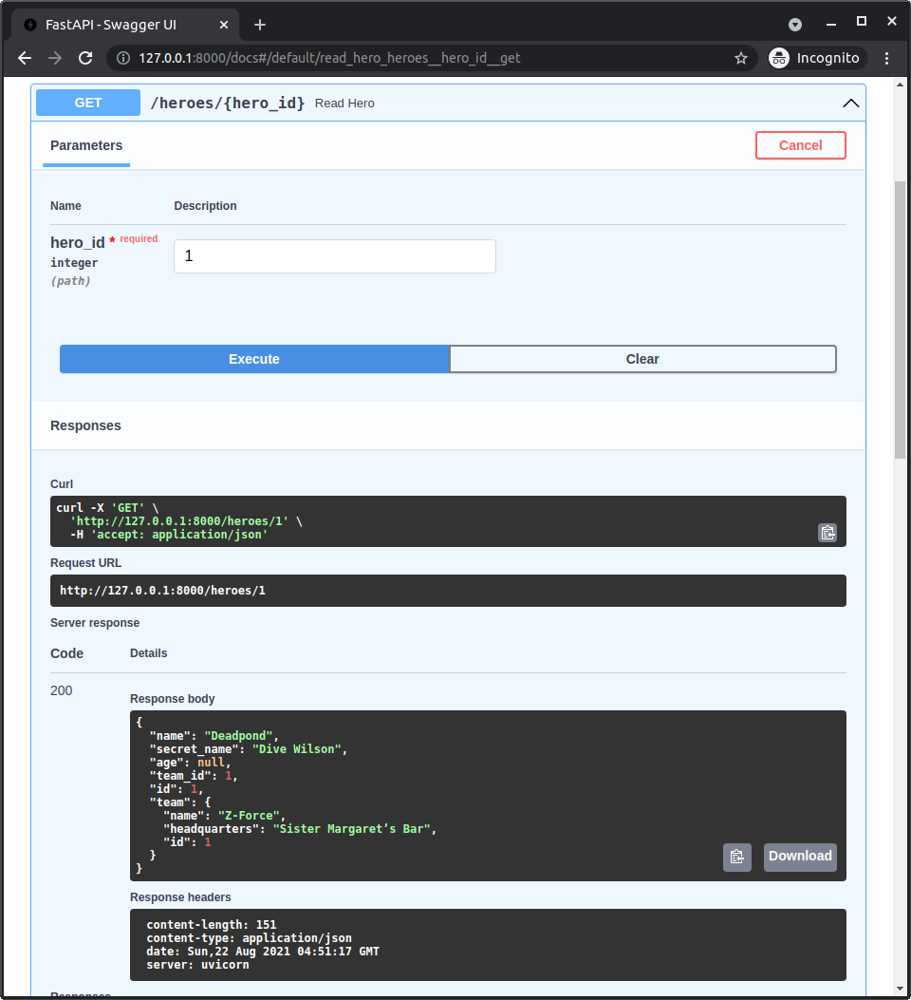
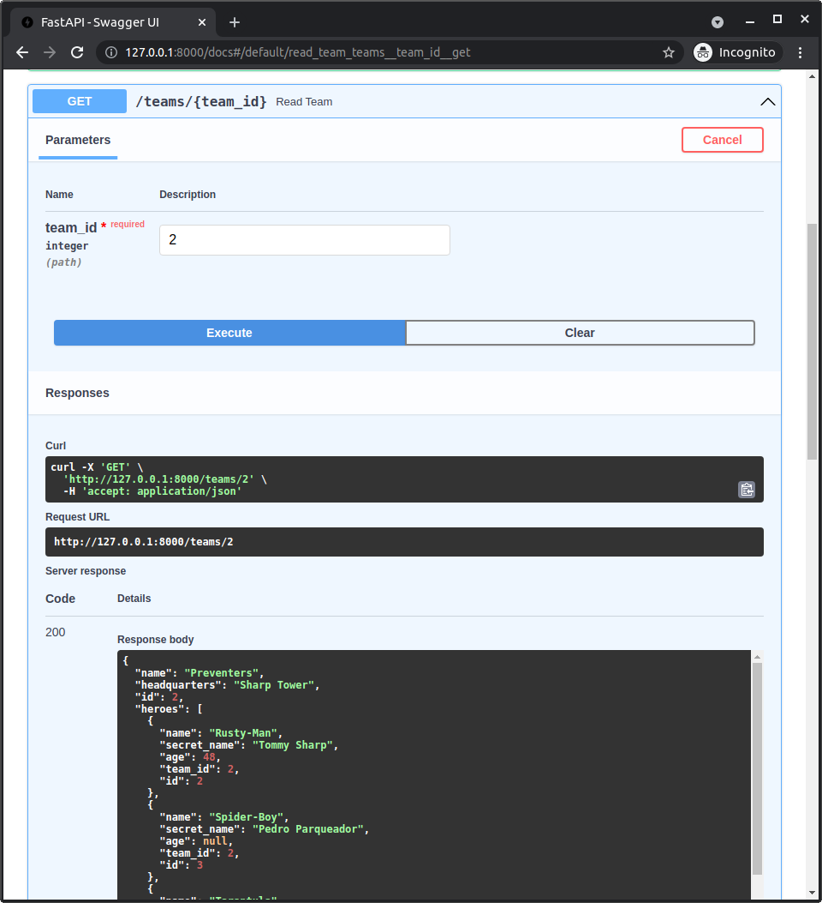

# FastAPI 中具有关系的模型

如果我们现在通过 ID 查询单个 **英雄**，我们会得到包含团队 ID 的英雄数据。

但是我们并没有得到任何关于该团队的具体信息：



我们得到的响应是：

```JSON hl_lines="5"
{
    "name": "Deadpond",
    "secret_name": "Dive Wilson",
    "age": null,
    "team_id": 1,
    "id": 1
}
```

同样地，如果我们通过 ID 查询 **团队**，我们会得到团队数据，但没有关于这个团队英雄的任何信息：



我们得到的响应是：

```JSON
{
    "name": "Preventers",
    "headquarters": "Sharp Tower",
    "id": 2
}
```

...但是没有关于英雄的信息。

让我们来更新一下。🤓

## 为什么我们没有获取更多数据？

首先，为什么我们没有获取每个英雄和每个团队的相关数据呢？

这是因为我们在声明 `HeroPublic` 时只包括了 `HeroBase` 的基本字段以及 `id`，但没有包括 `team` 作为 **关系属性**。

同样地，我们在声明 `TeamPublic` 时只包括了 `TeamBase` 的基本字段和 `id`，但没有包括 `heroes` 作为 **关系属性**。

//// tab | Python 3.10+

```Python hl_lines="3-5  9-10  14-19  23-24"
# 上面的代码省略 👆

{!./docs_src/tutorial/fastapi/teams/tutorial001_py310.py[ln:5-7]!}

# 这里的代码省略 👈

{!./docs_src/tutorial/fastapi/teams/tutorial001_py310.py[ln:20-21]!}

# 这里的代码省略 👈

{!./docs_src/tutorial/fastapi/teams/tutorial001_py310.py[ln:29-34]!}

# 这里的代码省略 👈

{!./docs_src/tutorial/fastapi/teams/tutorial001_py310.py[ln:43-44]!}

# 下面的代码省略 👇
```

////

//// tab | Python 3.9+

```Python hl_lines="3-5  9-10  14-19  23-24"
# 上面的代码省略 👆

{!./docs_src/tutorial/fastapi/teams/tutorial001_py39.py[ln:7-9]!}

# 这里的代码省略 👈

{!./docs_src/tutorial/fastapi/teams/tutorial001_py39.py[ln:22-23]!}

# 这里的代码省略 👈

{!./docs_src/tutorial/fastapi/teams/tutorial001_py39.py[ln:31-36]!}

# 这里的代码省略 👈

{!./docs_src/tutorial/fastapi/teams/tutorial001_py39.py[ln:45-46]!}

# 下面的代码省略 👇
```

////

//// tab | Python 3.7+

```Python hl_lines="3-5  9-10  14-19  23-24"
# 上面的代码省略 👆

{!./docs_src/tutorial/fastapi/teams/tutorial001.py[ln:7-9]!}

# 这里的代码省略 👈

{!./docs_src/tutorial/fastapi/teams/tutorial001.py[ln:22-23]!}

# 这里的代码省略 👈

{!./docs_src/tutorial/fastapi/teams/tutorial001.py[ln:31-36]!}

# 这里的代码省略 👈

{!./docs_src/tutorial/fastapi/teams/tutorial001.py[ln:45-46]!}

# 下面的代码省略 👇
```

////

/// details | 👀 完整文件预览

//// tab | Python 3.10+

```Python
{!./docs_src/tutorial/fastapi/teams/tutorial001_py310.py!}
```

////

//// tab | Python 3.9+

```Python
{!./docs_src/tutorial/fastapi/teams/tutorial001_py39.py!}
```

////

//// tab | Python 3.7+

```Python
{!./docs_src/tutorial/fastapi/teams/tutorial001.py!}
```

////

///

现在，记住 FastAPI 使用 `response_model` 来验证和 **过滤** 响应数据，对吧？

在这种情况下，我们使用了 `response_model=TeamPublic` 和 `response_model=HeroPublic`，因此 FastAPI 会使用它们来过滤响应数据，即使我们返回的是包含 **关系属性** 的 **表模型**：

//// tab | Python 3.10+

```Python hl_lines="3  8  12  17"
# 上面的代码省略 👆

{!./docs_src/tutorial/fastapi/teams/tutorial001_py310.py[ln:102-107]!}

# 这里的代码省略 👈

{!./docs_src/tutorial/fastapi/teams/tutorial001_py310.py[ln:156-161]!}

# 下面的代码省略 👇
```

////

//// tab | Python 3.9+

```Python hl_lines="3  8  12  17"
# 上面的代码省略 👆

{!./docs_src/tutorial/fastapi/teams/tutorial001_py39.py[ln:104-109]!}

# 这里的代码省略 👈

{!./docs_src/tutorial/fastapi/teams/tutorial001_py39.py[ln:158-163]!}

# 下面的代码省略 👇
```

////

//// tab | Python 3.7+

```Python hl_lines="3  8  12  17"
# 上面的代码省略 👆

{!./docs_src/tutorial/fastapi/teams/tutorial001.py[ln:104-109]!}

# 这里的代码省略 👈

{!./docs_src/tutorial/fastapi/teams/tutorial001.py[ln:158-163]!}

# 下面的代码省略 👇
```

////

/// details | 👀 完整文件预览

//// tab | Python 3.10+

```Python
{!./docs_src/tutorial/fastapi/teams/tutorial001_py310.py!}
```

////

//// tab | Python 3.9+

```Python
{!./docs_src/tutorial/fastapi/teams/tutorial001_py39.py!}
```

////

//// tab | Python 3.7+

```Python
{!./docs_src/tutorial/fastapi/teams/tutorial001.py!}
```

////

///

## 不包含所有数据

现在让我们暂停一下，思考一下这个问题。

我们不能简单地包含 *所有* 数据，包括所有的内部关系，因为每个 **英雄** 都有一个 `team` 属性指向他们的团队，而这个 **团队** 也有一个 `heroes` 属性包含该团队的所有 **英雄**，包括这个英雄本身。

如果我们尝试包含所有内容，服务器应用可能会 **崩溃**，因为它会尝试提取 **无限数据**，不断地重复遍历相同的英雄和团队，像这样：

```JSON hl_lines="2  13  24  34"
{
    "name": "Rusty-Man",
    "secret_name": "Tommy Sharp",
    "age": 48,
    "team_id": 1,
    "id": 1,
    "team": {
        "name": "Preventers",
        "headquarters": "Sharp Tower",
        "id": 2,
        "heroes": [
            {
                "name": "Rusty-Man",
                "secret_name": "Tommy Sharp",
                "age": 48,
                "team_id": 1,
                "id": 1,
                "team": {
                    "name": "Preventers",
                    "headquarters": "Sharp Tower",
                    "id": 2,
                    "heroes": [
                        {
                            "name": "Rusty-Man",
                            "secret_name": "Tommy Sharp",
                            "age": 48,
                            "team_id": 1,
                            "id": 1,
                            "team": {
                                "name": "Preventers",
                                "headquarters": "Sharp Tower",
                                "id": 2,
                                "heroes": [
                                    ...这里是无限数据... 😱
                                ]
                            }
                        }
                    ]
                }
            }
        ]
    }
}
```

正如你所看到的，在这个例子中，我们会得到英雄 **Rusty-Man**，然后从这个英雄我们会得到团队 **Preventers**，接着从这个团队我们会得到它的英雄，当然，包括 **Rusty-Man**... 😱

然后我们又开始了，最终服务器会因为尝试获取所有数据而 **崩溃**，出现 `"Maximum recursion error"`，我们甚至不会得到像上面那样的响应。

因此，我们需要谨慎选择在什么情况下包含数据，在什么情况下不包含数据。

## 应该包含哪些数据？

这是一个依赖于 **每个应用程序** 的决策。

在我们的情况下，假设如果我们获取一个 **英雄列表**，我们不想在每个英雄中包含他们各自的团队信息。

如果我们获取一个 **团队列表**，我们也不希望获取每个团队的英雄列表。

但如果我们获取一个 **单个英雄**，我们希望包含团队数据（但不包括团队的英雄）。

如果我们获取一个 **单个团队**，我们希望包含英雄列表（但不包括每个英雄的团队）。

让我们添加几个新的 **数据模型**，来声明这些数据，以便在这两个特定的 *路径操作* 中使用它们。

## 具有关系的模型

我们将添加 `HeroPublicWithTeam` 和 `TeamPublicWithHeroes` 模型。

我们将在 **其他模型之后** 添加它们，以便可以轻松引用之前的模型。

//// tab | Python 3.10+

```Python hl_lines="3-4  7-8"
# 上面的代码省略 👆

{!./docs_src/tutorial/fastapi/relationships/tutorial001_py310.py[ln:59-64]!}

# 下面的代码省略 👇
```

////

//// tab | Python 3.9+

```Python hl_lines="3-4  7-8"
# 上面的代码省略 👆

{!./docs_src/tutorial/fastapi/relationships/tutorial001_py39.py[ln:61-66]!}

# 下面的代码省略 👇
```

////

//// tab | Python 3.7+

```Python hl_lines="3-4  7-8"
# 上面的代码省略 👆

{!./docs_src/tutorial/fastapi/relationships/tutorial001.py[ln:61-66]!}

# 下面的代码省略 👇
```

////

/// details | 👀 完整文件预览

//// tab | Python 3.10+

```Python
{!./docs_src/tutorial/fastapi/relationships/tutorial001_py310.py!}
```

////

//// tab | Python 3.9+

```Python
{!./docs_src/tutorial/fastapi/relationships/tutorial001_py39.py!}
```

////

//// tab | Python 3.7+

```Python
{!./docs_src/tutorial/fastapi/relationships/tutorial001.py!}
```

////

///

这两个模型的代码非常 **简单**，但实际上这里有很多内容发生。让我们来看看。

### 继承与类型注解

`HeroPublicWithTeam` **继承** 自 `HeroPublic`，这意味着它将拥有 `HeroPublic` 中声明的 **用于读取的常规字段**，包括必需的 `id` 字段。

然后，它添加了一个 **新字段** `team`，该字段可能是 `None`，并且被声明为类型 `TeamPublic`，该类型包含读取团队的基础字段。

对于 `TeamPublicWithHeroes`，我们做了相同的操作，它 **继承** 自 `TeamPublic`，并声明了 **新字段** `heroes`，该字段是 `HeroPublic` 类型的列表。

### 没有关系属性的数据模型

现在，请注意这些新字段 `team` 和 `heroes` 并未使用 `Relationship()` 声明，因为这些并不是 **表模型**，它们无法像数据库中的模型那样通过魔术方法访问数据。

相反，这些只是 **数据模型**，用来告诉 FastAPI **应该从哪些属性** 获取数据，以及 **从这些属性中获取哪些数据**。

### 对其他模型的引用

此外，请注意字段 `team` 并未声明为 `TeamPublicWithHeroes`，因为那样会再次导致数据的无限递归。相反，我们使用了普通的 `TeamPublic` 模型来声明它。

对于 `TeamPublicWithHeroes` 也是一样，新的字段 `heroes` 使用的是 `HeroPublic` 模型，以便仅获取每个英雄的数据。

这也意味着，尽管我们有了这两个新模型，**我们仍然需要之前的模型**，即 `HeroPublic` 和 `TeamPublic`，因为我们需要在这里引用它们（并且在其余的 *路径操作* 中也在使用它们）。

## 更新路径操作

现在我们可以更新 *路径操作*，使用新模型。

这将告诉 **FastAPI** 从 *路径操作函数* 返回的对象（一个 **表模型**）中 **访问附加属性**，并提取它们的数据。

对于英雄来说，这会告诉 FastAPI 也提取 `team`。对于团队来说，也会提取 `heroes` 列表。

//// tab | Python 3.10+

```Python hl_lines="3  8  12  17"
# 上面的代码省略 👆

{!./docs_src/tutorial/fastapi/relationships/tutorial001_py310.py[ln:111-116]!}

# 这里的代码省略 👈

{!./docs_src/tutorial/fastapi/relationships/tutorial001_py310.py[ln:165-170]!}

# 下面的代码省略 👇
```

////

//// tab | Python 3.9+

```Python hl_lines="3  8  12  17"
# 上面的代码省略 👆

{!./docs_src/tutorial/fastapi/relationships/tutorial001_py39.py[ln:113-118]!}

# 这里的代码省略 👈

{!./docs_src/tutorial/fastapi/relationships/tutorial001_py39.py[ln:167-172]!}

# 下面的代码省略 👇
```

////

//// tab | Python 3.7+

```Python hl_lines="3  8  12  17"
# 上面的代码省略 👆

{!./docs_src/tutorial/fastapi/relationships/tutorial001.py[ln:113-118]!}

# 这里的代码省略 👈

{!./docs_src/tutorial/fastapi/relationships/tutorial001.py[ln:167-172]!}

# 下面的代码省略 👇
```

////

/// details | 👀 完整文件预览

//// tab | Python 3.10+

```Python
{!./docs_src/tutorial/fastapi/relationships/tutorial001_py310.py!}
```

////

//// tab | Python 3.9+

```Python
{!./docs_src/tutorial/fastapi/relationships/tutorial001_py39.py!}
```

////

//// tab | Python 3.7+

```Python
{!./docs_src/tutorial/fastapi/relationships/tutorial001.py!}
```

////

///

## 在文档 UI 中查看

现在我们再次在 **文档 UI** 中尝试一下。

我们再试一次获取 ID 为 `1` 的 **英雄**：



现在我们得到了 **团队** 数据：

```JSON hl_lines="7-11"
{
    "name": "Deadpond",
    "secret_name": "Dive Wilson",
    "age": null,
    "team_id": 1,
    "id": 1,
    "team": {
        "name": "Z-Force",
        "headquarters": "Sister Margaret's Bar",
        "id": 1
    }
}
```

现在，如果我们获取 ID 为 `2` 的 **团队**：



现在我们得到了 **英雄** 的列表：

```JSON hl_lines="5-41"
{
    "name": "Preventers",
    "headquarters": "Sharp Tower",
    "id": 2,
    "heroes": [
        {
            "name": "Rusty-Man",
            "secret_name": "Tommy Sharp",
            "age": 48,
            "team_id": 2,
            "id": 2
        },
        {
            "name": "Spider-Boy",
            "secret_name": "Pedro Parqueador",
            "age": null,
            "team_id": 2,
            "id": 3
        },
        {
            "name": "Tarantula",
            "secret_name": "Natalia Roman-on",
            "age": 32,
            "team_id": 2,
            "id": 6
        },
        {
            "name": "Dr. Weird",
            "secret_name": "Steve Weird",
            "age": 36,
            "team_id": 2,
            "id": 7
        },
        {
            "name": "Captain North America",
            "secret_name": "Esteban Rogelios",
            "age": 93,
            "team_id": 2,
            "id": 8
        }
    ]
}
```

## 总结

通过声明额外的 **数据模型**，我们可以告诉 FastAPI 在响应中返回哪些数据，即使我们返回的是 **表模型**。

在这里，我们几乎 **不需要改变 FastAPI 应用** 的代码，但当然，也会有一些情况，在这些情况下你需要在 *路径操作函数* 中获取并以不同的方式处理数据，然后再返回它。

但即便在这些情况下，你仍然可以定义 **数据模型** 用于 `response_model`，以告诉 FastAPI 如何验证和过滤数据。

到此为止，你已经拥有了一个非常强大的 API，能够结合 **SQLModel** 和 **FastAPI** 处理 SQL 数据库中的数据，并实现了 **最佳实践**，例如数据验证、转换、过滤和文档生成。✨

在下一章，我将告诉你如何使用 FastAPI 和 SQLModel 为你的应用实现自动化 **测试**。✅
