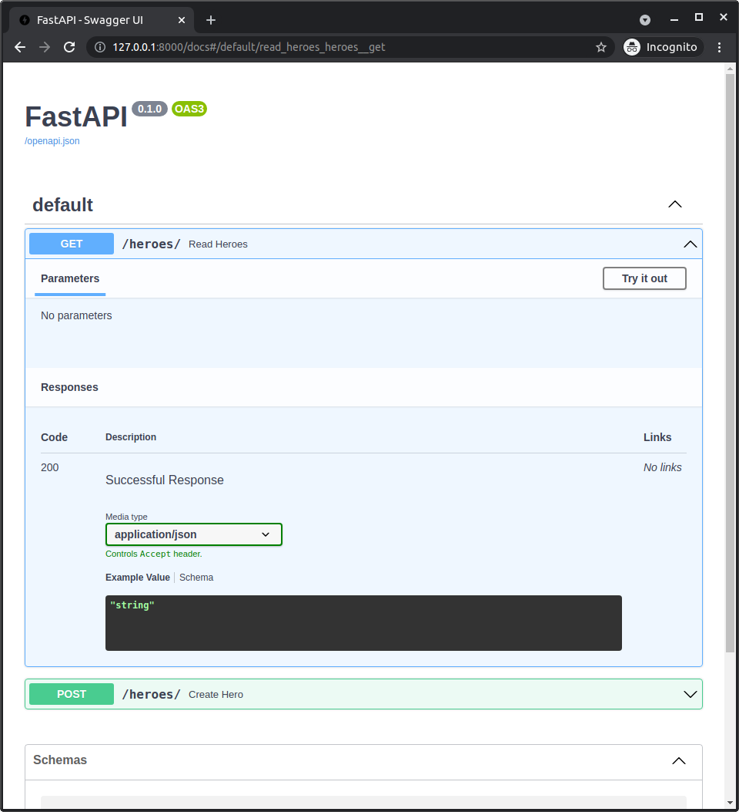
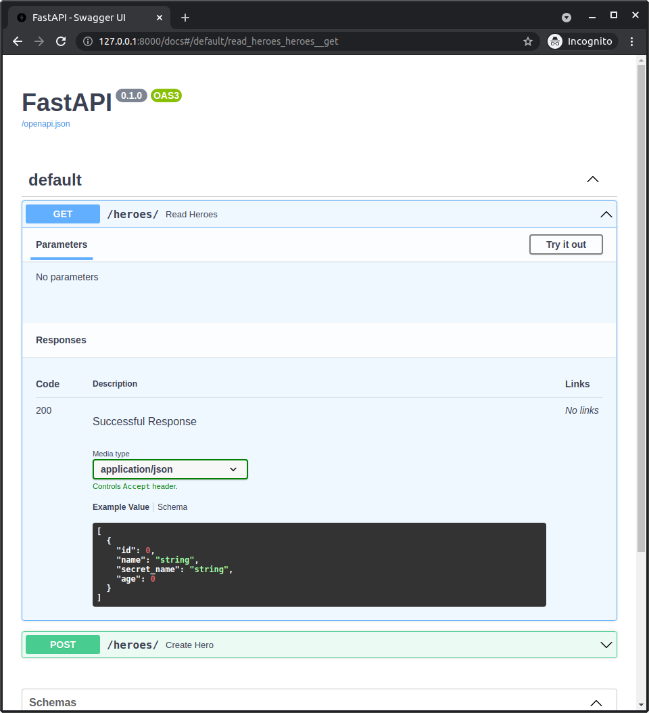

# FastAPI 响应模型与 SQLModel

现在，我将向你展示如何使用 FastAPI 的 `response_model` 与 **SQLModel** 配合使用。

## 交互式 API 文档

到目前为止，我们使用的代码，API 文档已经知道客户端需要发送的数据：


这个交互式文档 UI 是由 <a href="https://github.com/swagger-api/swagger-ui" class="external-link" target="_blank">Swagger UI</a> 提供支持的，Swagger UI 的作用是读取一个大型的 JSON 内容，这个 JSON 定义了 API 和所有数据架构（数据结构），使用标准的 <a href="https://github.com/OAI/OpenAPI-Specification/blob/main/versions/3.0.3.md" class="external-link" target="_blank">OpenAPI</a>，并将其显示在这个漂亮的 <abbr title="用户界面">UI</abbr> 中。

FastAPI 会自动 **生成 OpenAPI**，供 Swagger UI 读取。

它根据你编写的代码生成这些内容，利用 Pydantic 模型（在本例中是 **SQLModel** 模型）和类型注解来了解 API 处理的数据架构。

## 响应数据

但是，到目前为止，API 文档 UI 并不知道我们的应用程序返回的 *响应* 的架构。

你可以看到，有一个可能的 "成功响应" 和代码 `200`，但是我们并不知道响应数据的具体样子。



现在，我们只告诉了 FastAPI 我们希望接收的数据，但还没有告诉它我们希望发送回的数据。

让我们现在做这个改变。🤓

## 使用 `response_model`

我们可以使用 `response_model` 来告诉 FastAPI 我们希望发送回的数据的架构。

例如，我们可以传递相同的 `Hero` **SQLModel** 类（因为它也是一个 Pydantic 模型）：

//// tab | Python 3.10+

```Python hl_lines="3"
# Code above omitted 👆

{!./docs_src/tutorial/fastapi/response_model/tutorial001_py310.py[ln:31-37]!}

# Code below omitted 👇
```

////

//// tab | Python 3.9+

```Python hl_lines="3"
# Code above omitted 👆

{!./docs_src/tutorial/fastapi/response_model/tutorial001_py39.py[ln:33-39]!}

# Code below omitted 👇
```

////

//// tab | Python 3.7+

```Python hl_lines="3"
# Code above omitted 👆

{!./docs_src/tutorial/fastapi/response_model/tutorial001.py[ln:33-39]!}

# Code below omitted 👇
```

////

/// details | 👀 完整文件预览

//// tab | Python 3.10+

```Python
{!./docs_src/tutorial/fastapi/response_model/tutorial001_py310.py!}
```

////

//// tab | Python 3.9+

```Python
{!./docs_src/tutorial/fastapi/response_model/tutorial001_py39.py!}
```

////

//// tab | Python 3.7+

```Python
{!./docs_src/tutorial/fastapi/response_model/tutorial001.py!}
```

////

///

## 在 `response_model` 中列出英雄

我们还可以使用其他类型注解，就像我们在 Pydantic 字段中使用的那样。例如，我们可以传递一个 `Hero` 对象的列表。

首先，我们从 `typing` 导入 `List`，然后在 `response_model` 中声明 `List[Hero]`：

//// tab | Python 3.10+

```Python hl_lines="3"

# Code here omitted 👈

{!./docs_src/tutorial/fastapi/response_model/tutorial001_py310.py[ln:40-44]!}

# Code below omitted 👇
```

////

//// tab | Python 3.9+

```Python hl_lines="3"

# Code here omitted 👈

{!./docs_src/tutorial/fastapi/response_model/tutorial001_py39.py[ln:42-46]!}

# Code below omitted 👇
```

////

//// tab | Python 3.7+

```Python hl_lines="1  5"
{!./docs_src/tutorial/fastapi/response_model/tutorial001.py[ln:1]!}

# Code here omitted 👈

{!./docs_src/tutorial/fastapi/response_model/tutorial001.py[ln:42-46]!}

# Code below omitted 👇
```

////

/// details | 👀 完整文件预览

//// tab | Python 3.10+

```Python
{!./docs_src/tutorial/fastapi/response_model/tutorial001_py310.py!}
```

////

//// tab | Python 3.9+

```Python
{!./docs_src/tutorial/fastapi/response_model/tutorial001_py39.py!}
```

////

//// tab | Python 3.7+

```Python
{!./docs_src/tutorial/fastapi/response_model/tutorial001.py!}
```

////

///

## FastAPI 和 Response Model

FastAPI 会使用这个 `response_model` 进行数据验证和响应数据过滤。

这就像是我们应用程序和客户端之间的契约。

你可以在 <a href="https://fastapi.tiangolo.com/tutorial/response-model/" class="external-link" target="_blank">FastAPI 文档关于 `response_model` 的部分</a> 中阅读更多内容。

## 新的 API 文档 UI

现在我们可以返回到文档 UI，看到它们已经显示了我们将接收到的响应的 schema。




客户端将知道他们应该期待什么数据。

## 自动化客户端

使用 `response_model` 的最大好处之一就是它会显示在 API 文档 UI 中。

但它还有其他优点，比如 FastAPI 会使用这个模型自动进行 <a href="https://fastapi.tiangolo.com/tutorial/response-model/" class="external-link" target="_blank">数据验证和响应数据过滤</a>。

此外，由于 schema 是使用标准定义的，有许多工具可以利用这一点。

例如，客户端生成器可以自动生成与您的 API 交互所需的代码，支持多种语言。

/// tip

如果你对这些标准感兴趣，FastAPI 会生成 OpenAPI，而 OpenAPI 内部使用的是 JSON Schema。

你可以在 <a href="https://fastapi.tiangolo.com/tutorial/first-steps/#openapi" class="external-link" target="_blank">FastAPI 文档 - 第一步</a> 中阅读所有相关内容。

///

## 总结

使用 `response_model` 告诉 FastAPI 你希望发送回的数据的 schema，从而拥有强大的数据 API。 😎
