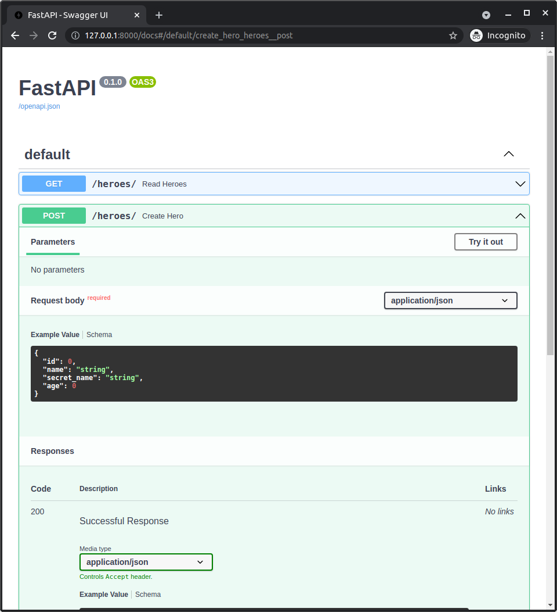
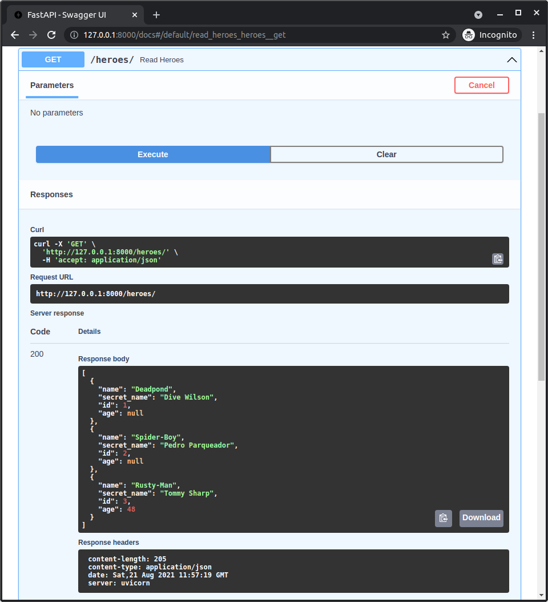
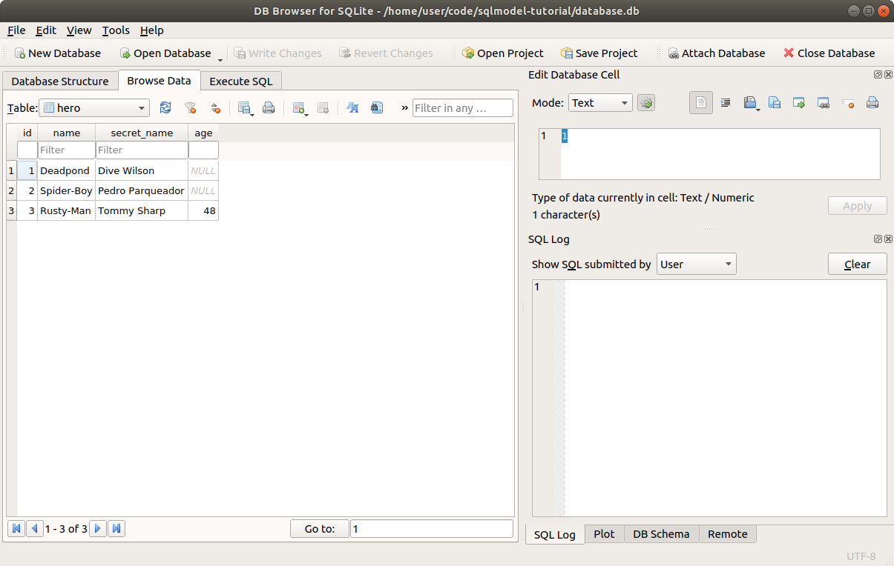

# 使用 FastAPI 构建简单的英雄 API

让我们从使用 **FastAPI** 构建一个简单的英雄 Web API 开始。✨

## 安装 **FastAPI**

第一步是安装 FastAPI。

FastAPI 是用于创建 **Web API** 的框架。

但我们还需要另一个程序来运行它，称为 "**服务器**"。我们将使用 **Uvicorn** 来实现这一点，并且我们将使用它的 *标准* 依赖项来安装 Uvicorn。

然后安装 FastAPI。

确保你创建了一个 [虚拟环境](../../virtual-environments.md){.internal-link target=_blank}，并激活它，然后用以下命令安装它们，例如：

<div class="termy">

```console
$ pip install fastapi "uvicorn[standard]"

---> 100%
```

</div>

## **SQLModel** 代码 - 模型与引擎

现在，让我们开始编写 SQLModel 代码。

我们将从 **最简单的版本** 开始，只处理英雄（还没有团队）。

这几乎与我们之前在示例中看到的代码相同：

//// tab | Python 3.10+

```Python hl_lines="18-19"

# 这里稍后会有一行 FastAPI 导入 👈
{!./docs_src/tutorial/fastapi/simple_hero_api/tutorial001_py310.py[ln:2]!}

{!./docs_src/tutorial/fastapi/simple_hero_api/tutorial001_py310.py[ln:5-20]!}

# 下面的代码省略 👇
```

////

//// tab | Python 3.7+

```Python hl_lines="20-21"
{!./docs_src/tutorial/fastapi/simple_hero_api/tutorial001.py[ln:1]!}

# 这里稍后会有一行 FastAPI 导入 👈
{!./docs_src/tutorial/fastapi/simple_hero_api/tutorial001.py[ln:4]!}

{!./docs_src/tutorial/fastapi/simple_hero_api/tutorial001.py[ln:7-22]!}

# 下面的代码省略 👇
```

////

/// details | 👀 完整文件预览

//// tab | Python 3.10+

```Python
{!./docs_src/tutorial/fastapi/simple_hero_api/tutorial001_py310.py!}
```

////

//// tab | Python 3.7+

```Python
{!./docs_src/tutorial/fastapi/simple_hero_api/tutorial001.py!}
```

////

///

这里与我们之前使用的代码唯一的不同是 `connect_args` 中的 `check_same_thread`。

这是 SQLAlchemy 传递给负责与数据库通信的低级库的一个配置项。

`check_same_thread` 默认设置为 `True`，用于防止在某些简单情况下的误用。

但在这里，我们将确保不在多个请求之间共享相同的 **会话**，这也是避免该配置项所用的任何问题的 **最安全方法**。

我们还需要禁用它，因为在 **FastAPI** 中，每个请求可能会由多个交互的线程处理。

/// info

目前这些信息已经足够了，你可以在 <a href="https://fastapi.tiangolo.com/async/" class="external-link" target="_blank">FastAPI 的 `async` 和 `await` 文档</a> 中阅读更多内容。

关键点是，通过确保你 **不共享** 同一个 **会话** 处理多个请求，代码已经是安全的。

///

## **FastAPI** 应用

下一步是创建 **FastAPI** 应用。

我们将从 `fastapi` 导入 `FastAPI` 类。

然后创建一个 `app` 对象，它是该 `FastAPI` 类的一个实例：

//// tab | Python 3.10+

```Python hl_lines="1  6"
{!./docs_src/tutorial/fastapi/simple_hero_api/tutorial001_py310.py[ln:1-2]!}

# 这里省略了 SQLModel 代码 👈

{!./docs_src/tutorial/fastapi/simple_hero_api/tutorial001_py310.py[ln:23]!}

# 下面的代码省略 👇
```

////

//// tab | Python 3.7+

```Python hl_lines="3  8"
{!./docs_src/tutorial/fastapi/simple_hero_api/tutorial001.py[ln:1-4]!}

# 这里省略了 SQLModel 代码 👈

{!./docs_src/tutorial/fastapi/simple_hero_api/tutorial001.py[ln:25]!}

# 下面的代码省略 👇
```

////

/// details | 👀 完整文件预览

//// tab | Python 3.10+

```Python
{!./docs_src/tutorial/fastapi/simple_hero_api/tutorial001_py310.py!}
```

////

//// tab | Python 3.7+

```Python
{!./docs_src/tutorial/fastapi/simple_hero_api/tutorial001.py!}
```

////

///

## 在应用启动时创建数据库和表

我们希望确保在应用启动时，`create_tables` 函数会被调用，以便创建数据库和表。

这个函数只应该在启动时调用一次，而不是在每个请求之前调用，因此我们将它放在处理 `"startup"` 事件的函数中：

//// tab | Python 3.10+

```Python hl_lines="6-8"
# 上面的代码省略 👆

{!./docs_src/tutorial/fastapi/simple_hero_api/tutorial001_py310.py[ln:23-28]!}

# 下面的代码省略 👇
```

////

//// tab | Python 3.7+

```Python hl_lines="6-8"
# 上面的代码省略 👆

{!./docs_src/tutorial/fastapi/simple_hero_api/tutorial001.py[ln:25-30]!}

# 下面的代码省略 👇
```

////

/// details | 👀 完整文件预览

//// tab | Python 3.10+

```Python
{!./docs_src/tutorial/fastapi/simple_hero_api/tutorial001_py310.py!}
```

////

//// tab | Python 3.7+

```Python
{!./docs_src/tutorial/fastapi/simple_hero_api/tutorial001.py!}
```

////

///

## 创建英雄 *路径操作*

/// info

如果你需要复习一下 **路径操作**（一个具有特定 HTTP 操作的端点）是什么，以及如何在 FastAPI 中使用它，可以查看 <a href="https://fastapi.tiangolo.com/tutorial/first-steps/" class="external-link" target="_blank">FastAPI 入门文档</a>。

///

让我们创建一个 **路径操作** 代码，用于创建一个新的英雄。

当用户发送一个 `POST` **操作** 请求到 `/heroes/` **路径** 时，它将被调用：

//// tab | Python 3.10+

```Python hl_lines="11-12"
# 上面的代码省略 👆

{!./docs_src/tutorial/fastapi/simple_hero_api/tutorial001_py310.py[ln:23-37]!}

# 下面的代码省略 👇
```

////

//// tab | Python 3.7+

```Python hl_lines="11-12"
# 上面的代码省略 👆

{!./docs_src/tutorial/fastapi/simple_hero_api/tutorial001.py[ln:25-39]!}

# 下面的代码省略 👇
```

////

/// details | 👀 完整文件预览

//// tab | Python 3.10+

```Python
{!./docs_src/tutorial/fastapi/simple_hero_api/tutorial001_py310.py!}
```

////

//// tab | Python 3.7+

```Python
{!./docs_src/tutorial/fastapi/simple_hero_api/tutorial001.py!}
```

////

///

/// info

如果你需要复习一些概念，查看 FastAPI 文档：

* <a href="https://fastapi.tiangolo.com/tutorial/first-steps/" class="external-link" target="_blank">入门</a>
* <a href="https://fastapi.tiangolo.com/tutorial/path-params/" class="external-link" target="_blank">路径参数 - 数据验证和数据转换</a>
* <a href="https://fastapi.tiangolo.com/tutorial/body/" class="external-link" target="_blank">请求体</a>

///

## **SQLModel** 的优势

在这里，我们的 **SQLModel** 类模型既是 **SQLAlchemy** 模型，又是 **Pydantic** 模型的优势得以体现。✨

在这里，我们使用 **相同的** 类模型来定义我们的 API 接收到的 **请求体**。

由于 **FastAPI** 是基于 Pydantic 构建的，它将使用相同的模型（Pydantic 部分）来执行自动数据验证和 <abbr title="也叫序列化、数据封送">转换</abbr>，将 JSON 请求转换为实际的 `Hero` 类实例对象。

然后，由于这个 **SQLModel** 对象不仅是 **Pydantic** 模型实例，还是 **SQLAlchemy** 模型实例，我们可以直接在 **会话** 中使用它来创建数据库中的行。

因此，我们可以使用直观的标准 Python **类型注解**，并且不必为数据库模型和 API 数据模型重复大量代码。🎉

/// tip

我们稍后会进一步改进这个，但目前，它已经展示了 **SQLModel** 类同时作为 **SQLAlchemy** 模型和 **Pydantic** 模型的强大功能。

///

## 读取英雄 *路径操作*

现在让我们添加另一个 **路径操作** 来读取所有英雄：

//// tab | Python 3.10+

```Python hl_lines="20-24"
# 上面的代码省略 👆

{!./docs_src/tutorial/fastapi/simple_hero_api/tutorial001_py310.py[ln:23-44]!}
```

////

//// tab | Python 3.7+

```Python hl_lines="20-24"
# 上面的代码省略 👆

{!./docs_src/tutorial/fastapi/simple_hero_api/tutorial001.py[ln:25-46]!}
```

////

/// details | 👀 完整文件预览

//// tab | Python 3.10+

```Python
{!./docs_src/tutorial/fastapi/simple_hero_api/tutorial001_py310.py!}
```

////

//// tab | Python 3.7+

```Python
{!./docs_src/tutorial/fastapi/simple_hero_api/tutorial001.py!}
```

////

///

这非常直接。

当客户端发送一个 `GET` HTTP **操作** 请求到 `/heroes/` **路径** 时，我们运行这个函数，从数据库中获取英雄并返回它们。

## 每个请求一个会话

记住我们应该在每组操作中使用一个 SQLModel **会话**，如果需要其他不相关的操作时，应该使用不同的会话吗？

在这里它更加明显。

在大多数情况下，我们应该**每个请求一个会话**。

在某些孤立的情况下，我们可能希望在内部创建新的会话，因此**每个请求可能有多个会话**。

但是我们 **绝不希望在不同的请求之间共享同一个会话**。

在这个简单的示例中，我们只是在 **路径操作函数** 中手动创建新的会话。

在后续的示例中，我们将使用 <a href="https://fastapi.tiangolo.com/tutorial/dependencies/" class="external-link" target="_blank">FastAPI 依赖项</a> 来获取 **会话**，能够与其他依赖项共享并在测试期间替换它。🤓

## 运行 **FastAPI** 应用

现在我们准备运行 FastAPI 应用了。

将所有代码放入一个名为 `main.py` 的文件中。

然后用 **Uvicorn** 运行它：

<div class="termy">

```console
$ uvicorn main:app

<span style="color: green;">INFO</span>:     Uvicorn running on http://127.0.0.1:8000 (Press CTRL+C to quit)
<span style="color: green;">INFO</span>:     Started reloader process [28720]
<span style="color: green;">INFO</span>:     Started server process [28722]
<span style="color: green;">INFO</span>:     Waiting for application startup.
<span style="color: green;">INFO</span>:     Application startup complete.
```

</div>

/// info

命令 `uvicorn main:app` 的含义是：

* `main`：指的是 `main.py` 文件（Python "模块"）。
* `app`：指的是在 `main.py` 中通过 `app = FastAPI()` 这一行创建的对象。

### Uvicorn `--reload`

在开发过程中（仅在开发过程中），你还可以为 Uvicorn 添加 `--reload` 选项。

它将在你每次修改代码时重新启动服务器，这样你就能更快地开发。🤓

<div class="termy">

```console
$ uvicorn main:app --reload

<span style="color: green;">INFO</span>:     Will watch for changes in these directories: ['/home/user/code/sqlmodel-tutorial']
<span style="color: green;">INFO</span>:     Uvicorn running on http://127.0.0.1:8000 (Press CTRL+C to quit)
<span style="color: green;">INFO</span>:     Started reloader process [28720]
<span style="color: green;">INFO</span>:     Started server process [28722]
<span style="color: green;">INFO</span>:     Waiting for application startup.
<span style="color: green;">INFO</span>:     Application startup complete.
```

</div>

只需记住，在生产环境中不要使用 `--reload`，因为它会消耗比必要更多的资源，容易出错等。

## 查看 API 文档 UI

现在你可以在浏览器中访问这个 URL `http://127.0.0.1:8000`。我们没有为根路径 `/` 创建 *路径操作*，所以这个 URL 只会显示一个 "Not Found" 错误... 这个 "Not Found" 错误是由你的 FastAPI 应用程序生成的。

但你可以访问 **自动生成的交互式 API 文档**，路径是 `/docs`：<a href="http://127.0.0.1:8000/docs" class="external-link" target="_blank">http://127.0.0.1:8000/docs</a>。✨

你会看到这个 **自动生成的 API 文档 UI** 显示了我们上面定义的 *路径* 和它们的 *操作*，并且它已经知道了 **路径操作** 将接收的数据的结构：



## 使用 API

你实际上可以点击按钮 <kbd>Try it out</kbd>，并发送一些请求来创建一些英雄，使用 **创建英雄** *路径操作*。

然后，你可以通过 **读取英雄** *路径操作* 获取它们：



## 检查数据库

现在你可以通过返回终端并按 <kbd>Ctrl+C</kbd> 来终止 Uvicorn 服务器。

然后，你可以打开 **DB Browser for SQLite** 并检查数据库，浏览数据并确认它确实保存了英雄。🎉



## 总结

做得好！这已经是一个 FastAPI **Web API** 应用程序，用于与英雄数据库进行交互。🎉

我们可以改进和扩展很多内容。例如，我们希望数据库决定每个新英雄的 ID，而不是允许用户发送它。

我们将在接下来的章节中做出这些改进。🚀
