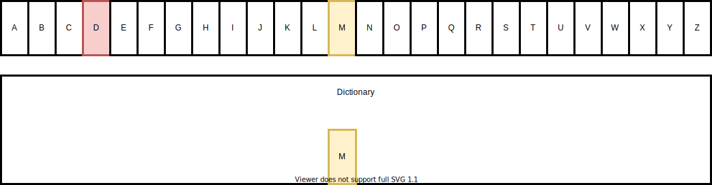
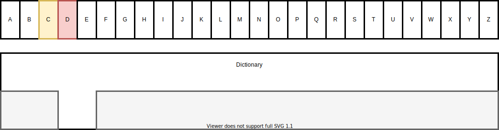
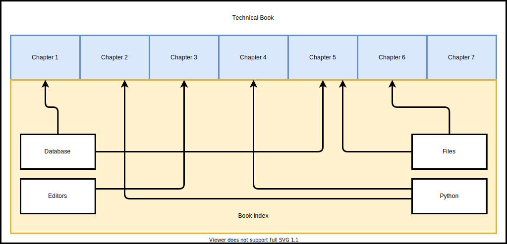

# 索引 - 优化查询

我们刚刚看到了如何获取满足某个 **条件** 的数据。例如，查询英雄 **名字为 "Deadpond"** 的数据。

如果我们像之前一样创建表和数据，当我们使用 `WHERE` 查询数据时，数据库必须 **扫描** **每一条记录** 来找到符合条件的记录。在这些示例中，只有 3 个英雄，这个问题不大。

但如果你的数据库有 **成千上万** 条 **记录**，每次查询名字为 "Deadpond" 的英雄时，数据库都需要扫描 **所有** 记录来找到所有可能的匹配项，这就变得很麻烦，因为它会变得非常 **慢**。

我将向你展示如何通过数据库 **索引** 来处理这个问题。

代码的更改 **非常小**，但理解背后发生了什么非常有用，所以我会向你展示 **它是如何工作的**，以及它意味着什么。

---

如果你已经执行了之前的示例并且有了数据库数据，**在运行每个示例之前删除数据库文件**，这样你就不会有重复的数据，并且可以得到相同的结果。

## 没时间解释

你已经是 **SQL专家**，没有时间看我所有的解释吗？

没问题，在这种情况下，你可以 **直接查看** 创建索引的最终代码。

/// details | 👀 完整文件预览

//// tab | Python 3.10+

```Python
{!./docs_src/tutorial/indexes/tutorial002_py310.py!}
```

////

//// tab | Python 3.7+

```Python
{!./docs_src/tutorial/indexes/tutorial002.py!}
```

////

///

...但如果你不是专家， **继续阅读**，这将可能对你有帮助。🤓

## 什么是索引

通常来说，  **索引** 就是我们可以用来帮助我们 **更快找到东西** 的工具。它通常通过将事物按 **顺序排列** 来工作。在考虑数据库和代码之前，我们可以先想想一些现实生活中的例子。

### 索引和字典

想象一下一个 **字典** ，它是一本包含单词定义的书。📔 ...不是Python中的`dict`。😅

假设你想要 **查找一个单词** ，例如“ **database** ”。你翻开字典，可能打开的是字典的中间部分。也许你看到了一些以字母 `m` 开头的单词，比如 `manual`，于是你推测自己正在字母 `m` 的部分。


你知道在字母表中，字母 `d`（比如“database”中的字母）排在字母 `m` 之前。



因此，你知道需要在当前所在的位置之前进行查找。你仍然不知道“database”具体在哪个位置，因为你还不清楚字母 `d` 在字典中的确切位置，但你知道它 **不会在** 当前位置之后，因此你可以 **丢弃字典的右半部分** ，不再搜索。


接下来，你 **再次翻开字典** ，但这次只考虑包含你要找的单词的 **字典左半部分** 。你在这个左半部分的中间位置打开字典，也许你停在了字母 `f`。


你知道字母 `d` 排在 `f` 之前，所以“database”肯定在 **这个位置之前** 。但此时你知道“database” **不会在**这个位置之后，因此你可以丢弃从此位置开始的字典部分。


现在，你剩下了一个 **小部分字典** 来继续查找（只有字典的 **四分之一** 区域可能包含你要的单词）。你从字典开头的这个四分之一部分中打开，在中间的地方，也许你到达了字母 `c`。


你知道“database”应该在 **字母 `c` 之后**而不是之前，因此你可以丢弃该部分的左边。



你重复这个过程 **几次** ，最终到达字母 `d`，然后继续在该部分进行查找，最后你 **找到了单词** “database”。🎉


你只需要翻开字典几次，可能是 **5次或10次** 。实际上，这相比起你本可能要做的工作来说， **非常少** 。

/// note | 技术细节

你喜欢 **高大上的词** 吗？酷！程序员通常喜欢高大上的词。😅

我刚才给你展示的那个 **算法** 叫做 **二分查找** 。

之所以叫它“二分查找”，是因为你 **通过将字典** （或任何有序的列表）分成 **两** 部分来查找东西（“二进制”意味着“两个”）。然后你重复这个过程，直到找到你想要的东西。

///

### 索引和小说

现在，假设你在阅读一本 **小说** 。有人告诉你，在某个地方提到了 **数据库** ，而你想要找到那一章。

你如何在小说中找到“*数据库*”这个词呢？你可能不得不 **阅读整本书** ，才能找到“ *数据库* ”出现的章节。你可能会逐页翻阅， **每一页都读一遍** ，直到找到这个词。虽然你可能会享受这本书，但这显然是 **低效** 的。😅

但是，如果我们只是想要 **快速找到信息** （就像在处理SQL数据库时），那么逐页翻阅500页就显得 **太低效**了。要是有个办法，能让你在5或10个地方直接找到信息，那就效率高得多了。

### 一本有索引的技术书

现在，假设你在阅读一本技术书。比如，它包含了关于编程的多个话题。而其中有几节内容提到了 **数据库** 。

这本书可能有一个 **书籍索引** ：书中的一节，列出了书中 **涵盖的主题名称** 以及这些主题所在的* *页码**。这些主题名称是 **按字母顺序排列** 的，类似字典（就像前面的例子中那本字典）。

在这种情况下，你可以翻到书的最后一页（或者开头）找到 **书籍索引**部分，这部分通常只有几页。然后，你就可以使用和上面 **字典** 示例相同的方法。

翻开索引，经过 **5到10步** ，你就能快速找到 **“数据库”** 这个话题，并看到它所在的页码，比如“第253页，第五章”。现在，你用字典中的方法找到了 **主题** ，而这个主题又给了你一个 **页码** 。

现在你知道需要找到的是 **“第253页”** 。但看着这本合上的书，你还不知道那一页在哪里，所以你得 **找到那一页** 。为了找到那一页，你可以再次使用相同的方法，但这次你不是在 **索引** 中查找 **主题** ，而是在 **整本书** 中查找 **页码** 。经过 **5到10步** ，你就能找到第五章的第253页。



经过这些步骤，虽然这本书不是字典，内容也有所不同，但你还是能 **快速找到** 涉及 **“数据库”** 的部分，整个过程只需要 **几步** （可能是10到20步，而不是翻阅所有500页）。

关键是，索引是 **排序的** ，所以我们可以使用和 **字典** 一样的方法来查找主题。然后，得到的页码也是 **有序的** ！😅

当我们有一个排序的列表时，我们可以应用相同的技术，这就是这里的核心技巧：我们首先在 **索引** 中查找 **主题** ，然后在 **页码** 上应用同样的方法来找到实际的章节。

如此高效！😎

## 什么是数据库索引

**数据库索引** 与 **书籍索引**非常相似。

数据库索引存储一些信息、键值，并以一种使得查找变得 **快速且简单**的方式进行排序（例如按顺序排列）。然后，对于每个键，它们 **指向数据库中其他地方的数据**。

让我们看一个更清晰的例子。假设你在数据库中有一个这样的表：

<table>
<tr>
<th>id</th><th>name</th><th>secret_name</th><th>age</th>
</tr>
<tr>
<td>1</td><td>Deadpond</td><td>Dive Wilson</td><td>null</td>
</tr>
<tr>
<td>2</td><td>Spider-Boy</td><td>Pedro Parqueador</td><td>null</td>
</tr>
<tr>
<td>3</td><td>Rusty-Man</td><td>Tommy Sharp</td><td>48</td>
</tr>
</table>

假设你有 **更多的行**，可能有 **成千上万**的记录。

如果你要求SQL数据库根据特定的名字获取英雄，例如 `Spider-Boy`（使用 `name` 在SQL查询的 `WHERE` 部分），数据库就必须 **扫描**所有的英雄，逐个检查每一行，以找到名字为 `Spider-Boy` 的记录。

在这种情况下，只有一条记录，但并没有任何限制数据库不能有 **更多相同名字的记录**。因此，数据库会 **继续查找**，逐条检查每一条记录，这会非常慢。

但现在假设数据库已经为 `name` 列创建了索引。这个索引可能像这样，我们可以把它想象成数据库自动管理的一个额外的特殊表：

<table>
<tr>
<th>name</th><th>id</th>
</tr>
<tr>
<td>Deadpond</td><td>1</td>
</tr>
<tr>
<td>Rusty-Man</td><td>3</td>
</tr>
<tr>
<td>Spider-Boy</td><td>2</td>
</tr>
</table>

索引会按 **顺序**列出每个 `name` 字段。它不会按 `id` 排序，而是按 `name` 排序（按字母顺序，因为 `name` 是字符串）。所以，首先是 `Deadpond`，然后是 `Rusty-Man`，最后是 `Spider-Boy`。它还会包含每个英雄的 `id`。记住，这里可能有 **成千上万**个英雄。

然后，数据库就能够使用类似上述 **字典**和 **书籍索引**的方式来查找。

它可以从某个地方开始（例如，从索引的中间）。它可能会找到像 `Rusty-Man` 这样的英雄。因为 **索引**中的 `name` 字段是按顺序排列的，数据库会知道它可以 **丢弃所有之前的索引行**，只在后面的索引行中进行查找。

<table>
<tr>
<th>name</th><th>id</th>
</tr>
<tr style="background-color: #F5F5F5; color: #999999;">
<td>Deadpond</td><td>1</td>
</tr>
<tr style="background-color: #F5F5F5; color: #999999;">
<td>Rusty-Man</td><td>3</td>
</tr>
<tr style="background-color: #FFF2CC;">
<td>Spider-Boy</td><td>2</td>
</tr>
</table>

这样，就像字典的例子一样， **无需读取成千上万的英雄**，数据库可以通过 **5到10步**快速找到包含 `Spider-Boy` 的索引行，即使表格（和索引）有成千上万行：

<table>
<tr>
<th>name</th><th>id</th>
</tr>
<tr style="background-color: #F5F5F5; color: #999999;">
<td>Deadpond</td><td>1</td>
</tr>
<tr style="background-color: #F5F5F5; color: #999999;">
<td>Rusty-Man</td><td>3</td>
</tr>
<tr style="background-color: #D5E8D4;">
<td>✨ Spider-Boy ✨</td><td>2</td>
</tr>
</table>

通过查看 **这个索引行**，数据库知道 `Spider-Boy` 在 `hero` 表中的 `id` 是 `2`。

接下来，它就可以使用 **相同的技术**，通过查找这个 `id` 在 `hero` 表中找到对应的记录。

这样，最终数据库无需读取成千上万的记录，只需要 **几步**就能找到我们需要的英雄。

## 更新索引

正如你所想的，要使这一切正常工作，索引需要与数据库中的数据保持 **最新**。

如果你需要 **手动**在代码中更新索引，这将非常繁琐且 **容易出错**，因为很容易陷入索引未更新、指向错误数据的状态。 😱

好消息是：当你在 **SQL数据库**中创建一个索引时，数据库会在需要时 **自动**负责 **更新**它。 😎🎉

如果你向 `hero` 表中 **添加新记录**，数据库会 **自动**更新索引。它会执行 **相同的过程**来 **查找**正确的位置，将新的索引数据插入进去（就像上面描述的 **5到10步**），然后将新的索引信息保存到那里。同样的过程也会在你 **更新**或 **删除**数据时发生。

在SQL数据库中，定义和创建索引是非常 **简单**的。而且 **使用**索引则更加容易……几乎是透明的。数据库会自动判断使用哪个索引，SQL查询甚至不需要改变。

所以，在SQL数据库中， **索引非常棒**！而且超级 **易于使用**。那为什么不为所有东西都创建索引呢？…..因为索引也有 **计算和存储（磁盘空间）上的“成本”**。

## 索引的成本

**索引** 是有 **成本**的。💰

当你没有索引，并向 `hero` 表中添加 **新行**时，数据库只需要执行 **1次操作**，将新英雄记录添加到表的末尾。

但如果你有 **英雄名字**的 **索引**，那么数据库就必须执行相同的 **1次操作**来添加这一行 **外加**在索引中进行额外的 **5到10次操作**，来找到正确的位置插入这个名字，然后将该 **索引记录**添加到那里。

如果你有一个`name`的索引、一个`age`的索引和一个`secret_name`的索引，那么数据库就需要执行相同的 **1次操作**来添加该行 **外加**在每个索引中进行 **5到10次操作**，这样一来，添加一行就需要大约 **31次操作**。

这也意味着你在 **读取**数据时节省的时间，会转变为 **写入**数据所需的时间，再加上一些额外的 **空间**，用于存储索引。

如果你的查询需要通过比较每个字段来从数据库中提取数据（例如使用 `WHERE`），那么为每个字段创建索引是非常有意义的。因为在创建或更新数据时，进行 **31次操作**（加上索引的空间）比进行可能的 **500或1000次操作**来读取所有行并通过每个字段进行比较要好得多。

但是，如果你 **从未**使用 `secret_name` 字段进行查询（例如从未在 `WHERE` 部分使用 `secret_name`），那么为 `secret_name` 字段/列创建索引可能就没有意义，因为这会增加数据库写入和更新的计算和空间 **成本**。

## 使用 SQL 创建索引

呼，这部分理论和解释挺多的。 😅

理解索引、如何使用以及何时使用它们是最重要的。

现在，让我们来看一下创建 **索引** 的 **SQL** 语法。它非常简单：

```SQL hl_lines="3"
CREATE INDEX ix_hero_name
ON hero (name)
```

这大致意味着：

> 嘿，SQL 数据库 👋，请为我 `CREATE` 一个 `INDEX`。
>
> 我希望这个索引的名字是 `ix_hero_name`。
>
> 这个索引应该是 `ON` `hero` 表，指向那个表。
>
> 我希望你使用 `name` 这一列来创建索引。

## 使用 SQLModel 声明索引

接下来，让我们看看如何在 **SQLModel** 中定义索引。

代码上的变化非常简单，几乎没有变化。 😆

这是我们之前的 `Hero` 模型：

//// tab | Python 3.10+

```Python hl_lines="6"
{!./docs_src/tutorial/where/tutorial001_py310.py[ln:1-8]!}

# 代码省略 👇
```

////

//// tab | Python 3.7+

```Python hl_lines="8"
{!./docs_src/tutorial/where/tutorial001.py[ln:1-10]!}

# 代码省略 👇
```

////

/// details | 👀 完整文件预览

//// tab | Python 3.10+

```Python
{!./docs_src/tutorial/where/tutorial001_py310.py!}
```

////

//// tab | Python 3.7+

```Python
{!./docs_src/tutorial/where/tutorial001.py!}
```

////

///

现在，我们将其更新，以便在创建表时告诉 **SQLModel** 为 `name` 字段创建一个索引：

//// tab | Python 3.10+

```Python hl_lines="6"
{!./docs_src/tutorial/indexes/tutorial001_py310.py[ln:1-8]!}

# 代码省略 👇
```

////

//// tab | Python 3.7+

```Python hl_lines="8"
{!./docs_src/tutorial/indexes/tutorial001.py[ln:1-10]!}

# 代码省略 👇
```

////

/// details | 👀 完整文件预览

//// tab | Python 3.10+

```Python
{!./docs_src/tutorial/indexes/tutorial001_py310.py!}
```

////

//// tab | Python 3.7+

```Python
{!./docs_src/tutorial/indexes/tutorial001.py!}
```

////

///

我们再次使用相同的 `Field()`，并设置 `index=True`。就这样！ 🚀

请注意，我们没有设置 `default=None` 或类似的参数。这意味着 **SQLModel**（借助 Pydantic）将其视为 **必填** 字段。

/// info

SQLModel（实际上是 SQLAlchemy）会为你**自动生成索引名称**。

在这种情况下，生成的名称将是 `ix_hero_name`。

///

## 查询数据

现在，使用字段 `name` 和新索引查询数据时，我们不需要在代码中做任何特殊或不同的处理，依然是**相同的代码**。

SQL 数据库会**自动**处理这一切。✨

这非常棒，因为它意味着索引的使用非常**简单**。但一开始可能会感觉有些反直觉，因为你在代码中**没有做任何**显式操作来表明索引是有用的，它的一切都在数据库后台悄悄发生。

//// tab | Python 3.10+

```Python hl_lines="5"
# 上面的代码已省略 👆

{!./docs_src/tutorial/indexes/tutorial001_py310.py[ln:34-39]!}

# 下面的代码已省略 👇
```

////

//// tab | Python 3.7+

```Python hl_lines="5"
# 上面的代码已省略 👆

{!./docs_src/tutorial/indexes/tutorial001.py[ln:36-41]!}

# 下面的代码已省略 👇
```

////

/// details | 👀 完整文件预览

//// tab | Python 3.10+

```Python
{!./docs_src/tutorial/indexes/tutorial001_py310.py!}
```

////

//// tab | Python 3.7+

```Python
{!./docs_src/tutorial/indexes/tutorial001.py!}
```

////

///

这与我们之前的代码完全相同，但现在数据库会在后台 **使用索引**。

## 运行程序

如果你现在运行程序，你会看到类似这样的输出：

<div class="termy">

```console
$ python app.py

// 一些样板输出已省略 😉

// 创建表
CREATE TABLE hero (
        id INTEGER,
        name VARCHAR NOT NULL,
        secret_name VARCHAR NOT NULL,
        age INTEGER,
        PRIMARY KEY (id)
)

// 创建索引 🤓🎉
CREATE INDEX ix_hero_name ON hero (name)

// 带 WHERE 的 SELECT 看起来一样
INFO Engine SELECT hero.id, hero.name, hero.secret_name, hero.age
FROM hero
WHERE hero.name = ?
INFO Engine [no key 0.00014s] ('Deadpond',)

// 结果英雄
secret_name='Dive Wilson' age=None id=1 name='Deadpond'
```

</div>

## 更多索引

我们将查询 `hero` 表，并对 `age` 字段进行比较，因此我们也应该 **为该字段定义一个索引**：

//// tab | Python 3.10+

```Python hl_lines="8"
{!./docs_src/tutorial/indexes/tutorial002_py310.py[ln:1-8]!}

# 下面的代码已省略 👇
```

////

//// tab | Python 3.7+

```Python hl_lines="10"
{!./docs_src/tutorial/indexes/tutorial002.py[ln:1-10]!}

# 下面的代码已省略 👇
```

////

/// details | 👀 完整文件预览

//// tab | Python 3.10+

```Python
{!./docs_src/tutorial/indexes/tutorial002_py310.py!}
```

////

//// tab | Python 3.7+

```Python
{!./docs_src/tutorial/indexes/tutorial002.py!}
```

////

///

在这个例子中，我们希望 `age` 的默认值继续为 `None`，因此在使用 `Field()` 时，我们设置了 `default=None`。

现在，当我们使用 **SQLModel** 创建数据库和表时，它也会为 `hero` 表中的这两列创建 **索引**。

因此，当我们查询数据库的 `hero` 表，并使用这 **两列**来定义我们获取的数据时，数据库将能够 **使用这些索引**来提高 **读取性能**。🚀

## 主键和索引

你可能注意到我们没有为 `id` 字段设置 `index=True`。

因为 `id` 已经是 **主键**，数据库会自动为它创建一个内部 **索引**。

数据库始终会自动为 **主键**创建一个内部索引，因为主键是组织、存储和检索数据的主要方式。🤓

但是，如果你需要 **频繁查询**SQL数据库中的任何 **其他字段**（例如在 `WHERE` 部分使用其他字段），你可能会希望为这些字段至少创建一个 **索引**。

## 总结

**索引** 对于提高查询数据库时的 **读取性能**和速度非常重要。🏎

创建和使用索引非常 **简单**和易于理解。最重要的部分是理解 **它们是如何工作的**， **何时**创建它们，以及为 **哪些列**创建它们。