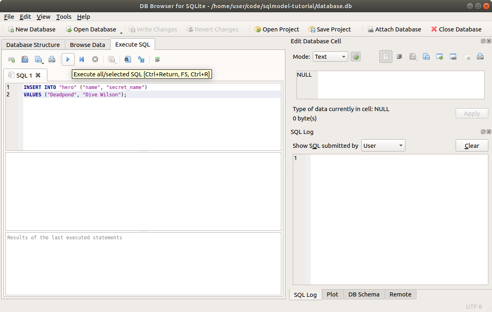
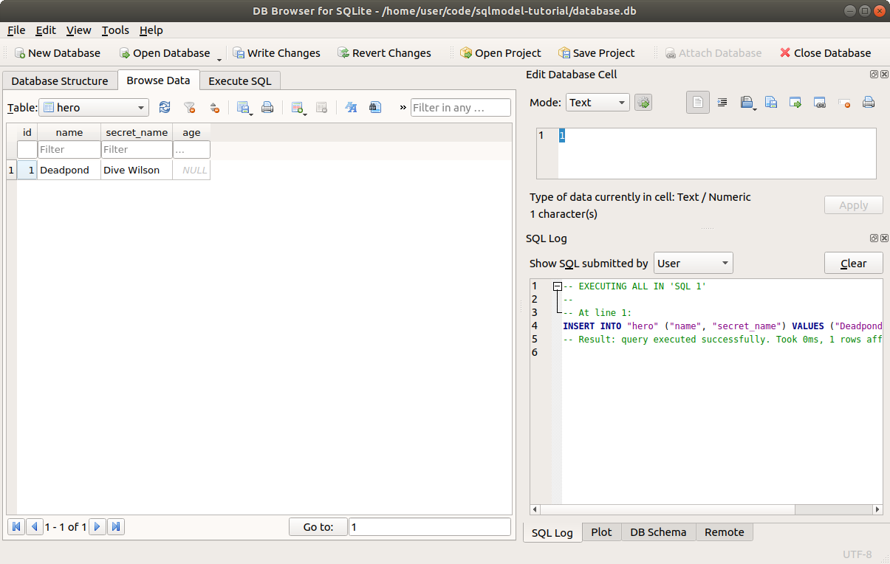
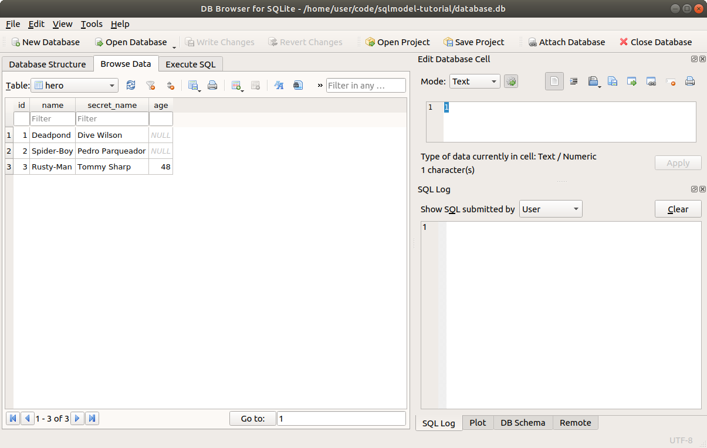

# 创建数据行 - 使用 Session - 插入（INSERT）

现在我们已经有了数据库和表，可以开始添加数据了。

以下是表格的样子（目标数据）：

<table>
<tr>
<th>id</th><th>name</th><th>secret_name</th><th>age</th>
</tr>
<tr>
<td>1</td><td>Deadpond</td><td>Dive Wilson</td><td>null</td>
</tr>
<tr>
<td>2</td><td>Spider-Boy</td><td>Pedro Parqueador</td><td>null</td>
</tr>
<tr>
<td>3</td><td>Rusty-Man</td><td>Tommy Sharp</td><td>48</td>
</tr>
</table>

---

## 创建表和数据库

我们将从上一章的内容继续。

以下是创建数据库和表的代码，这部分没有变化：

//// tab | Python 3.10+

```python
{!./docs_src/tutorial/create_db_and_table/tutorial003_py310.py[ln:1-18]!}

# 之后会添加更多代码 👈

{!./docs_src/tutorial/create_db_and_table/tutorial003_py310.py[ln:21-22]!}
```

{!./docs_src/tutorial/create_db_and_table/annotations/en/tutorial003.md!}

////

//// tab | Python 3.7+

```python
{!./docs_src/tutorial/create_db_and_table/tutorial003.py[ln:1-20]!}

# 之后会添加更多代码 👈

{!./docs_src/tutorial/create_db_and_table/tutorial003.py[ln:23-24]!}
```

{!./docs_src/tutorial/create_db_and_table/annotations/en/tutorial003.md!}

////

现在，我们已经能够创建数据库和表，我们将在此基础上继续扩展代码，在同一个文件中添加代码以插入数据。

## 使用 SQL 创建数据

在编写 Python 代码之前，让我们先看看如何使用 SQL 创建数据。

假设我们要向数据库中插入 `Deadpond` 的记录/行。

可以使用以下 SQL 语句完成：

```SQL
INSERT INTO "hero" ("name", "secret_name")
VALUES ("Deadpond", "Dive Wilson");
```

这段 SQL 语句的含义大致是：

> 嘿，SQL 数据库 👋，请 `INSERT` 一些内容（创建一条记录/行）到表 `"hero"` 中。
>
> 我希望你将这些值插入到以下指定的列中：
>
> - `"name"`
> - `"secret_name"`
>
> 我希望在这些列中填写的值是：
>
> - `"Deadpond"`
> - `"Dive Wilson"`

### 在 SQLite 的 DB Explorer 中尝试

你可以在 **DB Explorer for SQLite** 中尝试这条 SQL 语句。

确保点击 <kbd>Open Database</kbd> 打开我们之前创建的同一个数据库，并选择同一个 `database.db` 文件。

/// tip

如果你没有包含 `hero` 表的 `database.db` 文件，可以通过运行上方的 Python 程序重新创建该文件。👆

///

接着，进入 <kbd>Execute SQL</kbd> 选项卡，并复制上述 SQL 语句。

看起来会像这样：



点击 "Execute all" 按钮 <kbd>▶</kbd>。

然后，进入 <kbd>Browse Data</kbd> 选项卡，你将看到新创建的记录/行：



## 数据库中的数据与代码中的数据

当我们在编程语言中操作数据库（SQL 或其他类型）时，数据会有两种状态：一部分数据存在于**内存中**（由我们创建的对象和变量存储），另一部分数据则保存在**数据库中**。

我们经常会从数据库中**获取**一些数据，放入内存中的变量中。

同样地，我们会在代码中创建一些变量和对象，并将这些数据保存到数据库中，称之为**发送**。

有时候，我们甚至会在内存中创建一些数据，修改后再保存到数据库中。

也可能通过代码中的某些逻辑决定不再将数据保存到数据库中，仅在内存中处理这些数据，然后丢弃它们🔥，而无需与数据库进行交互。

**SQLModel** （实际上是通过 SQLAlchemy 实现的）尽可能地使这种交互变得简单、直观且贴近编程体验 ✨。

不过，这种数据存在于两种位置（内存或数据库）的分界始终存在。这一点非常重要，需要你时刻记在心中。🤓

## 使用 Python 和 **SQLModel** 创建数据

现在，我们通过 Python 创建相同的行。

首先，删除 `database.db` 文件，确保从零开始。

由于我们通过 Python 代码在内存中处理数据，而数据库是一个独立的系统（如一个独立的 SQLite 文件或外部的数据库服务器），因此需要执行以下两步：

* 在 Python 内存中（变量中）创建数据
* 将数据保存/发送到数据库

## 创建模型实例

从第一步开始，在内存中创建数据。

我们已经创建了一个名为 `Hero` 的类，用于表示数据库中的 `hero` 表。

我们创建的每个实例都将表示数据库中一行的数据。

因此，第一步就是简单地创建一个 `Hero` 实例。

我们将立即创建 3 个实例，分别代表 3 个英雄：

//// tab | Python 3.10+

```Python
# 上方省略的代码 👆

{!./docs_src/tutorial/insert/tutorial002_py310.py[ln:21-24]!}

# 后续将添加更多代码 👇
```

////

//// tab | Python 3.7+

```Python
# 上方省略的代码 👆

{!./docs_src/tutorial/insert/tutorial002.py[ln:23-26]!}

# 后续将添加更多代码 👇
```

////

/// details | 👀 完整文件预览

//// tab | Python 3.10+

```Python
{!./docs_src/tutorial/insert/tutorial002_py310.py!}
```

////

//// tab | Python 3.7+

```Python
{!./docs_src/tutorial/insert/tutorial002.py!}
```

////

///

/// tip

文件中的上述代码（省略部分）与本章开头的代码完全一致。

也就是我们之前用于创建 `Hero` 模型的代码。

///

我们将这些代码放入一个函数 `create_heroes()` 中，稍后可以调用这个函数完成操作。

如果你是交互式尝试代码，也可以直接编写这些代码。

## 创建 **Session**

到目前为止，我们只使用了 **engine** 与数据库交互。

**engine** 是一个全局共享的单一对象，负责与数据库通信，管理连接（例如使用 PostgreSQL 或 MySQL 这样的服务器数据库时），等等。

但在使用 **SQLModel** 时，大多数情况下会使用一个更高级的工具——**Session**。

与全局唯一的 **engine** 不同，我们会为每一组相关的数据库操作创建一个新的 **session**。

实际上，**session** 需要并依赖 **engine**。

例如，在构建 Web 应用时，通常会为每个请求创建一个独立的 **session**。

应用中的所有代码都会共享同一个 **engine**（被所有请求复用）。但对于每个请求，我们会创建一个新的 **session**，请求完成后关闭该 **session**。

第一步是导入 `Session` 类：

//// tab | Python 3.10+

```Python hl_lines="1"
{!./docs_src/tutorial/insert/tutorial001_py310.py[ln:1]!}

# 下方代码省略 👇
```

////

//// tab | Python 3.7+

```Python hl_lines="3"
{!./docs_src/tutorial/insert/tutorial001.py[ln:1-3]!}

# 下方代码省略 👇
```

////

/// details | 👀 完整文件预览

//// tab | Python 3.10+

```Python
{!./docs_src/tutorial/insert/tutorial001_py310.py!}
```

////

//// tab | Python 3.7+

```Python
{!./docs_src/tutorial/insert/tutorial001.py!}
```

////

///

接着，我们可以创建一个新的 **session**：

//// tab | Python 3.10+

```Python hl_lines="8"
# 上方代码省略 👆

{!./docs_src/tutorial/insert/tutorial001_py310.py[ln:21-26]!}

# 后续将添加更多代码 👇
```

////

//// tab | Python 3.7+

```Python hl_lines="8"
# 上方代码省略 👆

{!./docs_src/tutorial/insert/tutorial001.py[ln:23-28]!}

# 后续将添加更多代码 👇
```

////

/// details | 👀 完整文件预览

//// tab | Python 3.10+

```Python
{!./docs_src/tutorial/insert/tutorial001_py310.py!}
```

////

//// tab | Python 3.7+

```Python
{!./docs_src/tutorial/insert/tutorial001.py!}
```

////

///

新的 `Session` 需要一个 **engine** 作为参数，并会在底层使用该 **engine**。

/// tip

稍后我们将学习一种更好的方式，使用 `with` 块来创建 **session**。

///

## 将模型实例添加到 Session

现在我们已经有了一些英雄模型实例（内存中的对象）以及一个 **session**，下一步是将它们添加到 **session** 中：

//// tab | Python 3.10+

```Python hl_lines="9-11"
# 上方代码省略 👆
{!./docs_src/tutorial/insert/tutorial001_py310.py[ln:21-30]!}

# 后续将添加更多代码 👇
```

////

//// tab | Python 3.7+

```Python hl_lines="9-11"
# 上方代码省略 👆
{!./docs_src/tutorial/insert/tutorial001.py[ln:23-32]!}

# 后续将添加更多代码 👇
```

////

/// details | 👀 完整文件预览

//// tab | Python 3.10+

```Python
{!./docs_src/tutorial/insert/tutorial001_py310.py!}
```

////

//// tab | Python 3.7+

```Python
{!./docs_src/tutorial/insert/tutorial001.py!}
```

////

///

此时，我们的英雄数据还**没有**存储到数据库中。

这正是 **session** 独立于 **engine** 的意义所在。

**session** 会在内存中保存所有需要稍后存储到数据库的对象。

一旦准备好，我们可以执行 **commit** 操作，此时 **session** 将使用底层的 **engine** 生成相应的 SQL 并发送到数据库中，从而一次性将所有行写入数据库。

这种方式不仅提高了与数据库交互的效率，还带来了其他额外的好处。

/// info | 技术细节

**session** 会创建一个新的事务，并在该事务中执行所有 SQL 代码。

这确保了所有数据以单批的方式保存，并且要么全部成功，要么全部失败，从而避免了数据库处于不一致的状态。

///

## 提交 Session 的更改

现在，我们已经将英雄数据添加到了 **session** 中，并准备将这些数据保存到数据库，可以通过 **commit** 提交这些更改：

//// tab | Python 3.10+

```Python hl_lines="13"
# 上方代码省略 👆
{!./docs_src/tutorial/insert/tutorial001_py310.py[ln:21-32]!}

# 后续将添加更多代码 👇
```

////

//// tab | Python 3.7+

```Python hl_lines="13"
# 上方代码省略 👆
{!./docs_src/tutorial/insert/tutorial001.py[ln:23-34]!}

# 后续将添加更多代码 👇
```

////

/// details | 👀 完整文件预览

//// tab | Python 3.10+

```Python
{!./docs_src/tutorial/insert/tutorial001_py310.py!}
```

////

//// tab | Python 3.7+

```Python
{!./docs_src/tutorial/insert/tutorial001.py!}
```

////

///

执行这行代码后，**session** 将通过 **engine** 与数据库交互，发送相应的 SQL 语句，将所有数据保存到数据库中。

## 将英雄创建为脚本

现在，用于创建英雄的函数已经准备就绪。

接下来，我们需要确保在直接使用 Python 运行这个程序时调用它。

我们之前有一个类似这样的主程序块：

```Python
if __name__ == "__main__":
    create_db_and_tables()
```

我们可以在这里添加新函数，如下所示：

```Python
if __name__ == "__main__":
    create_db_and_tables()
    create_heroes()
```

但是为了让代码更有条理，我们可以创建一个新的函数 `main()`，用来包含所有在脚本独立运行时需要执行的代码。我们可以将之前的函数 `create_db_and_tables()` 放入其中，并添加新函数 `create_heroes()`：

//// tab | Python 3.10+

```Python hl_lines="2  4"
# 上方代码省略 👆
{!./docs_src/tutorial/insert/tutorial002_py310.py[ln:34-36]!}

# 后续将添加更多代码 👇
```

////

//// tab | Python 3.7+

```Python hl_lines="2  4"
# 上方代码省略 👆
{!./docs_src/tutorial/insert/tutorial002.py[ln:36-38]!}

# 后续将添加更多代码 👇
```

////

/// details | 👀 完整文件预览

//// tab | Python 3.10+

```Python
{!./docs_src/tutorial/insert/tutorial002_py310.py!}
```

////

//// tab | Python 3.7+

```Python
{!./docs_src/tutorial/insert/tutorial002.py!}
```

////

///

然后，我们可以在主程序块中调用这个单一的 `main()` 函数：

//// tab | Python 3.10+

```Python hl_lines="8"
# 上方代码省略 👆
{!./docs_src/tutorial/insert/tutorial002_py310.py[ln:34-40]!}
```

////

//// tab | Python 3.7+

```Python hl_lines="8"
# 上方代码省略 👆
{!./docs_src/tutorial/insert/tutorial002.py[ln:36-42]!}
```

////

/// details | 👀 完整文件预览

//// tab | Python 3.10+

```Python
{!./docs_src/tutorial/insert/tutorial002_py310.py!}
```

////

//// tab | Python 3.7+

```Python
{!./docs_src/tutorial/insert/tutorial002.py!}
```

////

///

通过将脚本运行时的所有逻辑集中到一个函数中，我们可以更方便地在后续添加代码。

此外，其他代码在需要时也可以导入并调用这个 `main()` 函数。

## 运行脚本

现在我们可以从控制台以脚本方式运行程序了。

由于我们在创建 **engine** 时设置了 `echo=True`，程序将输出所有正在执行的 SQL 代码：

<div class="termy">

```console
$ python app.py
// 一些初始操作，检查 hero 表是否已经存在
INFO Engine BEGIN (implicit)
INFO Engine PRAGMA main.table_info("hero")
INFO Engine [raw sql] ()
INFO Engine COMMIT
// 自动启动事务 ✨
INFO Engine BEGIN (implicit)
// INSERT 语句，使用 VALUES (?, ?, ?) 作为参数
INFO Engine INSERT INTO hero (name, secret_name, age) VALUES (?, ?, ?)
// ...以及参数值 🚀
INFO Engine [generated in 0.00013s] ('Deadpond', 'Dive Wilson', None)
// 对于 Spider-Boy 的 INSERT
INFO Engine INSERT INTO hero (name, secret_name, age) VALUES (?, ?, ?)
INFO Engine [cached since 0.000755s ago] ('Spider-Boy', 'Pedro Parqueador', None)
// 然后是 Rusty-Man 的 INSERT
INFO Engine INSERT INTO hero (name, secret_name, age) VALUES (?, ?, ?)
INFO Engine [cached since 0.001014s ago] ('Rusty-Man', 'Tommy Sharp', 48)
// 一切顺利？是的，提交事务！ 🎉
INFO Engine COMMIT
```

</div>

如果你使用过 Git，会发现这个过程很类似。

我们通过 `session.add()` 将新对象（模型实例）添加到 session 中（类似于 `git add`）。

此时这些数据已经准备好保存，但还未真正保存。

你可以进行更多修改，添加更多对象，等等。

一旦准备就绪，我们可以通过 **commit** 一步提交所有更改（类似于 `git commit`）。

## 关闭 Session

**session** 会持有一些资源，比如来自 **engine** 的连接。

因此，当我们完成 session 的操作后，应该 **关闭** 它以释放这些资源并完成清理：

//// tab | Python 3.10+

```Python hl_lines="16"
# 上方代码省略 👆

{!./docs_src/tutorial/insert/tutorial001_py310.py[ln:21-34]!}

# 后续将添加更多代码 👇
```

////

//// tab | Python 3.7+

```Python hl_lines="16"
# 上方代码省略 👆

{!./docs_src/tutorial/insert/tutorial001.py[ln:23-36]!}

# 后续将添加更多代码 👇
```

////

/// details | 👀 完整文件预览

//// tab | Python 3.10+

```Python
{!./docs_src/tutorial/insert/tutorial001_py310.py!}
```

////

//// tab | Python 3.7+

```Python
{!./docs_src/tutorial/insert/tutorial001.py!}
```

////

///

如果我们忘记关闭 session，或者代码中发生异常，导致 `session.close()` 没有被执行会怎样？

为了解决这种情况，可以使用更好的方式来创建和关闭 session，即使用 `with` 块。👇

## 在 `with` 块中使用 Session

了解如何手动创建和关闭 `Session` 很重要，例如，如果你想在交互式环境中探索代码（比如使用 Jupyter），这会非常有用。

不过，处理 `Session` 的更好方式是使用 `with` 块：

//// tab | Python 3.10+

```Python hl_lines="7-12"
# 上方代码省略 👆
{!./docs_src/tutorial/insert/tutorial002_py310.py[ln:21-31]!}
```

////

//// tab | Python 3.7+

```Python hl_lines="7-12"
# 上方代码省略 👆
{!./docs_src/tutorial/insert/tutorial002.py[ln:23-33]!}
```

////

/// details | 👀 完整文件预览

//// tab | Python 3.10+

```Python
{!./docs_src/tutorial/insert/tutorial002_py310.py!}
```

////

//// tab | Python 3.7+

```Python
{!./docs_src/tutorial/insert/tutorial002.py!}
```

////

///

这与手动创建和关闭 `Session` 的效果相同。但使用 `with` 块时，`Session` 会在 **进入** `with` 块时自动创建，并赋值给变量 `session`，在 `with` 块 **结束** 后自动关闭。

即使代码中发生异常，它也能正常关闭。😎

## 回顾所有代码

让我们再次查看整个文件的代码。🔍

你已经熟悉了前面部分的内容，包括创建 `Hero` 模型类、**engine**、数据库和表的部分。

现在关注新增的代码：

//// tab | Python 3.10+

```{.python .annotate }
{!./docs_src/tutorial/insert/tutorial003_py310.py!}
```

{!./docs_src/tutorial/insert/annotations/en/tutorial003.md!}

////

//// tab | Python 3.7+

```{.python .annotate }
{!./docs_src/tutorial/insert/tutorial003.py!}
```

{!./docs_src/tutorial/insert/annotations/en/tutorial003.md!}

////

/// tip

点击代码中的数字气泡，查看每一行的作用。👆

///

现在你可以将代码保存为 `app.py` 文件，并使用 Python 运行。你会看到类似前文展示的输出。

之后，如果用 **DB Browser for SQLite** 打开数据库，可以在 <kbd>Browse Data</kbd> 选项卡中看到刚创建的数据：



## 接下来学习什么

现在你已经知道如何向数据库添加行了。🎉

接下来，我们会深入理解为什么数据库中的 `id` 字段作为 **主键** **不能为 `NULL`**，但在 Python 代码中却可以是 **`None`**。

下一章会详细讲解这些内容。🚀
