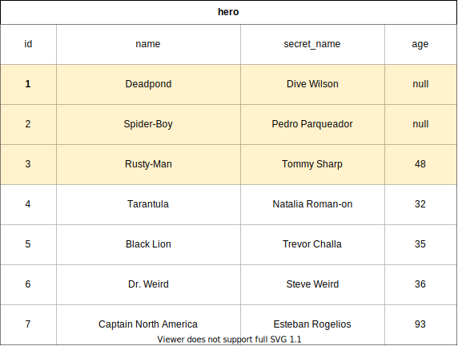
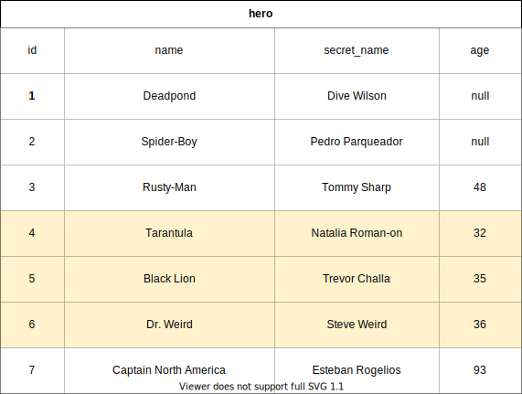
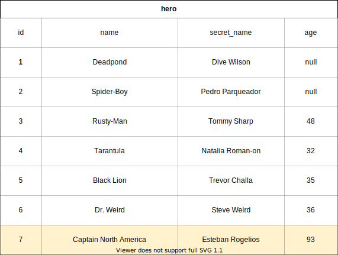
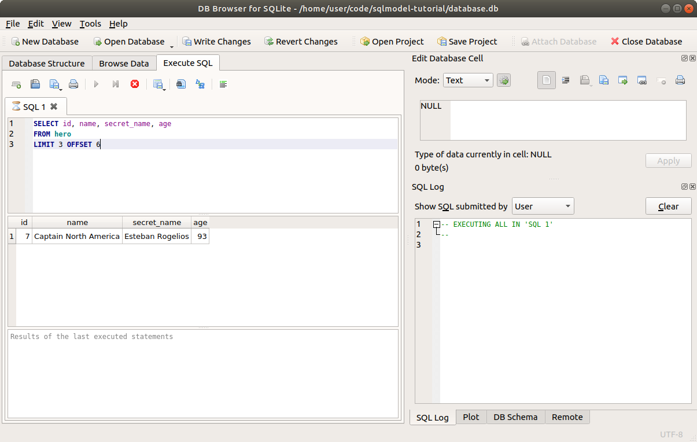

# 读取一范围数据 - LIMIT 和 OFFSET

现在你已经知道如何使用 `.one()`、`.first()` 和 `session.get()` 获取单行数据。

你也知道如何使用 `.where()` 进行筛选来获取多行数据。

接下来，让我们看看如何只获取一个 **结果范围**。



## 创建数据

我们将继续使用之前的代码，但会稍微修改 `select_heroes()` 函数，以简化示例并专注于我们想要实现的目标。

再次，我们将创建几个英雄，以便有一些数据可以选择：

//// tab | Python 3.10+

```Python hl_lines="4-10"
# Code above omitted 👆

{!./docs_src/tutorial/offset_and_limit/tutorial001_py310.py[ln:21-39]!}

# Code below omitted 👇
```

////

//// tab | Python 3.7+

```Python hl_lines="4-10"
# Code above omitted 👆

{!./docs_src/tutorial/offset_and_limit/tutorial001.py[ln:23-41]!}

# Code below omitted 👇
```

////

/// details | 👀 完整文件预览

//// tab | Python 3.10+

```Python
{!./docs_src/tutorial/offset_and_limit/tutorial001_py310.py!}
```

////

//// tab | Python 3.7+

```Python
{!./docs_src/tutorial/offset_and_limit/tutorial001.py!}
```

////

///

## 回顾选择所有数据

这是我们在 `select()` 示例中选择所有英雄的代码：

//// tab | Python 3.10+

```Python hl_lines="3-8"
# Code above omitted 👆

{!./docs_src/tutorial/select/tutorial003_py310.py[ln:34-39]!}

# Code below omitted 👇
```

////

//// tab | Python 3.7+

```Python hl_lines="3-8"
# Code above omitted 👆

{!./docs_src/tutorial/select/tutorial003.py[ln:36-41]!}

# Code below omitted 👇
```

////

/// details | 👀 完整文件预览

//// tab | Python 3.10+

```Python
{!./docs_src/tutorial/select/tutorial003_py310.py!}
```

////

//// tab | Python 3.7+

```Python
{!./docs_src/tutorial/select/tutorial003.py!}
```

////

///

但这将一次性获取 **所有** 英雄，假设数据库中可能有成千上万的数据，这样做可能会造成问题。

## 使用 Limit 选择

目前，我们的数据库中有 7 个英雄。但是我们也可能有成千上万的英雄，因此我们可以使用 `limit` 限制结果，只获取前 3 个：

//// tab | Python 3.10+

```Python hl_lines="5"
# Code above omitted 👆

{!./docs_src/tutorial/offset_and_limit/tutorial001_py310.py[ln:42-47]!}

# Code below omitted 👇
```

////

//// tab | Python 3.7+

```Python hl_lines="5"
# Code above omitted 👆

{!./docs_src/tutorial/offset_and_limit/tutorial001.py[ln:44-49]!}

# Code below omitted 👇
```

////

/// details | 👀 完整文件预览

//// tab | Python 3.10+

```Python
{!./docs_src/tutorial/offset_and_limit/tutorial001_py310.py!}
```

////

//// tab | Python 3.7+

```Python
{!./docs_src/tutorial/offset_and_limit/tutorial001.py!}
```

////

///

我们从 `select()` 获得的特殊 **select** 对象也有一个 `.limit()` 方法，我们可以使用它来限制结果的数量。

在这个例子中，我们不再获取所有的 7 行数据，而是将其限制为只获取前 3 行。 


## 在命令行运行程序

如果我们在命令行中运行程序，它会输出如下：

<div class="termy">

```console
$ python app.py

// 前面的输出已省略 🙈

// 使用 LIMIT 进行选择
INFO Engine SELECT hero.id, hero.name, hero.secret_name, hero.age
FROM hero
 LIMIT ? OFFSET ?
INFO Engine [no key 0.00014s] (3, 0)

// 打印收到的英雄，只有 3 个
[
    Hero(age=None, secret_name='Dive Wilson', id=1, name='Deadpond'),
    Hero(age=None, secret_name='Pedro Parqueador', id=2, name='Spider-Boy'),
    Hero(age=48, secret_name='Tommy Sharp', id=3, name='Rusty-Man')
]
```

</div>

太好了！我们得到了 3 个英雄，正如我们所希望的那样。

/// tip

稍后我们将更详细地查看 SQL 代码。

///

## 使用 Offset 和 Limit 进行选择

现在我们可以限制结果，获取前 3 个英雄。

但是假设我们正在一个用户界面中显示结果，每次显示 3 个英雄。

/// tip

这种方式通常被称为“分页”。因为用户界面通常会一次显示一“页”预定义数量的英雄。

然后，你可以与界面交互来获取下一页，以此类推。

///

如何获取接下来的 3 个英雄呢？



我们可以使用 `.offset()` 方法：

//// tab | Python 3.10+

```Python hl_lines="5"
# Code above omitted 👆

{!./docs_src/tutorial/offset_and_limit/tutorial002_py310.py[ln:42-47]!}

# Code below omitted 👇
```

////

//// tab | Python 3.7+

```Python hl_lines="5"
# Code above omitted 👆

{!./docs_src/tutorial/offset_and_limit/tutorial002.py[ln:44-49]!}

# Code below omitted 👇
```

////

/// details | 👀 完整文件预览

//// tab | Python 3.10+

```Python
{!./docs_src/tutorial/offset_and_limit/tutorial002_py310.py!}
```

////

//// tab | Python 3.7+

```Python
{!./docs_src/tutorial/offset_and_limit/tutorial002.py!}
```

////

///

这种方法的工作原理是，我们从 `select()` 得到的特殊 **select** 对象有一些方法，例如 `.where()`、`.offset()` 和 `.limit()`。

每个方法都会在内部的特殊选择语句对象上应用变更，并且 **返回相同的对象** ，这样我们就可以继续在其上使用更多方法，就像上面的例子中，我们同时使用了 `.offset()` 和 `.limit()`。

**Offset** 意味着“跳过这么多行”，而我们要跳过已经查看过的前三行，因此我们使用 `.offset(3)`。

## 在命令行中使用 Offset 运行程序

现在我们可以在命令行中运行程序，它会输出如下：

<div class="termy">

```console
$ python app.py

// 前面的输出已省略 🙈

// 使用 LIMIT 和 OFFSET 进行选择
INFO Engine SELECT hero.id, hero.name, hero.secret_name, hero.age
FROM hero
 LIMIT ? OFFSET ?
INFO Engine [no key 0.00020s] (3, 3)

// 打印收到的 3 个英雄，第二批
[
    Hero(age=32, secret_name='Natalia Roman-on', id=4, name='Tarantula'),
    Hero(age=35, secret_name='Trevor Challa', id=5, name='Black Lion'),
    Hero(age=36, secret_name='Steve Weird', id=6, name='Dr. Weird')
]
```

</div>

## 选择下一批数据

然后，为了获取下一批 3 行数据，我们需要跳过前面已经看到的 6 行：

//// tab | Python 3.10+

```Python hl_lines="5"
# Code above omitted 👆

{!./docs_src/tutorial/offset_and_limit/tutorial003_py310.py[ln:42-47]!}

# Code below omitted 👇
```

////

//// tab | Python 3.7+

```Python hl_lines="5"
# Code above omitted 👆

{!./docs_src/tutorial/offset_and_limit/tutorial003.py[ln:44-49]!}

# Code below omitted 👇
```

////

/// details | 👀 完整文件预览

//// tab | Python 3.10+

```Python
{!./docs_src/tutorial/offset_and_limit/tutorial003_py310.py!}
```

////

//// tab | Python 3.7+

```Python
{!./docs_src/tutorial/offset_and_limit/tutorial003.py!}
```

////

///

目前数据库中只有 **7 行**，所以这个查询只能获取 1 行数据。



但不用担心，数据库不会因为只剩 1 行数据就抛出错误（就像在 Python 列表中会发生的情况）。

数据库知道我们想要 **限制** 结果的数量，但它不一定需要找到那么多结果。

## 在命令行中运行最后一批数据

如果我们在命令行中运行程序，它会输出如下：

<div class="termy">

```console
$ python app.py

// 前面的输出已省略 🙈

// 使用 LIMIT 和 OFFSET 选择最后一批
INFO Engine SELECT hero.id, hero.name, hero.secret_name, hero.age
FROM hero
 LIMIT ? OFFSET ?
INFO Engine [no key 0.00038s] (3, 6)

// 打印最后一批英雄，只有 1 个
[
    Hero(age=93, secret_name='Esteban Rogelios', id=7, name='Captain North America')
]
```

</div>

## SQL 中的 LIMIT 和 OFFSET

你可能注意到 SQL 中的新关键字 `LIMIT` 和 `OFFSET`。

你可以在 SQL 中使用它们，位于其他部分的后面：

```SQL
SELECT id, name, secret_name, age
FROM hero
LIMIT 3 OFFSET 6
```

如果你在 **DB Browser for SQLite** 中尝试这个 SQL 查询，你会得到相同的结果：



## 将 Limit 和 Offset 与 Where 结合使用

当然，你也可以将 `.limit()` 和 `.offset()` 与 `.where()` 以及你稍后将学到的其他方法结合使用：

//// tab | Python 3.10+

```Python hl_lines="5"
# Code above omitted 👆

{!./docs_src/tutorial/offset_and_limit/tutorial004_py310.py[ln:42-47]!}

# Code below omitted 👇
```

////

//// tab | Python 3.7+

```Python hl_lines="5"
# Code above omitted 👆

{!./docs_src/tutorial/offset_and_limit/tutorial004.py[ln:44-49]!}

# Code below omitted 👇
```

////

/// details | 👀 完整文件预览

//// tab | Python 3.10+

```Python
{!./docs_src/tutorial/offset_and_limit/tutorial004_py310.py!}
```

////

//// tab | Python 3.7+

```Python
{!./docs_src/tutorial/offset_and_limit/tutorial004.py!}
```

////

///

## 在命令行中运行包含 Limit、Offset 和 Where 的程序

如果我们在命令行中运行程序，它将查找数据库中所有年龄大于 32 的英雄。通常这会是 4 个英雄。

但是我们从偏移量为 1 的位置开始（因此不计算第一个），并将结果限制为仅获取后面两个英雄：

<div class="termy">

```console
$ python app.py

// 前面的输出已省略 🙈

// 使用 WHERE、LIMIT 和 OFFSET 进行选择
INFO Engine SELECT hero.id, hero.name, hero.secret_name, hero.age
FROM hero
WHERE hero.age > ?
 LIMIT ? OFFSET ?
INFO Engine [no key 0.00022s] (32, 2, 1)

// 打印收到的 2 个英雄
[
    Hero(age=36, id=6, name='Dr. Weird', secret_name='Steve Weird'),
    Hero(age=48, id=3, name='Rusty-Man', secret_name='Tommy Sharp')
]
```

</div>

## 总结

无论你如何使用 `.where()` 或其他方法筛选数据，你都可以使用 `.limit()` 来限制查询结果的最大数量。

同样，你可以使用 `.offset()` 跳过前面的结果。
