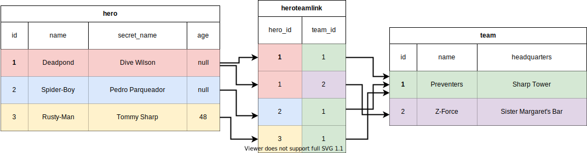

# 使用多对多关系创建模型

现在我们将通过 **关联表** 支持 **多对多** 关系，如下所示：



让我们从定义类模型开始，包括 **关联表** 模型。

## 关联表模型

为了支持 **多对多** 关系，我们需要一个 **关联表** 来连接它们。

我们可以像创建其他 **SQLModel** 一样创建它：

//// tab | Python 3.10+

```Python hl_lines="4-6"
{!./docs_src/tutorial/many_to_many/tutorial001_py310.py[ln:1-6]!}

# 以下代码省略 👇
```

////

//// tab | Python 3.9+

```Python hl_lines="6-12"
{!./docs_src/tutorial/many_to_many/tutorial001_py39.py[ln:1-12]!}

# 以下代码省略 👇
```

////

//// tab | Python 3.7+

```Python hl_lines="6-12"
{!./docs_src/tutorial/many_to_many/tutorial001.py[ln:1-12]!}

# 以下代码省略 👇
```

////

/// details | 👀 完整文件预览

//// tab | Python 3.10+

```Python
{!./docs_src/tutorial/many_to_many/tutorial001_py310.py!}
```

////

//// tab | Python 3.9+

```Python
{!./docs_src/tutorial/many_to_many/tutorial001_py39.py!}
```

////

//// tab | Python 3.7+

```Python
{!./docs_src/tutorial/many_to_many/tutorial001.py!}
```

////

///

这与其他 **SQLModel** 类模型表相同。

它有两个字段，`team_id` 和 `hero_id`。

它们都是各自表的 **外键**。我们稍后会创建这些模型，但你已经知道它们是如何工作的了。

而且这 **两个字段都是主键**。这是我们之前没有使用过的功能。🤓

## 团队模型（Team Model）

来看一下 `Team` 模型，它与之前的模型几乎相同，但有一点小改动：

//// tab | Python 3.10+

```Python hl_lines="8"
# 上方代码已省略 👆

{!./docs_src/tutorial/many_to_many/tutorial001_py310.py[ln:9-14]!}

# 下方代码已省略 👇
```

////

//// tab | Python 3.9+

```Python hl_lines="8"
# 上方代码已省略 👆

{!./docs_src/tutorial/many_to_many/tutorial001_py39.py[ln:15-20]!}

# 下方代码已省略 👇
```

////

//// tab | Python 3.7+

```Python hl_lines="8"
# 上方代码已省略 👆

{!./docs_src/tutorial/many_to_many/tutorial001.py[ln:15-20]!}

# 下方代码已省略 👇
```

////

/// details | 👀 完整文件预览

//// tab | Python 3.10+

```Python
{!./docs_src/tutorial/many_to_many/tutorial001_py310.py!}
```

////

//// tab | Python 3.9+

```Python
{!./docs_src/tutorial/many_to_many/tutorial001_py39.py!}
```

////

//// tab | Python 3.7+

```Python
{!./docs_src/tutorial/many_to_many/tutorial001.py!}
```

////

///

**关系属性 `heroes`** 仍然是一个英雄的列表，类型注解为 `List["Hero"]`。我们用引号括住 `"Hero"`，因为此时代码中还没有声明这个类（但正如你所知，编辑器和 **SQLModel** 能理解它）。

我们继续使用 **`Relationship()`** 函数。

这里用 **`back_populates="teams"`**，而不是之前的 `team`，因为现在可以有多个团队，所以我们在创建 `Hero` 模型时将其重命名为 `teams`。

此外，允许 **多对多** 关系的关键部分是使用 **`link_model=HeroTeamLink`**。就是这样！✨

## 英雄模型（Hero Model）

接下来看看关系的另一端，即 `Hero` 模型：

//// tab | Python 3.10+

```Python hl_lines="9"
# 上方代码已省略 👆

{!./docs_src/tutorial/many_to_many/tutorial001_py310.py[ln:17-23]!}

# 下方代码已省略 👇
```

////

//// tab | Python 3.9+

```Python hl_lines="9"
# 上方代码已省略 👆

{!./docs_src/tutorial/many_to_many/tutorial001_py39.py[ln:23-29]!}

# 下方代码已省略 👇
```

////

//// tab | Python 3.7+

```Python hl_lines="9"
# 上方代码已省略 👆

{!./docs_src/tutorial/many_to_many/tutorial001.py[ln:23-29]!}

# 下方代码已省略 👇
```

////

/// details | 👀 完整文件预览

//// tab | Python 3.10+

```Python
{!./docs_src/tutorial/many_to_many/tutorial001_py310.py!}
```

////

//// tab | Python 3.9+

```Python
{!./docs_src/tutorial/many_to_many/tutorial001_py39.py!}
```

////

//// tab | Python 3.7+

```Python
{!./docs_src/tutorial/many_to_many/tutorial001.py!}
```

////

///

我们**移除了**之前的 `team_id` 字段（列），因为现在通过关联表完成关系管理。🔥

关系属性现在改名为 **`teams`**，而不再是 `team`，因为现在支持多支团队。

属性的类型从 `Optional[Team]` 改为多个团队的列表，注解为 **`List[Team]`**。

这里同样使用了 **`Relationship()`**。

仍然保留了 **`back_populates="heroes"`**，与之前一致。

此外，添加了 **`link_model=HeroTeamLink`** 来实现多对多的关系管理。✨

## 创建表

与之前一样，我们会编写代码来创建 **engine**，并定义一个函数 `create_db_and_tables()` 用于创建所有表。

//// tab | Python 3.10+

```Python hl_lines="9"
# 上方代码已省略 👆

{!./docs_src/tutorial/many_to_many/tutorial001_py310.py[ln:26-33]!}

# 下方代码已省略 👇
```

////

//// tab | Python 3.9+

```Python hl_lines="9"
# 上方代码已省略 👆

{!./docs_src/tutorial/many_to_many/tutorial001_py39.py[ln:32-39]!}

# 下方代码已省略 👇
```

////

//// tab | Python 3.7+

```Python hl_lines="9"
# 上方代码已省略 👆

{!./docs_src/tutorial/many_to_many/tutorial001.py[ln:32-39]!}

# 下方代码已省略 👇
```

////

/// details | 👀 完整文件预览

//// tab | Python 3.10+

```Python
{!./docs_src/tutorial/many_to_many/tutorial001_py310.py!}
```

////

//// tab | Python 3.9+

```Python
{!./docs_src/tutorial/many_to_many/tutorial001_py39.py!}
```

////

//// tab | Python 3.7+

```Python
{!./docs_src/tutorial/many_to_many/tutorial001.py!}
```

////

///

与之前的例子类似，我们将这个函数添加到一个 `main()` 函数中，并在主程序块中调用它：

//// tab | Python 3.10+

```Python hl_lines="4"
# 上方代码已省略 👆

{!./docs_src/tutorial/many_to_many/tutorial001_py310.py[ln:72-73]!}
    # 后续将在此处添加更多功能 👈

{!./docs_src/tutorial/many_to_many/tutorial001_py310.py[ln:77-78]!}
```

////

//// tab | Python 3.9+

```Python hl_lines="4"
# 上方代码已省略 👆

{!./docs_src/tutorial/many_to_many/tutorial001_py39.py[ln:78-79]!}
    # 后续将在此处添加更多功能 👈

{!./docs_src/tutorial/many_to_many/tutorial001_py39.py[ln:83-84]!}
```

////

//// tab | Python 3.7+

```Python hl_lines="4"
# 上方代码已省略 👆

{!./docs_src/tutorial/many_to_many/tutorial001.py[ln:78-79]!}
    # 后续将在此处添加更多功能 👈

{!./docs_src/tutorial/many_to_many/tutorial001.py[ln:83-84]!}
```

////

/// details | 👀 完整文件预览

//// tab | Python 3.10+

```Python
{!./docs_src/tutorial/many_to_many/tutorial001_py310.py!}
```

////

//// tab | Python 3.9+

```Python
{!./docs_src/tutorial/many_to_many/tutorial001_py39.py!}
```

////

//// tab | Python 3.7+

```Python
{!./docs_src/tutorial/many_to_many/tutorial001.py!}
```

////

///


## 运行代码

如果你在命令行中运行代码，输出将如下所示：

<div class="termy">

```console
$ python app.py

// 标准输出省略 😉

INFO Engine
CREATE TABLE team (
        id INTEGER,
        name VARCHAR NOT NULL,
        headquarters VARCHAR NOT NULL,
        PRIMARY KEY (id)
)


INFO Engine [no key 0.00033s] ()
INFO Engine
CREATE TABLE hero (
        id INTEGER,
        name VARCHAR NOT NULL,
        secret_name VARCHAR NOT NULL,
        age INTEGER,
        PRIMARY KEY (id)
)


INFO Engine [no key 0.00016s] ()
INFO Engine

// 我们全新的链接表 ✨
CREATE TABLE heroteamlink (
        team_id INTEGER,
        hero_id INTEGER,
        PRIMARY KEY (team_id, hero_id),
        FOREIGN KEY(team_id) REFERENCES team (id),
        FOREIGN KEY(hero_id) REFERENCES hero (id)
)


INFO Engine [no key 0.00031s] ()
INFO Engine COMMIT

```

</div>

## 回顾

我们可以通过声明一个链接表来支持表之间的 **多对多** 关系。

可以像创建其他 **SQLModel** 类一样创建链接表，然后在 `Relationship()` 的 `link_model` 参数中使用它。

接下来，我们将使用这些模型处理数据。🤓
