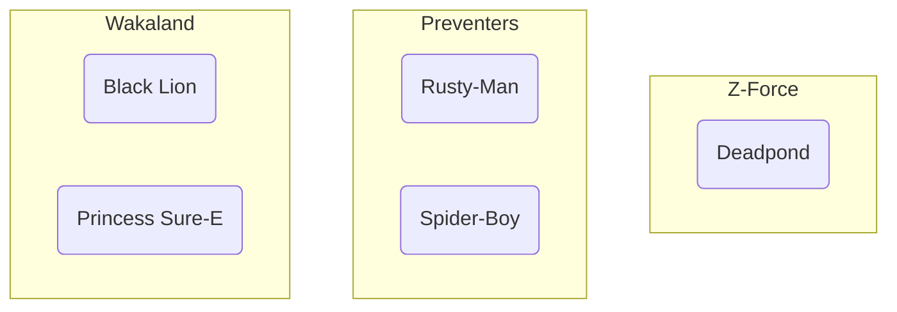
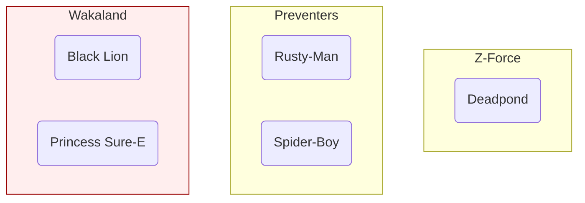
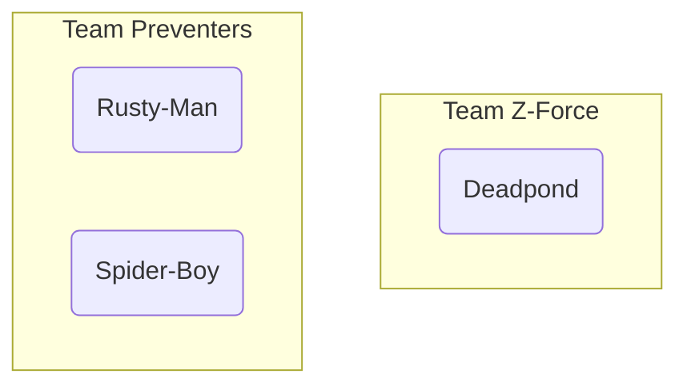
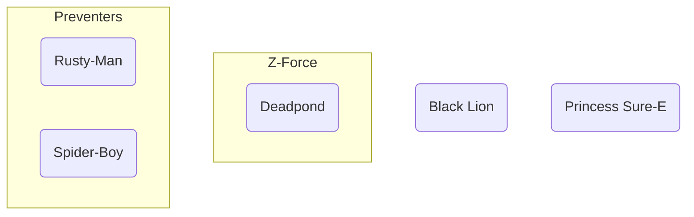

# 级联删除关系

如果我们**删除**一个与英雄有**关系**的团队会发生什么？

这些英雄是否也应该被**自动删除**？这就叫做“**级联**”，因为初始的删除会引发一连串其他删除。

或者，应该将他们的 `team_id` 设置为 `NULL`，而不是删除？

让我们看看如何使用 **SQLModel** 配置这个操作。

/// info

此功能，包括 `cascade_delete`、`ondelete` 和 `passive_deletes`，自 SQLModel 版本 `0.0.21` 起可用。

///

## 初始的英雄和团队

假设我们有以下这些**团队**和**英雄**。

### 团队表

| id  | name       | headquarters          |
| --- | ---------- | --------------------- |
| 1   | Z-Force    | Sister Margaret's Bar |
| 2   | Preventers | Sharp Tower           |
| 3   | Wakaland   | Wakaland Capital City |

### 英雄表

| id  | name            | secret_name      | age | team_id |
| --- | --------------- | ---------------- | --- | ------- |
| 1   | Deadpond        | Dive WIlson      |     | 1       |
| 2   | Rusty-Man       | Tommy Sharp      | 48  | 2       |
| 3   | Spider-Boy      | Pedro Parqueador |     | 2       |
| 4   | Black Lion      | Trevor Challa    | 35  | 3       |
| 5   | Princess Sure-E | Sure-E           |     | 3       |

### 可视化团队和英雄

我们可以这样可视化它们：



## 删除一个有英雄的团队

当我们 **删除一个团队** 时，必须对相关的英雄做一些处理。

默认情况下，它们指向该团队的外键会在数据库中被设置为 `NULL`。

但是假设我们希望相关的英雄被 **自动删除** 。

例如，我们可以删除团队 `Wakaland`：



我们希望英雄 `Black Lion` 和 `Princess Sure-E` 也被 **自动删除** 。

最终，团队和英雄将变成这样：



## 配置自动删除

自动删除的配置有**两个地方**：

* 在 **Python 代码** 中
* 在 **数据库** 中

## 在 Python 中使用 `cascade_delete` 删除

在创建 `Relationship()` 时，我们可以设置 `cascade_delete=True`。

这会配置 SQLModel，使其在删除初始记录（团队）时，**自动删除**相关记录（英雄）。

//// tab | Python 3.10+

```Python hl_lines="9"
{!./docs_src/tutorial/relationship_attributes/cascade_delete_relationships/tutorial001_py310.py[ln:1-9]!}

# Code below omitted 👇
```

////

//// tab | Python 3.9+

```Python hl_lines="11"
{!./docs_src/tutorial/relationship_attributes/cascade_delete_relationships/tutorial001_py39.py[ln:1-11]!}

# Code below omitted 👇
```

////

//// tab | Python 3.7+

```Python hl_lines="11"
{!./docs_src/tutorial/relationship_attributes/cascade_delete_relationships/tutorial001.py[ln:1-11]!}

# Code below omitted 👇
```

////

/// details | 👀 完整文件预览

//// tab | Python 3.10+

```Python
{!./docs_src/tutorial/relationship_attributes/cascade_delete_relationships/tutorial001_py310.py!}
```

////

//// tab | Python 3.9+

```Python
{!./docs_src/tutorial/relationship_attributes/cascade_delete_relationships/tutorial001_py39.py!}
```

////

//// tab | Python 3.7+

```Python
{!./docs_src/tutorial/relationship_attributes/cascade_delete_relationships/tutorial001.py!}
```

////

///

使用此配置，当我们删除一个团队时，SQLModel（实际上是 SQLAlchemy）将会：

* 确保 **相关记录的对象已加载** ，在这个例子中，就是 `heroes`（英雄）。如果它们没有加载，SQLModel 会发送一个 `SELECT` 查询来从数据库中获取它们。
* 向数据库发送一个 `DELETE` 查询，**包括每一条相关记录**（每个英雄）。
* 最后，发送另一个 `DELETE` 查询，**删除初始记录**（团队）。

这样，内部的 **Python 代码** 将通过发出必要的 SQL 查询来处理删除相关记录的操作。

/// tip

`cascade_delete` 参数设置在 **没有外键** 的模型中的 `Relationship()` 中。

///

/// note | 技术细节

在 `Relationship()` 中设置 `cascade_delete=True` 将配置 SQLAlchemy 使用 `cascade="all, delete-orphan"`，这是当需要级联删除时最常用且有效的配置。

你可以在 <a href="https://docs.sqlalchemy.org/en/20/orm/cascades.html" class="external-link" target="_blank">SQLAlchemy 文档</a> 中了解更多信息。

///

## 使用 `ondelete` 在数据库中删除

在上一节中，我们看到使用 `cascade_delete` 处理了从 Python 代码中的自动删除。

但是，如果有人直接 **与数据库交互** ，没有使用我们的代码，而是 **用 SQL 删除了一个团队** ，会发生什么呢？

针对这种情况，我们可以通过 `Field()` 中的 `ondelete` 参数来配置数据库， **自动删除** 相关记录。

### `ondelete` 选项

`ondelete` 参数将在数据库的 **外键列** 中设置 SQL 的 `ON DELETE`。

`ondelete` 可以有以下值：

* `CASCADE`：当相关记录（团队）被删除时， **自动删除该记录** （英雄）。
* `SET NULL`：当相关记录被删除时，将 **外键** （`hero.team_id`）字段设置为 `NULL`。
* `RESTRICT`：如果存在外键值，则 **阻止** 删除该记录（英雄），并抛出错误。

## 设置 `ondelete` 为 `CASCADE`

如果我们希望在删除父记录时，数据库 **自动删除** 相关记录，可以设置 `ondelete="CASCADE"`。

//// tab | Python 3.10+

```Python hl_lines="18"
{!./docs_src/tutorial/relationship_attributes/cascade_delete_relationships/tutorial001_py310.py[ln:1-19]!}

# Code below omitted 👇
```

////

//// tab | Python 3.9+

```Python hl_lines="21"
{!./docs_src/tutorial/relationship_attributes/cascade_delete_relationships/tutorial001_py39.py[ln:1-23]!}

# Code below omitted 👇
```

////

//// tab | Python 3.7+

```Python hl_lines="21"
{!./docs_src/tutorial/relationship_attributes/cascade_delete_relationships/tutorial001.py[ln:1-23]!}

# Code below omitted 👇
```

////

/// details | 👀 完整文件预览

//// tab | Python 3.10+

```Python
{!./docs_src/tutorial/relationship_attributes/cascade_delete_relationships/tutorial001_py310.py!}
```

////

//// tab | Python 3.9+

```Python
{!./docs_src/tutorial/relationship_attributes/cascade_delete_relationships/tutorial001_py39.py!}
```

////

//// tab | Python 3.7+

```Python
{!./docs_src/tutorial/relationship_attributes/cascade_delete_relationships/tutorial001.py!}
```

////

///

现在，当我们在数据库中 **创建表** 时，`Hero` 表中的 `team_id` 列将在数据库级别的定义中具有 `ON DELETE CASCADE`。

这将 **配置数据库** ，使其在删除相关记录（团队）时， **自动删除** 相关记录（英雄）。

/// tip

`ondelete` 参数设置在 **具有外键** 的模型中的 `Field()`。

///

## 使用 `cascade_delete` 或 `ondelete`

此时，你可能会想知道是应该使用 `cascade_delete` 还是 `ondelete`。答案是：**两者都用**！ 🤓

`ondelete` 会 **配置数据库** ，以防有人直接与数据库交互。

但仍然需要 `cascade_delete` 来告诉 SQLAlchemy，它应该删除内存中的**Python 对象**。

### 外键约束支持

一些数据库不支持外键约束。

例如， **SQLite** 默认不支持外键约束。它们需要通过自定义 SQL 命令手动启用：

```
PRAGMA foreign_keys = ON;
```

因此，通常建议同时配置 `cascade_delete` 和 `ondelete`。

/// tip

你将会在下文的 `passive_deletes` 部分中学习到如何 **禁用默认的** 自动 SQLModel（SQLAlchemy）行为，并 **仅依赖于数据库** 。

///

### `cascade_delete` 在 `Relationship()` 上和 `ondelete` 在 `Field()` 上

记住一点... 🤓

* `ondelete` 应该放在具有 **外键** 的 `Field()` 上。通常在 "一对多" 关系的 **"多"** 端。

```Python
class Hero(SQLModel, table=True):
    ...

    team_id: int = Field(foreign_key="team.id", ondelete="CASCADE")
```

* `cascade_delete` 应该放在 `Relationship()` 上。通常在 "一对多" 关系的 **"一"** 端，即 **没有外键** 的那一端。

```Python
class Team(SQLModel, table=True):
    ...

    heroes: list[Hero] = Relationship(cascade_delete=True)
```

## 删除团队及其英雄

现在，当我们 **删除一个团队** 时，无需做任何额外操作，它会 **自动** 删除与该团队相关联的 **英雄** 。

//// tab | Python 3.10+

```Python hl_lines="7"
# Code above omitted 👆

{!./docs_src/tutorial/relationship_attributes/cascade_delete_relationships/tutorial001_py310.py[ln:76-82]!}

# Code below omitted 👇
```

////

//// tab | Python 3.9+

```Python hl_lines="7"
# Code above omitted 👆

{!./docs_src/tutorial/relationship_attributes/cascade_delete_relationships/tutorial001_py39.py[ln:80-86]!}

# Code below omitted 👇
```

////

//// tab | Python 3.7+

```Python hl_lines="7"
# Code above omitted 👆

{!./docs_src/tutorial/relationship_attributes/cascade_delete_relationships/tutorial001.py[ln:80-86]!}

# Code below omitted 👇
```

////

/// details | 👀 完整文件预览

//// tab | Python 3.10+

```Python
{!./docs_src/tutorial/relationship_attributes/cascade_delete_relationships/tutorial001_py310.py!}
```

////

//// tab | Python 3.9+

```Python
{!./docs_src/tutorial/relationship_attributes/cascade_delete_relationships/tutorial001_py39.py!}
```

////

//// tab | Python 3.7+

```Python
{!./docs_src/tutorial/relationship_attributes/cascade_delete_relationships/tutorial001.py!}
```

////

///

## 确认英雄已被删除

我们可以确认，在删除了团队 `Wakaland` 后，英雄 `Black Lion` 和 `Princess Sure-E` 也会被**删除**。

如果我们尝试从数据库中选择它们，我们将**再也找不到**它们。

//// tab | Python 3.10+

```Python hl_lines="5  8  10  13"
# Code above omitted 👆

{!./docs_src/tutorial/relationship_attributes/cascade_delete_relationships/tutorial001_py310.py[ln:85-95]!}

# Code below omitted 👇
```

////

//// tab | Python 3.9+

```Python hl_lines="5  8  10  13"
# Code above omitted 👆

{!./docs_src/tutorial/relationship_attributes/cascade_delete_relationships/tutorial001_py39.py[ln:89-99]!}

# Code below omitted 👇
```

////

//// tab | Python 3.7+

```Python hl_lines="5  8  10  13"
# Code above omitted 👆

{!./docs_src/tutorial/relationship_attributes/cascade_delete_relationships/tutorial001.py[ln:89-99]!}

# Code below omitted 👇
```

////

/// details | 👀 完整文件预览

//// tab | Python 3.10+

```Python
{!./docs_src/tutorial/relationship_attributes/cascade_delete_relationships/tutorial001_py310.py!}
```

////

//// tab | Python 3.9+

```Python
{!./docs_src/tutorial/relationship_attributes/cascade_delete_relationships/tutorial001_py39.py!}
```

////

//// tab | Python 3.7+

```Python
{!./docs_src/tutorial/relationship_attributes/cascade_delete_relationships/tutorial001.py!}
```

////

///

## 运行启用 `cascade_delete=True` 和 `ondelete="CASCADE"` 的程序

我们可以通过运行程序来确认一切正常工作。

<div class="termy">

```console
$ python app.py

// 一些模板代码和之前的输出已省略 😉

// 如以前一样，创建团队表
CREATE TABLE team (
        id INTEGER NOT NULL,
        name VARCHAR NOT NULL,
        headquarters VARCHAR NOT NULL,
        PRIMARY KEY (id)
)

// 英雄表被创建，并且带有 ON DELETE CASCADE 🎉
// 在 SQLite 中，它还包括 REFERENCES team (id)，这是 SQLite 正常使用 ON DELETE CASCADE 所必需的。
// SQLAlchemy 为我们处理了这个设置，确保它正常工作 🤓
CREATE TABLE hero (
        id INTEGER NOT NULL,
        name VARCHAR NOT NULL,
        secret_name VARCHAR NOT NULL,
        age INTEGER,
        team_id INTEGER,
        PRIMARY KEY (id),
        FOREIGN KEY(team_id) REFERENCES team (id) ON DELETE CASCADE
)

// 我们选择团队 Wakaland
INFO Engine SELECT team.id, team.name, team.headquarters
FROM team
WHERE team.name = ?
INFO Engine [generated in 0.00014s] ('Wakaland',)

// 然后，因 `cascade_delete`，在删除 Wakaland 之前，SQLAlchemy 加载了相关英雄
INFO Engine SELECT hero.id AS hero_id, hero.name AS hero_name, hero.secret_name AS hero_secret_name, hero.age AS hero_age, hero.team_id AS hero_team_id
FROM hero
WHERE ? = hero.team_id
INFO Engine [generated in 0.00020s] (3,)

// 接下来，在删除 Wakaland 团队之前，SQLAlchemy 发送 DELETE 语句，包含每个相关的英雄：Black Lion 和 Princess Sure-E，ID 分别为 4 和 5
INFO Engine DELETE FROM hero WHERE hero.id = ?
INFO Engine [generated in 0.00022s] [(4,), (5,)]

// 然后，它将发送删除团队 Wakaland 的 SQL 语句，ID 为 3
INFO Engine DELETE FROM team WHERE team.id = ?
INFO Engine [generated in 0.00017s] (3,)

// 打印已删除的团队
Deleted team: name='Wakaland' id=3 headquarters='Wakaland Capital City'

// 最后，我们尝试选择 Wakaland 的英雄 Black Lion 和 Princess Sure-E 并打印它们，但它们现在已被删除
Black Lion not found: None
Princess Sure-E not found: None
```

</div>

## `ondelete` 配置为 `SET NULL`

我们可以配置数据库，当相关记录（在 `team` 表中的记录）被删除时，**将外键**（在 `hero` 表中的 `team_id`）设置为 **`NULL`**。

在这种情况下，使用 `Relationship()` 的一方不会设置 `cascade_delete`，但在有 `Field()` 和 `foreign_key` 的一方会设置 `ondelete="SET NULL"`。

//// tab | Python 3.10+

```Python hl_lines="19"
{!./docs_src/tutorial/relationship_attributes/cascade_delete_relationships/tutorial002_py310.py[ln:1-21]!}

# Code below omitted 👇
```

////

//// tab | Python 3.9+

```Python hl_lines="21"
{!./docs_src/tutorial/relationship_attributes/cascade_delete_relationships/tutorial002_py39.py[ln:1-23]!}

# Code below omitted 👇
```

////

//// tab | Python 3.7+

```Python hl_lines="21"
{!./docs_src/tutorial/relationship_attributes/cascade_delete_relationships/tutorial002.py[ln:1-23]!}

# Code below omitted 👇
```

////

/// details | 👀 完整文件预览

//// tab | Python 3.10+

```Python
{!./docs_src/tutorial/relationship_attributes/cascade_delete_relationships/tutorial002_py310.py!}
```

////

//// tab | Python 3.9+

```Python
{!./docs_src/tutorial/relationship_attributes/cascade_delete_relationships/tutorial002_py39.py!}
```

////

//// tab | Python 3.7+

```Python
{!./docs_src/tutorial/relationship_attributes/cascade_delete_relationships/tutorial002.py!}
```

////

///

上述配置将 `Hero` 表中的 `team_id` 列设置为具有 `ON DELETE SET NULL`。

这样，当有人直接使用 SQL 删除数据库中的团队时，数据库会自动将该团队的英雄记录中的 `team_id` 设置为 `NULL`（如果数据库支持的话）。

/// tip

外键应该允许 `None` 值（数据库中的 `NULL`），否则会因为违反 `NOT NULL` 约束而导致完整性错误。

因此，`team_id` 需要有一个支持 `None` 的类型，例如：

```Python
team_id: int | None
```

///

### 不使用 `ondelete="SET NULL"`

如果不使用 `ondelete="SET NULL"`，也不设置任何 `cascade_delete`，然后删除一个团队会发生什么？

默认行为是，SQLModel（实际上是 SQLAlchemy）会从 **Python 代码** 中去更新英雄的 `team_id` 字段，将其设置为 `NULL`。

所以，**默认情况下**，这些 `team_id` 字段会被**设置为 `NULL`**。

但是，如果有人进入数据库并**手动删除一个团队**，这些英雄的 `team_id` 可能会指向一个不存在的团队。

通过添加 `ondelete="SET NULL"`，可以将数据库本身配置为也将这些字段设置为 `NULL`。

但是，如果从代码中删除一个团队，默认情况下 SQLModel（实际上是 SQLAlchemy）会在数据库的 `SET NULL` 生效之前，先将这些 `team_id` 字段更新为 `NULL`。

### 使用 `SET NULL` 删除团队

删除团队的 **代码与之前相同**，唯一不同的是数据库中底层的配置。

//// tab | Python 3.10+

```Python hl_lines="7"
# Code above omitted 👆

{!./docs_src/tutorial/relationship_attributes/cascade_delete_relationships/tutorial002_py310.py[ln:78-84]!}

# Code below omitted 👇
```

////

//// tab | Python 3.9+

```Python hl_lines="7"
# Code above omitted 👆

{!./docs_src/tutorial/relationship_attributes/cascade_delete_relationships/tutorial002_py39.py[ln:80-86]!}

# Code below omitted 👇
```

////

//// tab | Python 3.7+

```Python hl_lines="7"
# Code above omitted 👆

{!./docs_src/tutorial/relationship_attributes/cascade_delete_relationships/tutorial002.py[ln:80-86]!}

# Code below omitted 👇
```

////

/// details | 👀 完整文件预览

//// tab | Python 3.10+

```Python
{!./docs_src/tutorial/relationship_attributes/cascade_delete_relationships/tutorial002_py310.py!}
```

////

//// tab | Python 3.9+

```Python
{!./docs_src/tutorial/relationship_attributes/cascade_delete_relationships/tutorial002_py39.py!}
```

////

//// tab | Python 3.7+

```Python
{!./docs_src/tutorial/relationship_attributes/cascade_delete_relationships/tutorial002.py!}
```

////

///

执行以上代码后，结果将是以下表格：

#### 删除 `SET NULL` 后的 Team 表

| id  | name       | headquarters          |
| --- | ---------- | --------------------- |
| 1   | Z-Force    | Sister Margaret's Bar |
| 2   | Preventers | Sharp Tower           |

#### 删除 `SET NULL` 后的 Hero 表

| id  | name            | secret_name      | age | team_id |
| --- | --------------- | ---------------- | --- | ------- |
| 1   | Deadpond        | Dive WIlson      |     | 1       |
| 2   | Rusty-Man       | Tommy Sharp      | 48  | 2       |
| 3   | Spider-Boy      | Pedro Parqueador |     | 2       |
| 4   | Black Lion      | Trevor Challa    | 35  | NULL    |
| 5   | Princess Sure-E | Sure-E           |     | NULL    |

#### 删除 `SET NULL` 后的团队和英雄

我们可以像这样可视化它们：



### 使用 `SET NULL` 运行程序

现在，让我们通过运行程序来确认一切正常工作：

<div class="termy">

```console
$ python app.py

// 一些模板代码和之前的输出已省略 😉

// hero 表被创建时带有 ON DELETE SET NULL 🎉
// 在 SQLite 中，它还包括：REFERENCES team (id)。这个 REFERENCES 是 SQLite 为了正确使用 ON DELETE CASCADE 所需的。
// SQLModel 和 SQLAlchemy 会为我们设置好，确保它正常工作 🤓
CREATE TABLE hero (
        id INTEGER NOT NULL,
        name VARCHAR NOT NULL,
        secret_name VARCHAR NOT NULL,
        age INTEGER,
        team_id INTEGER,
        PRIMARY KEY (id),
        FOREIGN KEY(team_id) REFERENCES team (id) ON DELETE SET NULL
)

// 我们选择团队 Wakaland
INFO Engine SELECT team.id, team.name, team.headquarters
FROM team
WHERE team.id = ?
INFO Engine [generated in 0.00010s] (3,)
Team Wakaland: id=3 name='Wakaland' headquarters='Wakaland Capital City'

// 然后，在删除 Wakaland 之前，英雄们会自动加载
INFO Engine SELECT hero.id AS hero_id, hero.name AS hero_name, hero.secret_name AS hero_secret_name, hero.age AS hero_age, hero.team_id AS hero_team_id
FROM hero
WHERE ? = hero.team_id
INFO Engine [generated in 0.00020s] (3,)

// 接下来，在删除 Wakaland 团队之前，它会发送一个 UPDATE 语句，包含每个相关的英雄：Black Lion 和 Princess Sure-E，ID 分别是 4 和 5，将它们的 team_id 设置为 NULL。这不是我们添加的 `SET NULL`，这是 SQLModel（SQLAlchemy）的默认行为。
INFO Engine UPDATE hero SET team_id=? WHERE hero.id = ?
INFO Engine [generated in 0.00009s] [(None, 4), (None, 5)]

// 然后，它会发送删除 ID 为 3 的团队 Wakaland 的语句
INFO Engine DELETE FROM team WHERE team.id = ?
INFO Engine [generated in 0.00017s] (3,)

// 打印已删除的团队
Deleted team: name='Wakaland' id=3 headquarters='Wakaland Capital City'

// 最后，我们选择并打印英雄 Black Lion 和 Princess Sure-E，发现它们不再有团队
Black Lion has no team: age=35 id=4 name='Black Lion' secret_name='Trevor Challa' team_id=None
Princess Sure-E has no team: age=None id=5 name='Princess Sure-E' secret_name='Sure-E' team_id=None
```

</div>

团队 `Wakaland` 被删除，所有英雄都失去了所属团队，换句话说，它们的 `team_id` 被设置为 `NULL`，但仍然保留在数据库中！ 🤓

## 使用 `passive_deletes` 让数据库处理删除操作

在之前的示例中，我们使用 `ondelete` 配置了 `CASCADE` 和 `SET NULL`，目的是让数据库自动处理相关记录的删除操作。但实际上，我们自己 **从未使用过这些功能**，因为 SQLModel（SQLAlchemy）默认会 **加载** 相关记录，并在发送删除请求之前 **删除** 或 **更新为 NULL**。

如果你知道你的数据库能够正确地处理删除或更新操作（通过 `ondelete="CASCADE"` 或 `ondelete="SET NULL"`），你可以在 `Relationship()` 中使用 `passive_deletes="all"`，告诉 SQLModel（实际上是 SQLAlchemy）**不要在发送删除请求之前删除或更新**这些记录（如英雄）。

### 在 SQLite 中启用外键支持

为了在 SQLite 中测试这一功能，我们首先需要启用外键支持。

//// tab | Python 3.10+

```Python hl_lines="6"
# Code above omitted 👆

{!./docs_src/tutorial/relationship_attributes/cascade_delete_relationships/tutorial003_py310.py[ln:30-33]!}

# Code below omitted 👇
```

////

//// tab | Python 3.9+

```Python hl_lines="6"
# Code above omitted 👆

{!./docs_src/tutorial/relationship_attributes/cascade_delete_relationships/tutorial003_py39.py[ln:32-35]!}

# Code below omitted 👇
```

////

//// tab | Python 3.7+

```Python hl_lines="6"
# Code above omitted 👆

{!./docs_src/tutorial/relationship_attributes/cascade_delete_relationships/tutorial003.py[ln:32-35]!}

# Code below omitted 👇
```

////

/// details | 👀 完整文件预览

//// tab | Python 3.10+

```Python
{!./docs_src/tutorial/relationship_attributes/cascade_delete_relationships/tutorial003_py310.py!}
```

////

//// tab | Python 3.9+

```Python
{!./docs_src/tutorial/relationship_attributes/cascade_delete_relationships/tutorial003_py39.py!}
```

////

//// tab | Python 3.7+

```Python
{!./docs_src/tutorial/relationship_attributes/cascade_delete_relationships/tutorial003.py!}
```

////

///

/// info

你可以在 <a href="https://docs.sqlalchemy.org/en/20/dialects/sqlite.html#foreign-key-support" class="external-link" target="_blank">SQLAlchemy 文档</a> 中了解有关 SQLite、外键和此 SQL 命令的更多信息。

///

### 使用 `passive_deletes="all"`

现在，让我们更新 `Team` 表模型，在 `heroes` 的 `Relationship()` 中使用 `passive_deletes="all"`。

我们还将在 `Hero` 模型表的外键 `Field()` 中使用 `ondelete="SET NULL"`，以让数据库自动将这些字段设置为 `NULL`。

//// tab | Python 3.10+

```Python hl_lines="9  19"
{!./docs_src/tutorial/relationship_attributes/cascade_delete_relationships/tutorial003_py310.py[ln:1-21]!}

# Code below omitted 👇
```

////

//// tab | Python 3.9+

```Python hl_lines="11  21"
{!./docs_src/tutorial/relationship_attributes/cascade_delete_relationships/tutorial003_py39.py[ln:1-23]!}

# Code below omitted 👇
```

////

//// tab | Python 3.7+

```Python hl_lines="11  21"
{!./docs_src/tutorial/relationship_attributes/cascade_delete_relationships/tutorial003.py[ln:1-23]!}

# Code below omitted 👇
```

////

/// details | 👀 完整文件预览

//// tab | Python 3.10+

```Python
{!./docs_src/tutorial/relationship_attributes/cascade_delete_relationships/tutorial003_py310.py!}
```

////

//// tab | Python 3.9+

```Python
{!./docs_src/tutorial/relationship_attributes/cascade_delete_relationships/tutorial003_py39.py!}
```

////

//// tab | Python 3.7+

```Python
{!./docs_src/tutorial/relationship_attributes/cascade_delete_relationships/tutorial003.py!}
```

////

///

### 使用 `passive_deletes` 运行程序

现在，如果我们运行程序，我们将看到 SQLModel（SQLAlchemy）不再加载和更新英雄，而是直接发送 `DELETE` 请求删除队伍。

<div class="termy">

```console
$ python app.py

// 一些初始化和先前的输出省略 😉

// 创建英雄表，使用了 `ON DELETE SET NULL` 如之前一样
CREATE TABLE hero (
        id INTEGER NOT NULL,
        name VARCHAR NOT NULL,
        secret_name VARCHAR NOT NULL,
        age INTEGER,
        team_id INTEGER,
        PRIMARY KEY (id),
        FOREIGN KEY(team_id) REFERENCES team (id) ON DELETE SET NULL
)

// 对于 SQLite，我们还发送了自定义命令来启用外键支持
INFO Engine PRAGMA foreign_keys=ON

// 选择并打印队伍 Wakaland
Team Wakaland: id=3 name='Wakaland' headquarters='Wakaland Capital City'

// 我们不会再看到对英雄的 SELECT 查询，也不会看到 UPDATE 或 DELETE。SQLModel（使用 SQLAlchemy）不会尝试加载或更新（或删除）英雄相关记录，它会直接发送队伍的 DELETE 请求。
INFO Engine DELETE FROM team WHERE team.id = ?
INFO Engine [generated in 0.00013s] (3,)

// 此时，由于我们启用了 SQLite 的外键支持，数据库会自动处理英雄记录的更新，将他们的 team_id 设置为 NULL

// 打印已删除的队伍
Deleted team: name='Wakaland' id=3 headquarters='Wakaland Capital City'

// 最后，我们选择并打印英雄 Black Lion 和 Princess Sure-E，他们已经没有队伍了
Black Lion has no team: age=35 id=4 name='Black Lion' secret_name='Trevor Challa' team_id=None
Princess Sure-E has no team: age=None id=5 name='Princess Sure-E' secret_name='Sure-E' team_id=None
```

</div>

## `ondelete` 与 `RESTRICT`

我们还可以配置数据库，在存在相关记录（如英雄）的情况下，**阻止删除**某个记录（如队伍）。

在这种情况下，当有人尝试 **删除包含英雄的队伍** 时，数据库将 **抛出错误**。

而且，因为这是在数据库中配置的，即使有人直接通过 SQL 与数据库交互（如果数据库支持），也会发生此错误。

/// tip

对于 SQLite，这也需要启用外键支持。

///

### 为 `RESTRICT` 启用 SQLite 外键支持

由于 `ondelete="RESTRICT"` 主要是数据库级的约束，因此我们需要首先启用 SQLite 的外键支持，以便进行测试。

//// tab | Python 3.10+

```Python hl_lines="6"
# Code above omitted 👆

{!./docs_src/tutorial/relationship_attributes/cascade_delete_relationships/tutorial004_py310.py[ln:30-33]!}

# Code below omitted 👇
```

////

//// tab | Python 3.9+

```Python hl_lines="6"
# Code above omitted 👆

{!./docs_src/tutorial/relationship_attributes/cascade_delete_relationships/tutorial004_py39.py[ln:32-35]!}

# Code below omitted 👇
```

////

//// tab | Python 3.7+

```Python hl_lines="6"
# Code above omitted 👆

{!./docs_src/tutorial/relationship_attributes/cascade_delete_relationships/tutorial004.py[ln:32-35]!}

# Code below omitted 👇
```

////

/// details | 👀 完整文件预览

//// tab | Python 3.10+

```Python
{!./docs_src/tutorial/relationship_attributes/cascade_delete_relationships/tutorial004_py310.py!}
```

////

//// tab | Python 3.9+

```Python
{!./docs_src/tutorial/relationship_attributes/cascade_delete_relationships/tutorial004_py39.py!}
```

////

//// tab | Python 3.7+

```Python
{!./docs_src/tutorial/relationship_attributes/cascade_delete_relationships/tutorial004.py!}
```

////

///

### 使用 `ondelete="RESTRICT"`

我们将在 `Hero` 模型表的 `team_id` 外键 `Field()` 中设置 `ondelete="RESTRICT"`。

在 `Team` 模型表中，我们将在英雄的 `Relationship()` 中使用 `passive_deletes="all"`，这样会禁用默认的行为，即将已删除模型的外键设置为 `NULL`，并且当我们尝试删除带有英雄的队伍时，数据库会 **抛出错误**。

/// tip

请注意，我们没有在 `Team` 模型表中设置 `cascade_delete`。

///

//// tab | Python 3.10+

```Python hl_lines="9  19"
{!./docs_src/tutorial/relationship_attributes/cascade_delete_relationships/tutorial004_py310.py[ln:1-21]!}

# Code below omitted 👇
```

////

//// tab | Python 3.9+

```Python hl_lines="11  21"
{!./docs_src/tutorial/relationship_attributes/cascade_delete_relationships/tutorial004_py39.py[ln:1-23]!}

# Code below omitted 👇
```

////

//// tab | Python 3.7+

```Python hl_lines="11  21"
{!./docs_src/tutorial/relationship_attributes/cascade_delete_relationships/tutorial004.py[ln:1-23]!}

# Code below omitted 👇
```

////

/// details | 👀 完整文件预览

//// tab | Python 3.10+

```Python
{!./docs_src/tutorial/relationship_attributes/cascade_delete_relationships/tutorial004_py310.py!}
```

////

//// tab | Python 3.9+

```Python
{!./docs_src/tutorial/relationship_attributes/cascade_delete_relationships/tutorial004_py39.py!}
```

////

//// tab | Python 3.7+

```Python
{!./docs_src/tutorial/relationship_attributes/cascade_delete_relationships/tutorial004.py!}
```

////

///

### 使用 `RESTRICT` 运行程序，查看错误

现在，如果我们运行程序并尝试删除一个带有英雄的队伍，我们将看到一个错误。

<div class="termy">

```console
$ python app.py

// 一些初始化和先前的输出省略 😉

// 创建英雄表，使用了 `ON DELETE RESTRICT`
CREATE TABLE hero (
        id INTEGER NOT NULL,
        name VARCHAR NOT NULL,
        secret_name VARCHAR NOT NULL,
        age INTEGER,
        team_id INTEGER,
        PRIMARY KEY (id),
        FOREIGN KEY(team_id) REFERENCES team (id) ON DELETE RESTRICT
)

// 现在，当我们尝试删除一个带有英雄的队伍时，我们会看到一个错误
Traceback (most recent call last):
     File "/home/user/code...

sqlite3.IntegrityError: FOREIGN KEY constraint failed

// 更多错误输出...
sqlalchemy.exc.IntegrityError: (sqlite3.IntegrityError) FOREIGN KEY constraint failed
[SQL: DELETE FROM team WHERE team.id = ?]
[parameters: (3,)]
```

</div>

太棒了！数据库没有让我们犯下删除带有英雄的队伍的错误。🤓

/// tip

如果你想测试是否需要 `PRAGMA foreign_keys=ON`，**注释掉那一行**并再次运行，你将 **不会看到错误**。😱

同样地，使用 `passive_deletes="all"` 也是如此，如果你 **注释掉那一行**，SQLModel（SQLAlchemy）会在删除队伍之前加载并更新英雄，将他们的外键 `team_id` 设置为 `NULL`，并且 **约束将无法按预期工作**，你将不会看到错误。😅

///

### 在删除队伍之前更新英雄

在配置了 `ondelete="RESTRICT"`，启用了 SQLite 外键支持，并且在 `Relationship()` 中设置了 `passive_deletes="all"` 后，如果我们尝试删除一个带有英雄的队伍，就会看到错误。

如果我们想删除队伍，需要 **先更新英雄**，将他们的 `team_id` 设置为 `None`（或在数据库中为 `NULL`）。

通过调用列表的 `.clear()` 方法，我们可以移除列表中的所有项。所以，通过调用 `team.heroes.clear()` 并保存到数据库，我们可以将英雄从队伍中解除关联，这会将他们的 `team_id` 设置为 `None`。

/// tip

调用 `team.heroes.clear()` 与 SQLModel（实际上是 SQLAlchemy）在没有配置 `passive_deletes="all"` 时会做的操作非常相似。

///

//// tab | Python 3.10+

```Python hl_lines="7"
# Code above omitted 👆

{!./docs_src/tutorial/relationship_attributes/cascade_delete_relationships/tutorial005_py310.py[ln:80-88]!}

# Code below omitted 👇
```

////

//// tab | Python 3.9+

```Python hl_lines="7"
# Code above omitted 👆

{!./docs_src/tutorial/relationship_attributes/cascade_delete_relationships/tutorial005_py39.py[ln:82-90]!}

# Code below omitted 👇
```

////

//// tab | Python 3.7+

```Python hl_lines="7"
# Code above omitted 👆

{!./docs_src/tutorial/relationship_attributes/cascade_delete_relationships/tutorial005.py[ln:82-90]!}

# Code below omitted 👇
```

////

/// details | 👀 完整文件预览

//// tab | Python 3.10+

```Python
{!./docs_src/tutorial/relationship_attributes/cascade_delete_relationships/tutorial005_py310.py!}
```

////

//// tab | Python 3.9+

```Python
{!./docs_src/tutorial/relationship_attributes/cascade_delete_relationships/tutorial005_py39.py!}
```

////

//// tab | Python 3.7+

```Python
{!./docs_src/tutorial/relationship_attributes/cascade_delete_relationships/tutorial005.py!}
```

////

///

### 运行程序，先删除英雄

现在，如果我们运行程序并先删除英雄，就能够顺利删除队伍了。

<div class="termy">

```console
$ python app.py

// 一些初始化和先前的输出省略 😉

// 创建英雄表，使用了 `ON DELETE RESTRICT`
CREATE TABLE hero (
        id INTEGER NOT NULL,
        name VARCHAR NOT NULL,
        secret_name VARCHAR NOT NULL,
        age INTEGER,
        team_id INTEGER,
        PRIMARY KEY (id),
        FOREIGN KEY(team_id) REFERENCES team (id) ON DELETE RESTRICT
)

// 我们手动解除英雄与队伍的关联
INFO Engine UPDATE hero SET team_id=? WHERE hero.id = ?
INFO Engine [generated in 0.00008s] [(None, 4), (None, 5)]

// 打印已移除英雄的队伍
Team with removed heroes: name='Wakaland' id=3 headquarters='Wakaland Capital City'

// 现在可以删除队伍
INFO Engine DELETE FROM team WHERE team.id = ?
INFO Engine [generated in 0.00008s] (3,)
INFO Engine COMMIT
Deleted team: name='Wakaland' id=3 headquarters='Wakaland Capital City'

// 英雄 Black Lion 和 Princess Sure-E 已不再与队伍关联
Black Lion has no team: secret_name='Trevor Challa' name='Black Lion' team_id=None age=35 id=4
Princess Sure-E has no team: secret_name='Sure-E' name='Princess Sure-E' team_id=None age=None id=5
```

</div>

## 结论

在许多情况下，**你实际上不需要配置任何东西**。😎

在某些情况下，如果你想要 **级联** 删除一个记录及其相关记录（删除一个带有英雄的队伍），你可以：

* 在没有外键的那一侧的 `Relationship()` 中使用 `cascade_delete=True`
* 并在带有外键的 `Field()` 中使用 `ondelete="CASCADE"`

这样就可以 **覆盖大多数用例**。🚀

如果你需要其他功能，可以参考上述描述的额外选项。🤓
