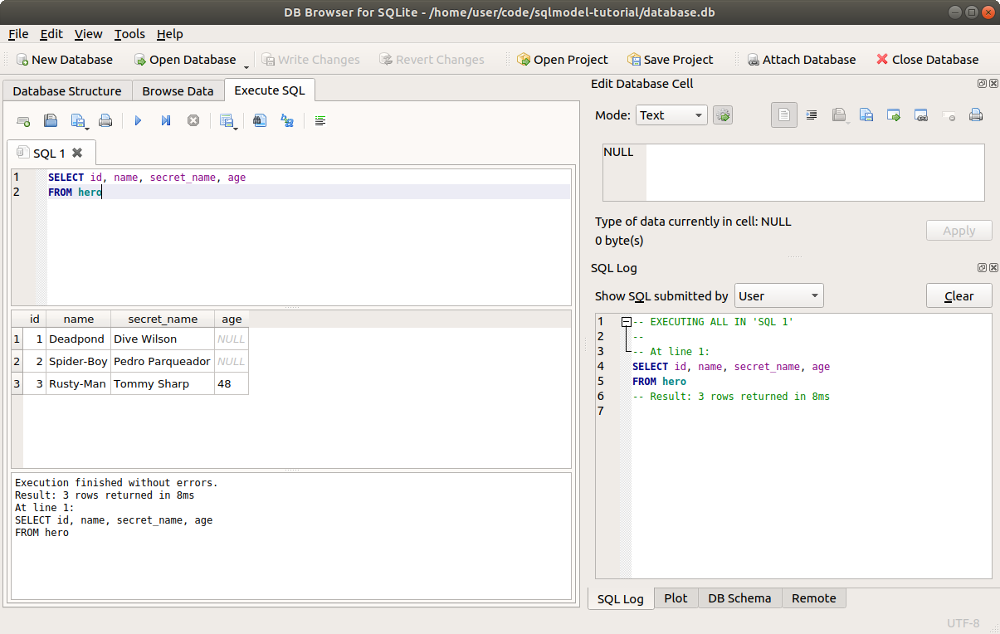

# 读取数据 - SELECT

我们已经有一个包含一些数据的数据库和表格，看起来大致如下所示：

<table>
<tr>
<th>id</th><th>name</th><th>secret_name</th><th>age</th>
</tr>
<tr>
<td>1</td><td>Deadpond</td><td>Dive Wilson</td><td>null</td>
</tr>
<tr>
<td>2</td><td>Spider-Boy</td><td>Pedro Parqueador</td><td>null</td>
</tr>
<tr>
<td>3</td><td>Rusty-Man</td><td>Tommy Sharp</td><td>48</td>
</tr>
</table>

事情变得越来越有趣了！现在让我们来看看如何从数据库中读取数据吧！🤩

## 从上一个代码继续

我们从之前创建数据的代码继续。

/// details | 👀 完整文件预览

//// tab | Python 3.10+

```Python
{!./docs_src/tutorial/insert/tutorial002_py310.py!}
```

////

//// tab | Python 3.7+

```Python
{!./docs_src/tutorial/insert/tutorial002.py!}
```

////

///

我们正在创建一个 **SQLModel** `Hero` 类模型，并插入一些记录。

我们需要 `Hero` 模型和 **引擎**，但是我们将创建一个新的会话来查询数据，放在一个新函数里。

## 使用 SQL 读取数据

在编写 Python 代码之前，让我们快速回顾一下如何用 SQL 查询数据：

```SQL
SELECT id, name, secret_name, age
FROM hero
```

它的意思大致是：

> 嘿 SQL 数据库 👋，请帮我`SELECT`一些数据。
>
> 我首先告诉你我需要哪些列：
>
> * `id`
> * `name`
> * `secret_name`
> * `age`
>
> 然后，我希望你从名为 `"hero"` 的表格中获取这些数据。

接着，数据库会去获取数据，并以类似下表的形式返回给你：

<table>
<tr>
<th>id</th><th>name</th><th>secret_name</th><th>age</th>
</tr>
<tr>
<td>1</td><td>Deadpond</td><td>Dive Wilson</td><td>null</td>
</tr>
<tr>
<td>2</td><td>Spider-Boy</td><td>Pedro Parqueador</td><td>null</td>
</tr>
<tr>
<td>3</td><td>Rusty-Man</td><td>Tommy Sharp</td><td>48</td>
</tr>
</table>

你可以在 **DB Browser for SQLite** 中尝试这个操作：



/// warning

这里我们是获取了所有的行数据。

如果你的数据表有成千上万行，那么对于数据库来说，计算起来可能会很昂贵。

通常你会想过滤行数据，只获取你需要的那部分。但是我们将在下一章学习如何做到这一点。

///

### SQL 快捷方式

如果我们想获取所有列，就像上面那个例子，在 SQL 中有一个快捷方式，直接写一个 `*`，而不是指定每个列的名称：

```SQL
SELECT *
FROM hero
```

这样会得到相同的结果。尽管如此，我们在 **SQLModel** 中不会使用这个方式。

### `SELECT` 少量列

我们也可以只选择少量列，例如：

```SQL
SELECT id, name
FROM hero
```

这里我们只选择了 `id` 和 `name` 列。

这将会返回如下的表格：

<table>
<tr>
<th>id</th><th>name</th>
</tr>
<tr>
<td>1</td><td>Deadpond</td>
</tr>
<tr>
<td>2</td><td>Spider-Boy</td>
</tr>
<tr>
<td>3</td><td>Rusty-Man</td>
</tr>
</table>

这里有一个有趣的观察。SQL 数据库将数据存储在表中，并且总是以 **表格** 的形式返回结果。

### `SELECT` 变体

SQL 语言允许在多个地方使用不同的 **变体** 。

其中一个变体是，在 `SELECT` 语句中，你可以直接使用列的名称，也可以使用表的名称加上点符号作为前缀。

例如，上面的 SQL 代码也可以写成：

```SQL
SELECT hero.id, hero.name, hero.secret_name, hero.age
FROM hero
```

当我们同时处理多个表格时，这一点特别重要，因为多个表格可能会有相同名称的列。

例如 `hero.id` 和 `team.id`，或者 `hero.name` 和 `team.name`。

另一个变体是，大多数 SQL 关键字，比如 `SELECT`，也可以小写书写，例如 `select`。

### 结果表格不一定需要存在

这是一个有趣的部分。SQL 数据库返回的表格 **不需要** 作为独立的表格存在于数据库中。🧙

例如，在我们的数据库中，只有一个包含所有列的表，即 `id`、`name`、`secret_name`、`age`。而我们在这里得到的结果表格只有较少的列。

SQL 的一个主要特点是能够保持数据在不同的表中结构化，避免数据重复等，然后以多种方式查询数据库，并以不同的表格形式返回结果。

## 使用 **SQLModel** 读取数据

现在，让我们用 **SQLModel** 做相同的查询，读取所有英雄的数据。

## 创建 **Session**

第一步是创建一个 **Session**，就像我们在创建数据行时所做的那样。

我们将在一个新的函数 `select_heroes()` 中开始这个过程：

//// tab | Python 3.10+

```Python hl_lines="3-4"
# 上面的代码已省略 👆

{!./docs_src/tutorial/select/tutorial001_py310.py[ln:34-35]!}

# 更多代码将在下文 👇
```

////

//// tab | Python 3.7+

```Python hl_lines="3-4"
# 上面的代码已省略 👆

{!./docs_src/tutorial/select/tutorial001.py[ln:36-37]!}

# 更多代码将在下文 👇
```

////

/// details | 👀 完整文件预览

//// tab | Python 3.10+

```Python
{!./docs_src/tutorial/select/tutorial001_py310.py!}
```

////

//// tab | Python 3.7+

```Python
{!./docs_src/tutorial/select/tutorial001.py!}
```

////

///

## 创建 `select` 语句

接下来，就像我们上面写 SQL `SELECT` 语句一样，现在我们将创建一个 **SQLModel** 的 `select` 语句。

首先，我们需要在文件顶部从 `sqlmodel` 导入 `select`：

//// tab | Python 3.10+

```Python hl_lines="1"
{!./docs_src/tutorial/select/tutorial001_py310.py[ln:1]!}

# 更多代码已省略 👇
```

////

//// tab | Python 3.7+

```Python hl_lines="3"
{!./docs_src/tutorial/select/tutorial001.py[ln:1-3]!}

# 更多代码已省略 👇
```

////

/// 详细信息 | 👀 完整文件预览

//// tab | Python 3.10+

```Python
{!./docs_src/tutorial/select/tutorial001_py310.py!}
```

////

//// tab | Python 3.7+

```Python
{!./docs_src/tutorial/select/tutorial001.py!}
```

////

///

然后，我们将使用它在 Python 代码中创建一个 `SELECT` 语句：

//// tab | Python 3.10+

```Python hl_lines="7"
{!./docs_src/tutorial/select/tutorial001_py310.py[ln:1]!}

# 更多代码已省略 👈

{!./docs_src/tutorial/select/tutorial001_py310.py[ln:34-36]!}

# 更多代码将在下文 👇
```

////

//// tab | Python 3.7+

```Python hl_lines="9"
{!./docs_src/tutorial/select/tutorial001.py[ln:1-3]!}

# 更多代码已省略 👈

{!./docs_src/tutorial/select/tutorial001.py[ln:36-38]!}

# 更多代码将在下文 👇
```

////

/// details | 👀 完整文件预览

//// tab | Python 3.10+

```Python
{!./docs_src/tutorial/select/tutorial001_py310.py!}
```

////

//// tab | Python 3.7+

```Python
{!./docs_src/tutorial/select/tutorial001.py!}
```

////

///

这是一行非常简单的代码，但它传达了很多信息：

```Python
statement = select(Hero)
```

这等同于上面的第一个 SQL `SELECT` 语句：

```SQL
SELECT id, name, secret_name, age
FROM hero
```

我们将类模型 `Hero` 传递给 `select()` 函数。这告诉它我们想要选择所有与 `Hero` 类相关的列。

请注意，在 `select()` 函数中我们并没有明确指定 `FROM` 部分。**SQLModel**（实际上是 SQLAlchemy）已经默认我们要从 `hero` 表中选择，因为 `Hero` 类模型与该表相关联。

/// tip

`select()` 返回的 `statement` 值是一个特殊对象，它允许我们做其他操作。

我将在接下来的章节中告诉你更多关于它的信息。

///

## 执行语句

现在我们有了 `select` 语句，可以使用 **session** 来执行它：

//// tab | Python 3.10+

```Python hl_lines="6"
# 上面的代码已省略 👆

{!./docs_src/tutorial/select/tutorial001_py310.py[ln:34-37]!}

# 更多代码将在下文 👇
```

////

//// tab | Python 3.7+

```Python hl_lines="6"
# 上面的代码已省略 👆

{!./docs_src/tutorial/select/tutorial001.py[ln:36-39]!}

# 更多代码将在下文 👇
```

////

/// details | 👀 完整文件预览

//// tab | Python 3.10+

```Python
{!./docs_src/tutorial/select/tutorial001_py310.py!}
```

////

//// tab | Python 3.7+

```Python
{!./docs_src/tutorial/select/tutorial001.py!}
```

////

///

这会告诉 **session** 使用 **engine** 执行数据库中的 `SELECT` 语句，并返回结果。

由于我们在创建 **engine** 时使用了 `echo=True`，它将在输出中显示所执行的 SQL。

这个 `session.exec(statement)` 将产生以下输出：

```
INFO Engine BEGIN (implicit)
INFO Engine SELECT hero.id, hero.name, hero.secret_name, hero.age
FROM hero
INFO Engine [no key 0.00032s] ()
```

数据库返回了包含所有数据的表格，就像我们直接编写 SQL 时一样：

<table>
<tr>
<th>id</th><th>name</th><th>secret_name</th><th>age</th>
</tr>
<tr>
<td>1</td><td>Deadpond</td><td>Dive Wilson</td><td>null</td>
</tr>
<tr>
<td>2</td><td>Spider-Boy</td><td>Pedro Parqueador</td><td>null</td>
</tr>
<tr>
<td>3</td><td>Rusty-Man</td><td>Tommy Sharp</td><td>48</td>
</tr>
</table>

## 遍历结果

`results` 对象是一个 <abbr title="可以在 `for` 循环中使用的对象">可迭代的</abbr> 对象，可以用来遍历每一行数据。

现在我们可以将它放入一个 `for` 循环中，打印每个英雄：

//// tab | Python 3.10+

```Python hl_lines="7-8"
# 上面的代码已省略 👆

{!./docs_src/tutorial/select/tutorial001_py310.py[ln:34-39]!}

# 下面的代码已省略 👇
```

////

//// tab | Python 3.7+

```Python hl_lines="7-8"
# 上面的代码已省略 👆

{!./docs_src/tutorial/select/tutorial001.py[ln:36-41]!}

# 下面的代码已省略 👇
```

////

/// details | 👀 完整文件预览

//// tab | Python 3.10+

```Python
{!./docs_src/tutorial/select/tutorial001_py310.py!}
```

////

//// tab | Python 3.7+

```Python
{!./docs_src/tutorial/select/tutorial001.py!}
```

////

///

这将打印以下输出：

```
id=1 name='Deadpond' age=None secret_name='Dive Wilson'
id=2 name='Spider-Boy' age=None secret_name='Pedro Parqueador'
id=3 name='Rusty-Man' age=48 secret_name='Tommy Sharp'
```

## 将 `select_heroes()` 添加到 `main()` 函数

现在，在 `main()` 函数中调用 `select_heroes()`，这样当我们从命令行运行程序时，它会被执行：

//// tab | Python 3.10+

```Python hl_lines="14"
# 上面的代码已省略 👆

{!./docs_src/tutorial/select/tutorial001_py310.py[ln:34-45]!}

# 下面的代码已省略 👇
```

////

//// tab | Python 3.7+

```Python hl_lines="14"
# 上面的代码已省略 👆

{!./docs_src/tutorial/select/tutorial001.py[ln:36-47]!}

# 下面的代码已省略 👇
```

////

/// details | 👀 完整文件预览

//// tab | Python 3.10+

```Python
{!./docs_src/tutorial/select/tutorial001_py310.py!}
```

////

//// tab | Python 3.7+

```Python
{!./docs_src/tutorial/select/tutorial001.py!}
```

////

///

## 回顾代码

太好了，你现在可以从数据库中读取数据了！🎉

让我们回顾一下到目前为止的代码：

//// tab | Python 3.10+

```{ .python .annotate }
{!./docs_src/tutorial/select/tutorial002_py310.py!}
```

{!./docs_src/tutorial/select/annotations/en/tutorial002.md!}

////

//// tab | Python 3.7+

```{ .python .annotate }
{!./docs_src/tutorial/select/tutorial002.py!}
```

{!./docs_src/tutorial/select/annotations/en/tutorial002.md!}

////

/// tip

查看数字气泡，看看每行代码做了什么。

///

这里开始更明显地看出为什么我们应该为整个应用程序使用一个 **engine**，但为每组操作使用不同的 **session**。

我们创建的这个新会话使用的是 *相同的* **engine**，但它是一个新的独立的 **session**。

上面的创建模型的代码可以，例如，放在一个处理 Web API 请求并创建模型的函数中。

而从数据库读取数据的第二部分可以放在另一个函数中处理其他请求。

因此，这两部分代码可以放在 **不同的位置**，并且它们需要各自的会话。

/// info

公平地说，在这个例子中，所有的代码实际上可以共享同一个 **session**，这里其实不需要有两个会话。

但这样做可以让我向你展示它们是如何分开的，并强调你应该为每个应用程序使用 **一个 engine**，并为每组操作使用 **多个 session**。

///

## 获取 `Hero` 对象的列表

到目前为止，我们一直在使用 `results` 来进行遍历。

但出于不同的原因，你可能希望立即获取完整的 **`Hero`** 对象列表，而不仅仅是一个 *可迭代对象*。例如，如果你想在 Web API 中返回这些数据。

这个特殊的 `results` 对象还具有一个方法 `results.all()`，它返回一个包含所有对象的列表：

//// tab | Python 3.10+

```Python hl_lines="7"
# 上面的代码已省略 👆

{!./docs_src/tutorial/select/tutorial003_py310.py[ln:34-39]!}

# 下面的代码已省略 👇
```

////

//// tab | Python 3.7+

```Python hl_lines="7"
# 上面的代码已省略 👆

{!./docs_src/tutorial/select/tutorial003.py[ln:36-41]!}

# 下面的代码已省略 👇
```

////

/// details | 👀 完整文件预览

//// tab | Python 3.10+

```Python
{!./docs_src/tutorial/select/tutorial003_py310.py!}
```

////

//// tab | Python 3.7+

```Python
{!./docs_src/tutorial/select/tutorial003.py!}
```

////

///

这样我们就可以将所有的英雄存储在 `heroes` 变量中的一个列表中。

打印后，结果会是这样的：

```
[
    Hero(id=1, name='Deadpond', age=None, secret_name='Dive Wilson'),
    Hero(id=2, name='Spider-Boy', age=None, secret_name='Pedro Parqueador'),
    Hero(id=3, name='Rusty-Man', age=48, secret_name='Tommy Sharp')
]
```

/// info

实际显示时会更紧凑，我为了让你看到它实际上是一个包含所有数据的列表，稍微做了格式化。

///

## 简洁版本

为了向你解释每个对象的作用，我创建了多个变量。

但是现在我们了解了每个对象的作用以及它们的功能后，我们可以简化一下，将它们合并成一个更简洁的形式：

//// tab | Python 3.10+

```Python hl_lines="5"
# 上面的代码已省略 👆

{!./docs_src/tutorial/select/tutorial004_py310.py[ln:34-37]!}

# 下面的代码已省略 👇
```

////

//// tab | Python 3.7+

```Python hl_lines="5"
# 上面的代码已省略 👆

{!./docs_src/tutorial/select/tutorial004.py[ln:36-39]!}

# 下面的代码已省略 👇
```

////

/// details | 👀 完整文件预览

//// tab | Python 3.10+

```Python
{!./docs_src/tutorial/select/tutorial004_py310.py!}
```

////

//// tab | Python 3.7+

```Python
{!./docs_src/tutorial/select/tutorial004.py!}
```

////

///

在这里，我们将所有代码放在一行，实际上你以后会更频繁地将 `select` 语句写成一行。

## SQLModel 或 SQLAlchemy - 技术细节

**SQLModel** 实际上是 **SQLAlchemy** 和 **Pydantic** 的结合体。

它使用并返回相同类型的对象，并与这两个库兼容。

然而，**SQLModel** 定义了一些自己的内部部分，以改善开发者的体验。

在本章中，我们触及到了一些这些细节。

### SQLModel 的 `select`

当你从 `sqlmodel` 导入 `select()` 函数时，你使用的是 **SQLModel** 版本的 `select`。

SQLAlchemy 也有它自己的 `select`，而 SQLModel 的 `select` 在内部使用了 SQLAlchemy 的 `select`。

但是，SQLModel 版本的 `select` 做了很多**技巧**，通过类型注解确保无论你使用 **VS Code**、**PyCharm** 还是其他工具，都能获得最佳的 **编辑器支持**。✨

/// info

为了尽可能提高这一点，内部代码进行了大量工作和研究，使用了不同版本的代码。🤓

///

### SQLModel 的 `session.exec`

📢 这个部分需要特别注意。

SQLAlchemy 自带的 `Session` 有一个方法 `session.execute()`，但没有 `session.exec()` 方法。

如果你查阅 SQLAlchemy 的教程，你会看到它们总是使用 `session.execute()`。

**SQLModel** 自带的 `Session` 直接继承自 SQLAlchemy 的 `Session`，并添加了这个额外的方法 `session.exec()`。在内部，它仍然使用相同的 `session.execute()`。

但是，`session.exec()` 做了很多**技巧**，结合了 `session()` 中的技巧，旨在为你提供**最佳的编辑器支持**，无论是**自动完成**还是**内联错误**，即使是在从 `select` 获取数据之后，也能提供这些功能。✨

例如，在 SQLAlchemy 中，你需要在这里添加 `.scalars()`：

```Python
heroes = session.execute(select(Hero)).scalars().all()
```

但是，当你选择多个项目时（稍后我们会看到），你必须移除它。

SQLModel 的 `session.exec()` 会为你处理这些问题，因此你无需添加 `.scalars()`。

这是 SQLAlchemy 当前无法提供的功能，因为常规的 `session.execute()` 支持其他多种用例，包括旧版用法，因此它不能拥有所有的内部类型注解和技巧来支持这种方式。

除此之外，**SQLModel** 的 `session.exec()` 还做了一些优化，减少了你编写代码的数量，并使其尽可能直观。

但是 SQLModel 的 `Session` 仍然可以访问 `session.execute()`。

/// tip

你的编辑器将为 `session.exec()` 和 `session.execute()` 提供自动完成功能。

📢 记住，**始终使用 `session.exec()`**，以获得最佳的编辑器支持和开发者体验。

///

### **SQLModel** 风格的局限性

SQLModel 设计的目标是为一些 **非常常见的用例** 提供最佳的 **开发者体验** 。✨

你仍然可以直接与 SQLAlchemy 配合使用，并在需要时使用 SQLAlchemy 的 **所有功能** ，包括更低层次的、更加“纯粹”的 SQL 构造、复杂的模式，甚至是旧版模式。🤓

但是， **SQLModel** 的设计（例如类型注解）假设你是在按照我在文档中所讲的方式使用它。

因此，通过这种方式，你将获得尽可能多的 **自动完成** 和 **内联错误** 。🚀

但这也意味着，如果你使用 SQLModel 与 SQLAlchemy 中的一些 **复杂模式** ，编辑器可能会告诉你 *存在错误*，但实际上代码仍然可以正常工作。

这就是取舍。🤷

但对于需要使用这些复杂模式的情况，你总是可以直接使用 SQLAlchemy，并结合 SQLModel（使用相同的模型等）。
