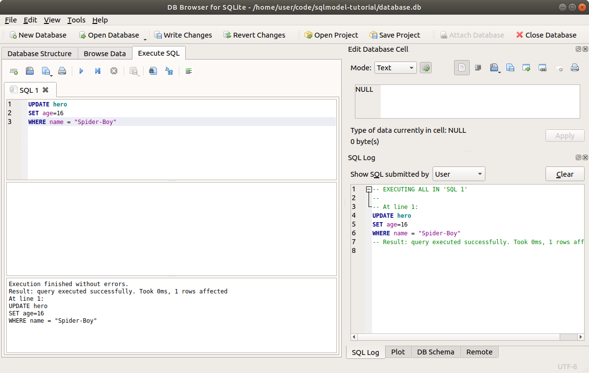

# 更新数据 - UPDATE

现在让我们看看如何使用 **SQLModel** 更新数据。

## 从上一个代码继续

如前所述，我们将从上次的代码继续。

/// details | 👀 完整文件预览

//// tab | Python 3.10+

```Python
{!./docs_src/tutorial/indexes/tutorial002_py310.py!}
```

////

//// tab | Python 3.7+

```Python
{!./docs_src/tutorial/indexes/tutorial002.py!}
```

////

///

在运行示例之前，记得删除 `database.db` 文件，以确保获得相同的结果。

## 使用 SQL 更新

让我们快速查看如何使用 SQL 更新数据：

```SQL hl_lines="1-2"
UPDATE hero
SET age=16
WHERE name = "Spider-Boy"
```

这大致意味着：

> 嘿，SQL 数据库 👋，我要 `UPDATE` 名为 `hero` 的表。
>
> 请将 `age` 列的值设置为 `16`...
>
> ...对于每一行，`WHERE` 列 `name` 的值等于 `"Spider-Boy"`。

与 `SELECT` 语句类似，第一部分定义了要操作的列：要更新哪些列以及将其设置为哪个值。其余列保持不变。

第二部分则通过 `WHERE` 定义了应该应用此更新的行。

在此案例中，由于只有一个名字为 `"Spider-Boy"` 的英雄，所以更新只会应用于这一行。

/// info

请注意，在 `UPDATE` 中，单等号（`=`）表示 **赋值** ，即将列设置为某个值。

而在 `WHERE` 中，相同的单等号（`=`）用于 **比较** 两个值，以查找匹配的行。

这与 Python 和大多数编程语言的用法有所不同，在这些语言中，单等号（`=`）用于赋值，而双等号（`==`）用于比较。

///

你可以在 **DB Browser for SQLite** 中尝试执行这个 SQL：



更新后，表中的数据将如下所示，`Spider-Boy` 的年龄已更新为 16：

<table>
<tr>
<th>id</th><th>name</th><th>secret_name</th><th>age</th>
</tr>
<tr>
<td>1</td><td>Deadpond</td><td>Dive Wilson</td><td>null</td>
</tr>
<tr>
<td>2</td><td>Spider-Boy</td><td>Pedro Parqueador</td><td>16 ✨</td>
</tr>
<tr>
<td>3</td><td>Rusty-Man</td><td>Tommy Sharp</td><td>48</td>
</tr>
</table>

/// tip

通常情况下，你会通过 `id` 查找要更新的行，例如：

```SQL
UPDATE hero
SET age=16
WHERE id = 2
```

但在上面的示例中，我使用了 `name` 来使操作更直观。

///

现在，让我们用 **SQLModel** 在代码中做同样的更新。

为了获得相同的结果，在运行示例之前删除 `database.db` 文件。

## 从数据库读取数据

我们将从选择英雄 `"Spider-Boy"` 开始，这也是我们将要更新的数据：

//// tab | Python 3.10+

```Python hl_lines="5"
# 上面的代码省略 👆

{!./docs_src/tutorial/update/tutorial001_py310.py[ln:42-47]!}

# 下面的代码省略 👇
```

////

//// tab | Python 3.7+

```Python hl_lines="5"
# 上面的代码省略 👆

{!./docs_src/tutorial/update/tutorial001.py[ln:44-49]!}

# 下面的代码省略 👇
```

////

/// details | 👀 完整文件预览

//// tab | Python 3.10+

```Python
{!./docs_src/tutorial/update/tutorial001_py310.py!}
```

////

//// tab | Python 3.7+

```Python
{!./docs_src/tutorial/update/tutorial001.py!}
```

////

///

别忘了将 `update_heroes()` 函数添加到 `main()` 函数中，这样在从命令行执行程序时会调用它：

//// tab | Python 3.10+

```Python hl_lines="6"
# 上面的代码省略 👆

{!./docs_src/tutorial/update/tutorial001_py310.py[ln:56-63]!}
```

////

//// tab | Python 3.7+

```Python hl_lines="6"
# 上面的代码省略 👆

{!./docs_src/tutorial/update/tutorial001.py[ln:58-65]!}
```

////

/// details | 👀 完整文件预览

//// tab | Python 3.10+

```Python
{!./docs_src/tutorial/update/tutorial001_py310.py!}
```

////

//// tab | Python 3.7+

```Python
{!./docs_src/tutorial/update/tutorial001.py!}
```

////

///

到目前为止，在命令行运行程序时将输出：

<div class="termy">

```console
$ python app.py

// 一些模板代码和之前的输出省略 😉

// SELECT with WHERE
INFO Engine SELECT hero.id, hero.name, hero.secret_name, hero.age
FROM hero
WHERE hero.name = ?
INFO Engine [no key 0.00017s] ('Spider-Boy',)

// 打印从数据库获取的英雄
Hero: name='Spider-Boy' secret_name='Pedro Parqueador' age=None id=2
```

</div>

/// tip

注意到到目前为止，这个英雄的年龄仍然没有设置。

///

## 设置字段值

现在你已经有了一个 `hero` 对象，你可以简单地设置你想要的字段值（代表列的属性）。

在本例中，我们将 `age` 设置为 `16`：

//// tab | Python 3.10+

```Python hl_lines="10"
# 上面的代码省略 👆

{!./docs_src/tutorial/update/tutorial001_py310.py[ln:42-49]!}

# 下面的代码省略 👇
```

////

//// tab | Python 3.7+

```Python hl_lines="10"
# 上面的代码省略 👆

{!./docs_src/tutorial/update/tutorial001.py[ln:44-51]!}

# 下面的代码省略 👇
```

////

/// details | 👀 完整文件预览

//// tab | Python 3.10+

```Python
{!./docs_src/tutorial/update/tutorial001_py310.py!}
```

////

//// tab | Python 3.7+

```Python
{!./docs_src/tutorial/update/tutorial001.py!}
```

////

///

## 将英雄添加到会话中

现在，由于 `hero` 对象在内存中的值已经发生了变化，特别是 `age` 的新值，我们需要将它添加到会话中。

这与我们在创建新的英雄实例时做的操作是一样的：

//// tab | Python 3.10+

```Python hl_lines="11"
# 上面的代码省略 👆

{!./docs_src/tutorial/update/tutorial001_py310.py[ln:42-50]!}

# 下面的代码省略 👇
```

////

//// tab | Python 3.7+

```Python hl_lines="11"
# 上面的代码省略 👆

{!./docs_src/tutorial/update/tutorial001.py[ln:44-52]!}

# 下面的代码省略 👇
```

////

/// details | 👀 完整文件预览

//// tab | Python 3.10+

```Python
{!./docs_src/tutorial/update/tutorial001_py310.py!}
```

////

//// tab | Python 3.7+

```Python
{!./docs_src/tutorial/update/tutorial001.py!}
```

////

///

## 提交会话

要保存会话中的当前更改，需要 **提交** 会话。

这将把更新后的英雄保存到数据库中：

//// tab | Python 3.10+

```Python hl_lines="12"
# 上面的代码省略 👆

{!./docs_src/tutorial/update/tutorial001_py310.py[ln:42-51]!}

# 下面的代码省略 👇
```

////

//// tab | Python 3.7+

```Python hl_lines="12"
# 上面的代码省略 👆

{!./docs_src/tutorial/update/tutorial001.py[ln:44-53]!}

# 下面的代码省略 👇
```

////

/// details | 👀 完整文件预览

//// tab | Python 3.10+

```Python
{!./docs_src/tutorial/update/tutorial001_py310.py!}
```

////

//// tab | Python 3.7+

```Python
{!./docs_src/tutorial/update/tutorial001.py!}
```

////

///

它还会保存会话中任何其他已经添加的内容。

例如，如果你之前创建了新的英雄并将这些对象添加到会话中，它们也将在这次提交中一起保存。

此提交将生成以下输出：

<div class="termy">

```console
$ python app.py

// 一些模板输出省略 😉

// 上述输出省略 🙈

// 更新英雄数据的 SQL 语句
INFO Engine UPDATE hero SET age=? WHERE hero.id = ?
INFO Engine [generated in 0.00017s] (16, 2)
INFO Engine COMMIT
```

</div>

## 刷新对象

此时，英雄数据已在数据库中更新，并且新数据已经保存。

如果我们访问某个属性，例如 `hero.name`，对象中的数据会自动刷新。

但在这个示例中，我们并没有访问任何属性，我们只是打印对象。同时，为了更加明确，我们将直接使用 `.refresh()` 来刷新对象：

//// tab | Python 3.10+

```Python hl_lines="13"
# 上面的代码省略 👆

{!./docs_src/tutorial/update/tutorial001_py310.py[ln:42-52]!}

# 下面的代码省略 👇
```

////

//// tab | Python 3.7+

```Python hl_lines="13"
# 上面的代码省略 👆

{!./docs_src/tutorial/update/tutorial001.py[ln:44-54]!}

# 下面的代码省略 👇
```

////

/// details | 👀 完整文件预览

//// tab | Python 3.10+

```Python
{!./docs_src/tutorial/update/tutorial001_py310.py!}
```

////

//// tab | Python 3.7+

```Python
{!./docs_src/tutorial/update/tutorial001.py!}
```

////

///

此刷新操作将触发与访问属性时自动触发的相同 SQL 查询。因此，它将生成以下输出：

<div class="termy">

```console
$ python app.py

// 一些模板输出省略 😉

// 上述输出省略 🙈

// 执行选择最新英雄数据的 SQL 查询
INFO Engine SELECT hero.id, hero.name, hero.secret_name, hero.age
FROM hero
WHERE hero.id = ?
INFO Engine [generated in 0.00018s] (2,)
```

</div>

## 打印更新后的对象

现在我们可以直接打印出更新后的英雄：

//// tab | Python 3.10+

```Python hl_lines="14"
# 上面的代码省略 👆

{!./docs_src/tutorial/update/tutorial001_py310.py[ln:42-53]!}

# 下面的代码省略 👇
```

////

//// tab | Python 3.7+

```Python hl_lines="14"
# 上面的代码省略 👆

{!./docs_src/tutorial/update/tutorial001.py[ln:44-55]!}

# 下面的代码省略 👇
```

////

/// details | 👀 完整文件预览

//// tab | Python 3.10+

```Python
{!./docs_src/tutorial/update/tutorial001_py310.py!}
```

////

//// tab | Python 3.7+

```Python
{!./docs_src/tutorial/update/tutorial001.py!}
```

////

///

因为我们在更新之后立即刷新了它，它现在包含最新的数据，包括我们刚刚更新的 `age`。

所以，打印出来将显示新的 `age`：

<div class="termy">

```console
$ python app.py

// 一些模板输出省略 😉

// 上述输出省略 🙈

// 打印更新后的英雄，包含新的年龄
Updated hero: name='Spider-Boy' secret_name='Pedro Parqueador' age=16 id=2
```

</div>

## 回顾代码

现在让我们回顾一下所有的代码：

//// tab | Python 3.10+

```{ .python .annotate hl_lines="42-53" }
{!./docs_src/tutorial/update/tutorial002_py310.py!}
```

{!./docs_src/tutorial/update/annotations/en/tutorial002.md!}

////

//// tab | Python 3.7+

```{ .python .annotate hl_lines="44-55" }
{!./docs_src/tutorial/update/tutorial002.py!}
```

{!./docs_src/tutorial/update/annotations/en/tutorial002.md!}

////

/// tip

查看每行代码旁边的数字气泡，了解每行代码的作用。

///

## 多次更新

使用 **SQLModel** 进行更新的过程与创建新对象的过程差不多，你只需要将它们添加到会话中，然后提交它们。

这也意味着你可以一次更新多个字段（属性，列），并且还可以一次更新多个对象（英雄）：

//// tab | Python 3.10+

```{ .python .annotate hl_lines="15-17  19-21  23" }
# 上面的代码省略 👆

{!./docs_src/tutorial/update/tutorial004_py310.py[ln:42-68]!}

# 下面的代码省略 👇
```

{!./docs_src/tutorial/update/annotations/en/tutorial004.md!}

////

//// tab | Python 3.7+

```{ .python .annotate hl_lines="15-17  19-21  23" }
# 上面的代码省略 👆

{!./docs_src/tutorial/update/tutorial004.py[ln:44-70]!}

# 下面的代码省略 👇
```

{!./docs_src/tutorial/update/annotations/en/tutorial004.md!}

////

/// details | 👀 完整文件预览

//// tab | Python 3.10+

```Python
{!./docs_src/tutorial/update/tutorial004_py310.py!}
```

////

//// tab | Python 3.7+

```Python
{!./docs_src/tutorial/update/tutorial004.py!}
```

////

///

/// tip

点击每个数字气泡，回顾每行代码的作用。👆

///

## 总结

更新 **SQLModel** 对象的方式与更新其他 Python 对象相同。🐍

只需要记得将它们 `add` 到 **会话** 中，然后执行 `commit`。如果需要，还可以执行 `refresh` 来刷新它们。
