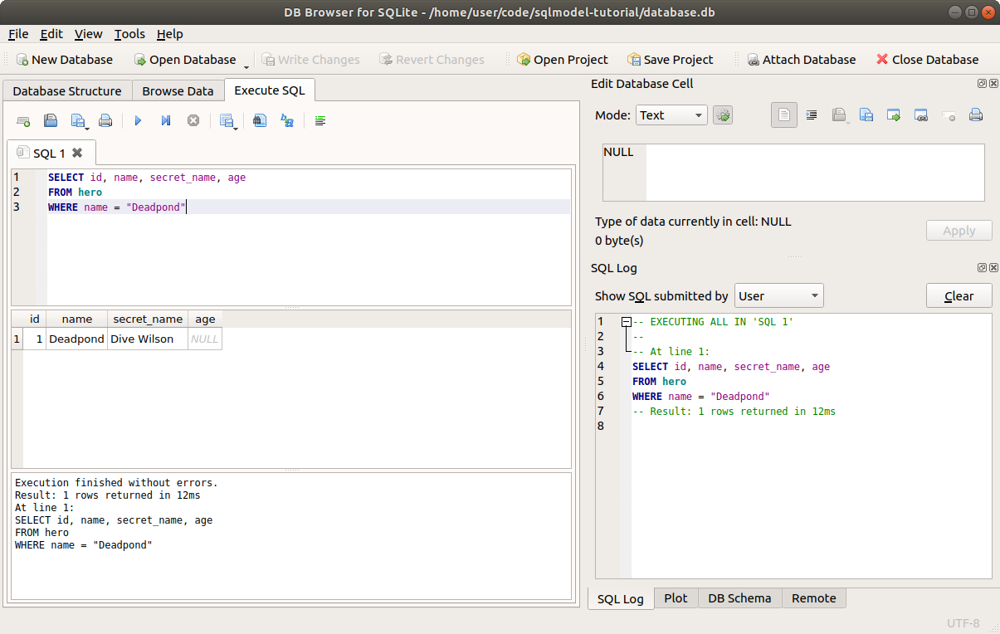

# 过滤数据 - WHERE

在上一章中，我们学习了如何从数据库中 `SELECT` 数据。

我们使用了纯 **SQL** 和 **SQLModel**。

但我们始终是获取了所有的行，即整个表：

<table>
<tr>
<th>id</th><th>name</th><th>secret_name</th><th>age</th>
</tr>
<tr>
<td>1</td><td>Deadpond</td><td>Dive Wilson</td><td>null</td>
</tr>
<tr>
<td>2</td><td>Spider-Boy</td><td>Pedro Parqueador</td><td>null</td>
</tr>
<tr>
<td>3</td><td>Rusty-Man</td><td>Tommy Sharp</td><td>48</td>
</tr>
</table>

在大多数情况下，我们只想获取一行数据，或者仅获取一组行。

现在我们将学习如何做到这一点，通过过滤数据，只获取 **满足条件** 的行。

## 从之前的代码继续

我们将继续使用之前章节中创建和选择数据时使用的相同示例。

现在我们将更新 `select_heroes()` 来过滤数据。

/// details | 👀 完整文件预览

//// tab | Python 3.10+

```Python hl_lines="36-41"
{!./docs_src/tutorial/select/tutorial001_py310.py!}
```

////

//// tab | Python 3.7+

```Python hl_lines="36-41"
{!./docs_src/tutorial/select/tutorial001.py!}
```

////

///

如果你已经执行了之前的示例并且有一个包含数据的数据库，在运行每个示例之前 **删除数据库文件**，这样你就不会有重复的数据，并且能够得到相同的结果。

## 使用 SQL 过滤数据

首先让我们看看如何使用 **SQL** 和 `WHERE` 关键字来过滤数据。

```SQL hl_lines="3"
SELECT id, name, secret_name, age
FROM hero
WHERE name = "Deadpond"
```

第一部分的含义与之前相同：

> 嘿，SQL 数据库 👋，请帮我 `SELECT` 一些数据。
>
> 我先告诉你我想要哪些列：
>
> * `id`
> * `name`
> * `secret_name`
> * `age`
>
> 并且我希望你从名为 `"hero"` 的表中获取这些列。

然后，`WHERE` 关键字加入了以下条件：

> 所以，SQL 数据库，我已经告诉你要 `SELECT` 哪些列，以及从哪里选择。
> 但我不希望你返回所有的行，我只想要那些 `name` 列的值为 `"Deadpond"` 的行。

然后，数据库将返回如下表格：

<table>
<tr>
<th>id</th><th>name</th><th>secret_name</th><th>age</th>
</tr>
<tr>
<td>1</td><td>Deadpond</td><td>Dive Wilson</td><td>null</td>
</tr>
</table>

/// tip

即使结果只有一行，数据库仍然会返回一个 **表格**。

在这种情况下，表格只有一行。

///

你可以在 **DB Browser for SQLite** 中试一下：



### `WHERE` 和 `FROM` 是“子句”

这些附加的关键字，如 `WHERE` 和 `FROM`，是紧跟在 `SELECT`（或其他关键字）后面的部分，它们有一个技术名词，叫做 **子句**。

还有其他的子句，它们有自己的 SQL 关键字。

在这里我不会过多使用 **子句** 这个术语，但了解它对你有帮助，因为它可能会出现在你以后阅读的其他教程中。🤓

## `SELECT` 和 `WHERE`

这是一个帮助我理解的快速技巧。

* **`SELECT`** 用来告诉 SQL 数据库返回哪些 **列**。
* **`WHERE`** 用来告诉 SQL 数据库返回哪些 **行**。

表格的两种维度的大小主要取决于这两个关键字。

### `SELECT` 区域

如果表格有太多或太少的 **列**，那是在 **`SELECT`** 部分修改的。

假设有一个表格：

<table>
<tr>
<th>id</th><th>name</th><th>secret_name</th><th>age</th>
</tr>
<tr>
<td>1</td><td>Deadpond</td><td>Dive Wilson</td><td>null</td>
</tr>
<tr>
<td>2</td><td>Spider-Boy</td><td>Pedro Parqueador</td><td>null</td>
</tr>
<tr>
<td>3</td><td>Rusty-Man</td><td>Tommy Sharp</td><td>48</td>
</tr>
</table>

...如果改变 **列** 的数量：

<table>
<tr>
<th>name</th>
</tr>
<tr>
<td>Deadpond</td>
</tr>
<tr>
<td>Spider-Boy</td>
</tr>
<tr>
<td>Rusty-Man</td>
</tr>
</table>

...这就是 `SELECT` 区域。

### `WHERE` 区域

如果表格有太多或太少的 **行**，那是在 **`WHERE`** 部分修改的。

假设有一个表格：

<table>
<tr>
<th>id</th><th>name</th><th>secret_name</th><th>age</th>
</tr>
<tr>
<td>1</td><td>Deadpond</td><td>Dive Wilson</td><td>null</td>
</tr>
<tr>
<td>2</td><td>Spider-Boy</td><td>Pedro Parqueador</td><td>null</td>
</tr>
<tr>
<td>3</td><td>Rusty-Man</td><td>Tommy Sharp</td><td>48</td>
</tr>
</table>

...如果改变 **行** 的数量：

<table>
<tr>
<th>id</th><th>name</th><th>secret_name</th><th>age</th>
</tr>
<tr>
<td>2</td><td>Spider-Boy</td><td>Pedro Parqueador</td><td>null</td>
</tr>
</table>

...这就是 `WHERE` 区域。

## 回顾使用 **SQLModel** 的 `SELECT`

让我们回顾一下我们用来读取数据的部分代码，重点关注 **select** 语句：

//// tab | Python 3.10+

```Python hl_lines="5"
# 省略上面的代码 👆

{!./docs_src/tutorial/select/tutorial001_py310.py[ln:34-39]!}

# 省略下面的代码 👇
```

////

//// tab | Python 3.7+

```Python hl_lines="5"
# 省略上面的代码 👆

{!./docs_src/tutorial/select/tutorial001.py[ln:36-41]!}

# 省略下面的代码 👇
```

////

/// details | 👀 完整文件预览

//// tab | Python 3.10+

```Python
{!./docs_src/tutorial/select/tutorial001_py310.py!}
```

////

//// tab | Python 3.7+

```Python
{!./docs_src/tutorial/select/tutorial001.py!}
```

////

///

## 使用 **SQLModel** 的 `WHERE` 过滤行

现在，就像我们在 SQL 语句中添加 `WHERE` 来过滤行一样，我们也可以在 **SQLModel** 的 `select()` 语句中添加 `.where()` 来过滤行，从而过滤返回的对象：

//// tab | Python 3.10+

```Python hl_lines="5"
# 省略上面的代码 👆

{!./docs_src/tutorial/where/tutorial001_py310.py[ln:34-39]!}

# 省略下面的代码 👇
```

////

//// tab | Python 3.7+

```Python hl_lines="5"
# 省略上面的代码 👆

{!./docs_src/tutorial/where/tutorial001.py[ln:36-41]!}

# 省略下面的代码 👇
```

////

/// details | 👀 完整文件预览

//// tab | Python 3.10+

```Python
{!./docs_src/tutorial/where/tutorial001_py310.py!}
```

////

//// tab | Python 3.7+

```Python
{!./docs_src/tutorial/where/tutorial001.py!}
```

////

///

这只是一个非常小的改变，但其中包含了许多细节。让我们来探讨一下。

## `select()` 对象

`select(Hero)` 返回的对象是一个具有一些方法的特殊类型对象。

其中一个方法是 `.where()`，用于（不出所料）向 SQL 语句中添加 `WHERE` 条件，在该 **select** 对象中进行过滤。

我们将稍后探索其他方法。💡

这些方法中的大多数在修改对象后会返回相同的对象。

因此，我们可以一个接一个地调用它们：

```Python
statement = select(Hero).where(Hero.name == "Deadpond").where(Hero.age == 48)
```

## 调用 `.where()`

现在，这个 `.where()` 方法是特别且非常强大的。它与 **SQLModel**（实际上是 SQLAlchemy）紧密集成，让你可以使用非常熟悉的 Python 语法和代码。

注意，我们没有使用单个等号 (`=`) 来调用它，也没有像这样写：

```Python
# 不支持 🚨
select(Hero).where(name="Deadpond")
```

这样当然会更简洁，但会更加容易出错且有限制。稍后我会向你展示原因。

相反，我们使用了两个 `==`：

```Python
select(Hero).where(Hero.name == "Deadpond")
```

那么，这里到底发生了什么？

## `.where()` 和表达式

在上面的例子中，我们使用了两个等号 (`==`)。这叫做 "**等于运算符**"。

/// 提示

**运算符** 只是一个符号，它放在一个值旁边，或者两个值之间，用来对它们进行操作。

`==` 被称为 **等于** 运算符，因为它检查两个东西是否 **相等**。

///

在编写 Python 代码时，如果你使用这个等于运算符 (`==`) 这样写：

```Python
some_name == "Deadpond"
```

...这叫做 **相等比较**，通常结果是：

```Python
True
```

...或者：

```Python
False
```

/// 提示

`<`, `>`, `==`, `>=`, `<=`, 和 `!=` 都是用于 **比较** 的 **运算符**。

///

但是，SQLAlchemy 给模型类中的列/字段添加了一些魔法，使得这些 Python 比较具有超级能力。

所以，如果你写出类似于：

```Python
Hero.name == "Deadpond"
```

...这并不会返回 `True` 或 `False`。🤯

相反，它会返回一个特殊类型的对象。如果你在交互式 Python 会话中尝试这个，你会看到类似这样的输出：

```Python
>>> Hero.name == "Deadpond"
<sqlalchemy.sql.elements.BinaryExpression object at 0x7f4aec0d6c90>
```

所以，结果值是一个 **表达式** 对象。💡

而 `.where()` 方法则接受一个（或多个）这种 **表达式** 对象来更新 SQL 语句。

## 模型类属性、表达式和实例

现在，让我们停下来做一个非常重要且容易忽视的清晰区分。

**模型类属性** 对于每个列/字段来说是特别的，可以用于表达式。

但这仅适用于 **模型类属性**。🚨

**实例** 属性则像普通的 Python 值一样表现。✅

因此，在 Python 比较中使用类（`Hero`，首字母大写）：

```Python
Hero.name == "Deadpond"
```

...结果是一个 **表达式** 对象，用于 `.where()`：

```Python
<sqlalchemy.sql.elements.BinaryExpression object at 0x7f4aec0d6c90>
```

但是，如果你创建一个实例：

```Python
some_hero = Hero(name="Deadpond", secret_name="Dive Wilson")
```

...并在比较中使用它：

```Python
some_hero.name == "Deadpond"
```

...这将返回一个 Python 值：

```Python
True
```

...或者如果它是一个具有不同名称的对象，它可能是：

```Python
False
```

区别在于，一个是使用 **模型类**，另一个是使用 **实例**。

## 类还是实例

你很可能最终会有一个名为 `hero`（小写 `h`）的变量，如：

```Python
hero = Hero(name="Deadpond", secret_name="Dive Wilson")
```

现在类是 `Hero`（大写 `H`），实例是 `hero`（小写 `h`）。

因此，现在你有 `Hero.name` 和 `hero.name`，它们看起来非常相似，但却是两个不同的东西：

```Python
>>> Hero.name == "Deadpond"
<sqlalchemy.sql.elements.BinaryExpression object at 0x7f4aec0d6c90>

>>> hero.name == "Deadpond"
True
```

这只是一个需要注意的点。🤓

但在理解了类和实例之间的区别后，它会变得很自然，你可以做出非常强大的操作。🚀

例如，由于 `hero.name` 像一个 `str` 类型，`Hero.name` 像一个用于比较的特殊对象，你可以写出如下代码：

```Python
select(Hero).where(Hero.name == hero.name)
```

这意味着：

> 嘿，SQL 数据库 👋，请 `SELECT` 所有列
>
> `FROM` 模型类 `Hero` 的表（表 `"hero"`）
>
> `WHERE` 列 `"name"` 等于我这里的这个英雄实例的名字：`hero.name`（在上面的示例中，值为 `"Deadpond"`）。

## `.where()` 和表达式代替关键字参数

现在，让我告诉你为什么我认为在与 SQL 数据库交互的这个用例中，使用这些表达式比使用关键字参数更好：

```Python
# 表达式 ✨
select(Hero).where(Hero.name == "Deadpond")
```

...而不是像这样使用关键字参数：

```Python
# 不支持，关键字参数 🚨
select(Hero).where(name="Deadpond")
```

当然，使用关键字参数会稍微简洁一点。

但是，使用 **表达式** 时，你的编辑器可以通过自动补全和内联错误检查为你提供很多帮助。✨

让我举个例子。假设 SQLModel 支持关键字参数，并且你想使用 Spider-Boy 的秘密身份来进行筛选。

你可能会写：

```Python
# 不要复制这个 🚨
select(Hero).where(secret_identity="Pedro Parqueador")
```

编辑器会看到这段代码，由于它没有任何信息来告诉你哪些关键字参数是允许的，哪些是不允许的，它就无法帮助你 **检测到错误**。

也许你的代码甚至可以运行，看起来一切正常，然后几个月后你会想知道为什么你的应用 *从未找到任何行*，尽管你确信有一个名为 `"Pedro Parqueador"` 的记录。😱

最后，也许你才会意识到，我们写的代码使用了 `secret_identity`，而这个并不是表中的列。我们应该写 `secret_name`。

现在，使用表达式时，如果你尝试这样写：

```Python
# 表达式 ✨
select(Hero).where(Hero.secret_identity == "Pedro Parqueador")
```

编辑器会立刻显示错误。

更好的是，它会为你自动补全正确的列名，变成：

```Python
select(Hero).where(Hero.secret_name == "Pedro Parqueador")
```

我认为，仅仅是拥有更好的编辑器支持、自动补全和内联错误检查，就足以让使用表达式比使用关键字参数更具优势。✨

/// tip

**表达式** 还提供了更多用于其他类型比较的功能，如下所示。👇

///

## 执行语句

现在我们知道了 `.where()` 的工作原理，让我们完成代码。

实际上，这与之前章节中选择数据的方式是一样的：

//// tab | Python 3.10+

```Python hl_lines="6-8"
# 代码省略 👆

{!./docs_src/tutorial/where/tutorial001_py310.py[ln:34-39]!}

# 代码省略 👇
```

////

//// tab | Python 3.7+

```Python hl_lines="6-8"
# 代码省略 👆

{!./docs_src/tutorial/where/tutorial001.py[ln:36-41]!}

# 代码省略 👇
```

////

/// details | 👀 完整文件预览

//// tab | Python 3.10+

```Python
{!./docs_src/tutorial/where/tutorial001_py310.py!}
```

////

//// tab | Python 3.7+

```Python
{!./docs_src/tutorial/where/tutorial001.py!}
```

////

///

我们获取包含 `WHERE` 的语句，并通过 `exec()` 执行它来获取结果。

在这个例子中，结果将只有一行：

<div class="termy">

```console
$ python app.py

// 一些样板输出被省略 😉

// 现在是关键部分，带有 WHERE 的 SELECT 💡

INFO Engine SELECT hero.id, hero.name, hero.secret_name, hero.age
FROM hero
WHERE hero.name = ?
INFO Engine [no key 0.00014s] ('Deadpond',)

// 这是唯一打印的英雄
secret_name='Dive Wilson' age=None id=1 name='Deadpond'
```

</div>

/// tip

`results` 对象是一个可迭代对象，可以在 `for` 循环中使用。

即使我们只得到了一个行，我们仍然会迭代 `results` 对象，就像它是一个包含一个元素的列表一样。

我们稍后会看到获取数据的其他方式。

///

## 其他比较

这是将这些特殊的 **表达式** 传递给 `.where()` 的另一个巨大优势。

在上面，我们使用了“等于”比较（使用 `==`），仅检查两个事物的值是否相同。

但我们也可以使用其他标准的 Python 比较。✨

### 不等于

我们可以使用 `!=` 来获取列值 **不等于** 某个值的行：

//// tab | Python 3.10+

```Python hl_lines="5"
# 代码省略 👆

{!./docs_src/tutorial/where/tutorial002_py310.py[ln:34-39]!}

# 代码省略 👇
```

////

//// tab | Python 3.7+

```Python hl_lines="5"
# 代码省略 👆

{!./docs_src/tutorial/where/tutorial002.py[ln:36-41]!}

# 代码省略 👇
```

////

/// details | 👀 完整文件预览

//// tab | Python 3.10+

```Python
{!./docs_src/tutorial/where/tutorial002_py310.py!}
```

////

//// tab | Python 3.7+

```Python
{!./docs_src/tutorial/where/tutorial002.py!}
```

////

///

这将输出：

```
secret_name='Pedro Parqueador' age=None id=2 name='Spider-Boy'
secret_name='Tommy Sharp' age=48 id=3 name='Rusty-Man'
```

### 暂停以添加数据

让我们更新 `create_heroes()` 函数，添加更多行数据，以使接下来的比较示例更清晰：

//// tab | Python 3.10+

```Python hl_lines="4-10  13-19"
# 代码省略 👆

{!./docs_src/tutorial/where/tutorial003_py310.py[ln:21-39]!}

# 代码省略 👇
```

////

//// tab | Python 3.7+

```Python hl_lines="4-10  13-19"
# 代码省略 👆

{!./docs_src/tutorial/where/tutorial003.py[ln:23-41]!}

# 代码省略 👇
```

////

/// details | 👀 完整文件预览

//// tab | Python 3.10+

```Python
{!./docs_src/tutorial/where/tutorial003_py310.py!}
```

////

//// tab | Python 3.7+

```Python
{!./docs_src/tutorial/where/tutorial003.py!}
```

////

///

现在我们有了多个不同年龄的英雄，接下来的比较操作将变得更加直观。

### 大于

现在我们使用 `>` 来获取某列值 **大于** 某个值的行：

//// tab | Python 3.10+

```Python hl_lines="5"
# 代码省略 👆

{!./docs_src/tutorial/where/tutorial003_py310.py[ln:42-47]!}

# 代码省略 👇
```

////

//// tab | Python 3.7+

```Python hl_lines="5"
# 代码省略 👆

{!./docs_src/tutorial/where/tutorial003.py[ln:44-49]!}

# 代码省略 👇
```

////

/// details | 👀 完整文件预览

//// tab | Python 3.10+

```Python
{!./docs_src/tutorial/where/tutorial003_py310.py!}
```

////

//// tab | Python 3.7+

```Python
{!./docs_src/tutorial/where/tutorial003.py!}
```

////

///

这将输出：

```
age=48 id=3 name='Rusty-Man' secret_name='Tommy Sharp'
age=36 id=6 name='Dr. Weird' secret_name='Steve Weird'
age=93 id=7 name='Captain North America' secret_name='Esteban Rogelios'
```

/// tip

注意，它没有选择 `Black Lion`，因为年龄没有**严格**大于 `35`。

///

### 大于或等于

让我们再做一次，但是这次使用 `>=` 来获取某列值 **大于或等于** 某个值的行：

//// tab | Python 3.10+

```Python hl_lines="5"
# 代码省略 👆

{!./docs_src/tutorial/where/tutorial004_py310.py[ln:42-47]!}

# 代码省略 👇
```

////

//// tab | Python 3.7+

```Python hl_lines="5"
# 代码省略 👆

{!./docs_src/tutorial/where/tutorial004.py[ln:44-49]!}

# 代码省略 👇
```

////

/// details | 👀 完整文件预览

//// tab | Python 3.10+

```Python
{!./docs_src/tutorial/where/tutorial004_py310.py!}
```

////

//// tab | Python 3.7+

```Python
{!./docs_src/tutorial/where/tutorial004.py!}
```

////

///

由于我们使用了 `>=`，所以年龄为 `35` 的行也会被包括在输出中：

``` hl_lines="2"
age=48 id=3 name='Rusty-Man' secret_name='Tommy Sharp'
age=35 id=5 name='Black Lion' secret_name='Trevor Challa'
age=36 id=6 name='Dr. Weird' secret_name='Steve Weird'
age=93 id=7 name='Captain North America' secret_name='Esteban Rogelios'
```

/// tip

这次我们也得到了 `Black Lion`，因为尽管年龄不 **严格** 大于 `35`，它 **等于** `35`。

///

### 小于

类似地，我们可以使用 `<` 来获取某列值 **小于** 某个值的行：

//// tab | Python 3.10+

```Python hl_lines="5"
# 代码省略 👆

{!./docs_src/tutorial/where/tutorial005_py310.py[ln:42-47]!}

# 代码省略 👇
```

////

//// tab | Python 3.7+

```Python hl_lines="5"
# 代码省略 👆

{!./docs_src/tutorial/where/tutorial005.py[ln:44-49]!}

# 代码省略 👇
```

////

/// details | 👀 完整文件预览

//// tab | Python 3.10+

```Python
{!./docs_src/tutorial/where/tutorial005_py310.py!}
```

////

//// tab | Python 3.7+

```Python
{!./docs_src/tutorial/where/tutorial005.py!}
```

////

///

输出的结果是数据库中年龄更小的一行：

```
age=32 id=4 name='Tarantula' secret_name='Natalia Roman-on'
```

/// tip

我们可以假设 **Spider-Boy** 更年轻。但由于我们不知道他的年龄，它在数据库中是 `NULL`（在 Python 中是 `None`），所以它不会与这些数字的年龄比较匹配。

///

### 小于或等于

最后，我们可以使用 `<=` 来获取某列值 **小于或等于** 某个值的行：

//// tab | Python 3.10+

```Python hl_lines="5"
# 代码省略 👆

{!./docs_src/tutorial/where/tutorial006_py310.py[ln:42-47]!}

# 代码省略 👇
```

////

//// tab | Python 3.7+

```Python hl_lines="5"
# 代码省略 👆

{!./docs_src/tutorial/where/tutorial006.py[ln:44-49]!}

# 代码省略 👇
```

////

/// details | 👀 完整文件预览

//// tab | Python 3.10+

```Python
{!./docs_src/tutorial/where/tutorial006_py310.py!}
```

////

//// tab | Python 3.7+

```Python
{!./docs_src/tutorial/where/tutorial006.py!}
```

////

///

我们得到了年龄小于或等于 `35` 的行：

``` 
age=32 id=4 name='Tarantula' secret_name='Natalia Roman-on'
age=35 id=5 name='Black Lion' secret_name='Trevor Challa'
```

/// tip

我们也得到了 `Black Lion`，因为虽然年龄不*严格*小于 `35`，但它是*等于* `35`。

///

### 表达式的好处

这是一个很好的时机，展示使用这些纯 Python 表达式而不是关键字参数可以提供的帮助。✨

我们可以使用相同的标准 Python 比较运算符，如 `<`、`<=`、`>`、`>=`、`==` 等等。

## 多重 `.where()`

因为 `.where()` 返回的是相同的特殊选择对象，我们可以在其上添加更多的 `.where()` 调用：

//// tab | Python 3.10+

```Python hl_lines="5"
# 代码省略 👆

{!./docs_src/tutorial/where/tutorial007_py310.py[ln:42-47]!}

# 代码省略 👇
```

////

//// tab | Python 3.7+

```Python hl_lines="5"
# 代码省略 👆

{!./docs_src/tutorial/where/tutorial007.py[ln:44-49]!}

# 代码省略 👇
```

////

/// details | 👀 完整文件预览

//// tab | Python 3.10+

```Python
{!./docs_src/tutorial/where/tutorial007_py310.py!}
```

////

//// tab | Python 3.7+

```Python
{!./docs_src/tutorial/where/tutorial007.py!}
```

////

///

这将选择 `age` **大于或等于** `35` 且 `age` **小于** `40` 的行。

等效的 SQL 语句是：

```SQL hl_lines="3"
SELECT id, name, secret_name, age
FROM hero
WHERE age >= 35 AND age < 40
```

这里使用 `AND` 将两个比较条件结合在一起。

然后我们可以运行它，查看程序输出：

<div class="termy">

```console
$ python app.py

// 一些冗余输出被省略 😉

// 使用 WHERE 语句和 AND 连接的 SELECT 语句
INFO Engine SELECT hero.id, hero.name, hero.secret_name, hero.age
FROM hero
WHERE hero.age >= ? AND hero.age < ?
INFO Engine [no key 0.00014s] (35, 40)

// 输出的两个英雄
age=35 id=5 name='Black Lion' secret_name='Trevor Challa'
age=36 id=6 name='Dr. Weird' secret_name='Steve Weird'

```

</div>

## 使用多个表达式的 `.where()`

作为使用多个 `.where()` 的替代方案，我们还可以将多个表达式传递给单个 `.where()`：

//// tab | Python 3.10+

```Python hl_lines="5"
# 代码省略 👆

{!./docs_src/tutorial/where/tutorial008_py310.py[ln:42-47]!}

# 代码省略 👇
```

////

//// tab | Python 3.7+

```Python hl_lines="5"
# 代码省略 👆

{!./docs_src/tutorial/where/tutorial008.py[ln:44-49]!}

# 代码省略 👇
```

////

/// details | 👀 完整文件预览

//// tab | Python 3.10+

```Python
{!./docs_src/tutorial/where/tutorial008_py310.py!}
```

////

//// tab | Python 3.7+

```Python
{!./docs_src/tutorial/where/tutorial008.py!}
```

////

///

这与上面的方法相同，结果将输出两个英雄：

```
age=35 id=5 name='Black Lion' secret_name='Trevor Challa'
age=36 id=6 name='Dr. Weird' secret_name='Steve Weird'
```

## 使用 `OR` 的多个 `.where()`

在之前的例子中，我们使用了 `.where()` 和多个表达式。这些表达式通过 `AND` 在最终的 SQL 中组合，意味着只有当一行中的 *所有* 表达式都为真时，才会包含该行结果。

但是，我们也可以使用 `OR` 来组合表达式。这样，**任何**（但不一定是所有）表达式为真时，行就会被包含在结果中。

要实现这一点，可以导入 `or_`：

//// tab | Python 3.10+

```Python hl_lines="1"
{!./docs_src/tutorial/where/tutorial009_py310.py[ln:1]!}

# 代码省略 👇
```

////

//// tab | Python 3.7+

```Python hl_lines="3"
{!./docs_src/tutorial/where/tutorial009.py[ln:1-3]!}

# 代码省略 👇
```

////

/// details | 👀 完整文件预览

//// tab | Python 3.10+

```Python
{!./docs_src/tutorial/where/tutorial009_py310.py!}
```

////

//// tab | Python 3.7+

```Python
{!./docs_src/tutorial/where/tutorial009.py!}
```

////

///

然后将两个表达式传递给 `or_()` 并将其放入 `.where()` 中。

例如，这里我们选择年龄最小或最大（即，选择最年轻或最年老的英雄）：

//// tab | Python 3.10+

```Python hl_lines="5"
# 代码省略 👆

{!./docs_src/tutorial/where/tutorial009_py310.py[ln:42-47]!}

# 代码省略 👇
```

////

//// tab | Python 3.7+

```Python hl_lines="5"
# 代码省略 👆

{!./docs_src/tutorial/where/tutorial009.py[ln:44-49]!}

# 代码省略 👇
```

////

/// details | 👀 完整文件预览

//// tab | Python 3.10+

```Python
{!./docs_src/tutorial/where/tutorial009_py310.py!}
```

////

//// tab | Python 3.7+

```Python
{!./docs_src/tutorial/where/tutorial009.py!}
```

////

///

运行它时，会生成如下输出：

<div class="termy">

```console
$ python app.py

// 省略一些样板输出 😉

// 使用 WHERE 和 OR 的 SELECT 语句 🔍
INFO Engine SELECT hero.id, hero.name, hero.secret_name, hero.age
FROM hero
WHERE hero.age <= ? OR hero.age > ?
INFO Engine [no key 0.00021s] (35, 90)

// 结果包括最年轻和最年长的英雄 ✨
secret_name='Natalia Roman-on' age=32 id=4 name='Tarantula'
secret_name='Trevor Challa' age=35 id=5 name='Black Lion'
secret_name='Esteban Rogelios' age=93 id=7 name='Captain North America'
```

</div>

## 类型注解和错误

在使用这些比较时，可能会遇到编辑器给出错误提示，例如：

```Python
Hero.age > 35
```

编辑器会提示错误：

> `Hero.age` 可能是 `None`，不能与 `>` 进行比较

这是因为我们使用了简单的 Python 类型注解，`age` 被注解为 `int | None`（或 `Optional[int]`）。

通过使用这种简单且标准的 Python 类型注解，我们能够享受额外的简洁性和创建或使用实例时的内联错误检查的好处。✨

当我们在 `.where()` 中使用这些特殊的 **类属性** 时，在程序执行过程中，这些类属性会知道比较仅适用于数据库中非 `NULL` 的值，因此它会正确工作。

但是，编辑器并不知道它是一个特殊的 **类属性**，所以它会尝试帮助我们避免错误（在这种情况下，这是一个误报）。

不过，我们可以很容易地解决这个问题。🎉

我们可以告诉编辑器，这个类属性实际上是一个特殊的 **SQLModel** 列（而不是一个普通值的实例属性）。

为此，我们可以导入 `col()`（代表“列”）：

//// tab | Python 3.10+

```Python hl_lines="1"
{!./docs_src/tutorial/where/tutorial011_py310.py[ln:1]!}

# 代码省略 👇
```

////

//// tab | Python 3.7+

```Python hl_lines="3"
{!./docs_src/tutorial/where/tutorial011.py[ln:1-3]!}

# 代码省略 👇
```

////

/// details | 👀 完整文件预览

//// tab | Python 3.10+

```Python
{!./docs_src/tutorial/where/tutorial011_py310.py!}
```

////

//// tab | Python 3.7+

```Python
{!./docs_src/tutorial/where/tutorial011.py!}
```

////

///

然后，在 `.where()` 中使用时，将 **类属性** 放入 `col()` 中：

//// tab | Python 3.10+

```Python hl_lines="5"
# 代码省略 👆

{!./docs_src/tutorial/where/tutorial011_py310.py[ln:42-47]!}

# 代码省略 👇
```

////

//// tab | Python 3.7+

```Python hl_lines="5"
# 代码省略 👆

{!./docs_src/tutorial/where/tutorial011.py[ln:44-49]!}

# 代码省略 👇
```

////

/// details | 👀 完整文件预览

//// tab | Python 3.10+

```Python
{!./docs_src/tutorial/where/tutorial011_py310.py!}
```

////

//// tab | Python 3.7+

```Python
{!./docs_src/tutorial/where/tutorial011.py!}
```

////

///

因此，现在的比较不再是：

```Python
Hero.age > 35
```

而是：

```Python
col(Hero.age) > 35
```

这样，编辑器就知道这段代码实际上是正确的，因为这是一个特殊的 **SQLModel** 列。

/// 提示

`col()` 在后续会派上用场，它会为我们提供自动补全，帮助我们做更多的事情，利用这些特殊的 **类属性** 列。

但我们会在后面详细讨论。

///

## 总结

你可以使用 `.where()` 和强大的表达式，通过 **SQLModel** 列（特殊的类属性）来过滤你想要的行。🚀

到目前为止，数据库会 **逐行检查每一条记录**，找到符合条件的记录。如果你有成千上万条记录，这可能会非常 **慢**。😱

在接下来的章节中，我将告诉你如何为数据库添加 **索引**，这将使查询变得 **非常高效**。😎
