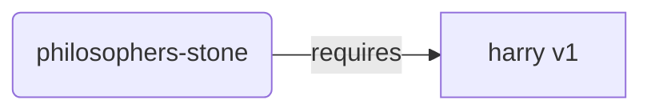
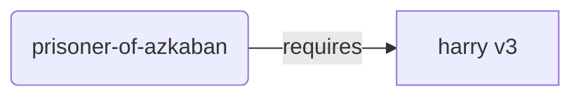
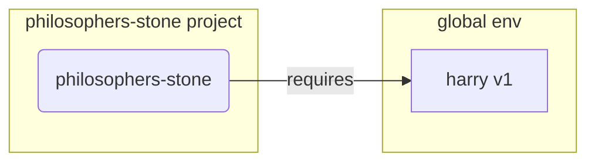
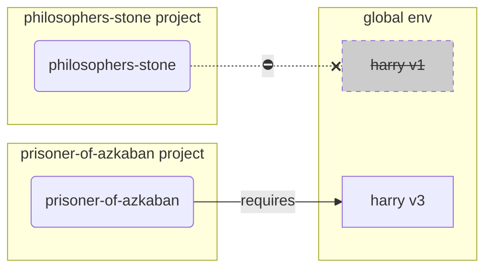
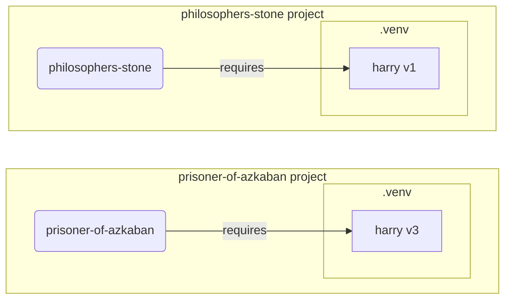

# 虚拟环境

在进行 Python 项目开发时，你通常应该使用 **虚拟环境**（或类似的机制）来隔离为每个项目安装的包。

/// info

如果你已经了解虚拟环境、如何创建和使用它们，你可以跳过这一部分。🤓

///

/// tip

**虚拟环境** 与 **环境变量** 不同。

**环境变量** 是系统中的一个变量，可以被程序使用。

**虚拟环境** 是一个包含一些文件的目录。

///

/// info

本页面将教你如何使用 **虚拟环境** 以及它们的工作原理。

如果你准备好采用一个 **为你管理一切的工具**（包括安装 Python），可以试试 <a href="https://github.com/astral-sh/uv" class="external-link" target="_blank">uv</a>。

///

## 创建项目

首先，为你的项目创建一个目录。

我通常做的是，在我的主目录/user 目录下创建一个名为 `code` 的目录。

然后在这个目录下为每个项目创建一个子目录。

<div class="termy">

```console
// 进入主目录
$ cd
// 创建一个用于存放所有代码项目的目录
$ mkdir code
// 进入这个 code 目录
$ cd code
// 为此项目创建一个目录
$ mkdir awesome-project
// 进入该项目目录
$ cd awesome-project
```

</div>

## 创建虚拟环境

当你开始第一次进行 Python 项目开发时，应该在 **项目内部** 创建一个虚拟环境。

/// tip

你只需要为每个项目做一次这件事，而不是每次工作时都做。

///

//// tab | `venv`

要创建虚拟环境，你可以使用 Python 内置的 `venv` 模块。

<div class="termy">

```console
$ python -m venv .venv
```

</div>

/// details | 该命令的含义

* `python`：使用名为 `python` 的程序
* `-m`：将模块作为脚本执行，我们接下来会告诉它使用哪个模块
* `venv`：使用名为 `venv` 的模块，它通常随 Python 一起安装
* `.venv`：在新目录 `.venv` 中创建虚拟环境

///

////

//// tab | `uv`

如果你已经安装了 <a href="https://github.com/astral-sh/uv" class="external-link" target="_blank">`uv`</a>，你可以用它来创建虚拟环境。

<div class="termy">

```console
$ uv venv
```

</div>

/// tip

默认情况下，`uv` 会在名为 `.venv` 的目录中创建虚拟环境。

不过，你也可以通过传递一个额外的参数来定制目录名称。

///

////

该命令会在一个名为 `.venv` 的目录中创建一个新的虚拟环境。

/// details | `.venv` 或其他名称

你可以在其他目录中创建虚拟环境，但通常约定使用 `.venv` 作为目录名称。

///

## 激活虚拟环境

激活新的虚拟环境，以便你运行的任何 Python 命令或安装的包都使用它。

/// tip

每次开始一个 **新的终端会话** 来处理项目时，都需要执行此操作。

///

//// tab | Linux, macOS

<div class="termy">

```console
$ source .venv/bin/activate
```

</div>

////

//// tab | Windows PowerShell

<div class="termy">

```console
$ .venv\Scripts\Activate.ps1
```

</div>

////

//// tab | Windows Bash

如果你使用的是 Windows 的 Bash（例如 <a href="https://gitforwindows.org/" class="external-link" target="_blank">Git Bash</a>）：

<div class="termy">

```console
$ source .venv/Scripts/activate
```

</div>

////

/// tip

每次在该环境中安装 **新包** 时，都要重新 **激活** 环境。

这样可以确保你使用的是虚拟环境中的程序，而不是任何可能已经全局安装的程序，后者可能是不同版本的。

///

## 检查虚拟环境是否已激活

检查虚拟环境是否已激活（即之前的命令是否成功）。

/// tip

这**是可选的**，但它是**检查**一切是否按预期工作，确保你使用的是预定的虚拟环境的好方法。

///

//// tab | Linux, macOS, Windows Bash

<div class="termy">

```console
$ which python

/home/user/code/awesome-project/.venv/bin/python
```

</div>

如果它显示的 `python` 二进制文件在 `.venv/bin/python`，并且位于你的项目目录（此处为 `awesome-project`）内，那么说明它成功了。🎉

////

//// tab | Windows PowerShell

<div class="termy">

```console
$ Get-Command python

C:\Users\user\code\awesome-project\.venv\Scripts\python
```

</div>

如果它显示的 `python` 二进制文件在 `.venv\Scripts\python`，并且位于你的项目目录（此处为 `awesome-project`）内，那么说明它成功了。🎉

////

## 升级 `pip`

/// tip

如果你使用 <a href="https://github.com/astral-sh/uv" class="external-link" target="_blank">`uv`</a>，你将使用它来安装软件包，而不是 `pip`，因此你无需升级 `pip`。😎

///

如果你使用 `pip` 安装包（它是 Python 的默认安装工具），你应该**升级**到最新版本。

许多安装包时遇到的异常错误，仅通过先升级 `pip` 就能解决。

/// tip

通常只需在创建虚拟环境之后 **一次性** 执行此操作。

///

确保虚拟环境已激活（使用上面的命令），然后运行：

<div class="termy">

```console
$ python -m pip install --upgrade pip

---> 100%
```

</div>

## 添加 `.gitignore`

如果你使用 **Git**（应该使用），则应添加一个 `.gitignore` 文件，以将 `.venv` 中的所有内容排除在 Git 之外。

/// tip

如果你使用 <a href="https://github.com/astral-sh/uv" class="external-link" target="_blank">`uv`</a> 创建虚拟环境，它已经为你完成了这个步骤，可以跳过此步骤。😎

///

/// tip

只需在创建虚拟环境之后 **一次性** 执行此操作。

///

<div class="termy">

```console
$ echo "*" > .venv/.gitignore
```

</div>

/// details | 该命令的含义

* `echo "*"`：将在终端打印文本 `*`（接下来的部分稍作调整）
* `>`：命令左侧的输出将不会打印到终端，而是写入右侧指定的文件
* `.gitignore`：文件的名称，用来存储输出内容

在 Git 中，`*` 表示“所有内容”。因此，它会忽略 `.venv` 目录中的所有内容。

该命令将创建一个 `.gitignore` 文件，内容为：

```gitignore
*
```

///

## 安装包

激活虚拟环境后，你可以在其中安装包。

/// tip

安装或升级项目所需的包时，**只需执行一次**。

如果你需要升级版本或添加新包，**再次执行**此操作。

///

### 直接安装包

如果你很急，并且不想使用文件来声明项目所需的包，可以直接安装它们。

/// tip

将程序所需的包及版本放入文件（例如 `requirements.txt` 或 `pyproject.toml`）是一个（非常）好的做法。

///

//// tab | `pip`

<div class="termy">

```console
$ pip install sqlmodel

---> 100%
```

</div>

////

//// tab | `uv`

如果你使用 <a href="https://github.com/astral-sh/uv" class="external-link" target="_blank">`uv`</a>：

<div class="termy">

```console
$ uv pip install sqlmodel
---> 100%
```

</div>

////

### 从 `requirements.txt` 安装

如果你有一个 `requirements.txt` 文件，现在可以使用它来安装文件中的包。

//// tab | `pip`

<div class="termy">

```console
$ pip install -r requirements.txt
---> 100%
```

</div>

////

//// tab | `uv`

如果你使用 <a href="https://github.com/astral-sh/uv" class="external-link" target="_blank">`uv`</a>：

<div class="termy">

```console
$ uv pip install -r requirements.txt
---> 100%
```

</div>

////

/// details | `requirements.txt`

一个包含一些包的 `requirements.txt` 文件可能如下所示：

```requirements.txt
sqlmodel==0.13.0
rich==13.7.1
```

///

## 运行你的程序

激活虚拟环境后，你可以运行你的程序，它将使用虚拟环境中的 Python 和你在那里安装的包。

<div class="termy">

```console
$ python main.py

Hello World
```

</div>

## 配置你的编辑器

你可能会使用一个编辑器，确保你配置它使用你创建的虚拟环境（它可能会自动检测到），这样你就可以获得自动补全和内联错误。

例如：

* <a href="https://code.visualstudio.com/docs/python/environments#_select-and-activate-an-environment" class="external-link" target="_blank">VS Code</a>
* <a href="https://www.jetbrains.com/help/pycharm/creating-virtual-environment.html" class="external-link" target="_blank">PyCharm</a>

/// tip

通常你只需要在创建虚拟环境时 **执行一次** 这个操作。

///

## 停用虚拟环境

完成项目工作后，你可以 **停用** 虚拟环境。

<div class="termy">

```console
$ deactivate
```

</div>

这样，当你运行 `python` 时，它就不会再尝试从该虚拟环境中运行 Python，也不会使用其中安装的包。

## 准备工作

现在你准备好开始你的项目了。

/// tip

想了解上面所有内容吗？

继续阅读。👇🤓

///

## 为什么使用虚拟环境

要使用 SQLModel，你需要安装 <a href="https://www.python.org/" class="external-link" target="_blank">Python</a>。

安装完成后，你还需要 **安装** SQLModel 和你想使用的其他 **包**。

安装包时，你通常会使用 Python 自带的 `pip` 命令（或者类似的替代工具）。

然而，如果你直接使用 `pip`，包将会安装到你的 **全局 Python 环境**（全局安装的 Python）中。

### 问题

那么，在全局 Python 环境中安装包有什么问题呢？

到某个时候，你可能会写许多不同的程序，这些程序依赖于 **不同的包**。并且这些项目中，某些依赖于 **相同包的不同版本**。 😱

例如，你可能创建一个名为 `philosophers-stone` 的项目，这个程序依赖于另一个包 **`harry`，版本 `1`**。所以，你需要安装 `harry`。



然后，在某个时间点，你又创建了一个名为 `prisoner-of-azkaban` 的项目，这个项目也依赖于 `harry`，但它需要 **`harry` 版本 `3`**。



但现在的问题是，如果你将包安装在全局（全局环境）中，而不是在本地的 **虚拟环境** 中，你就必须选择安装哪个版本的 `harry`。

如果你想运行 `philosophers-stone`，你需要首先安装 `harry` 版本 `1`，例如通过以下命令：

<div class="termy">

```console
$ pip install "harry==1"
```

</div>

然后你会在全局 Python 环境中安装 `harry` 版本 `1`。



但是如果你想运行 `prisoner-of-azkaban`，你就需要先卸载 `harry` 版本 `1`，然后安装 `harry` 版本 `3`（或者直接安装版本 `3`，它会自动卸载版本 `1`）。

<div class="termy">

```console
$ pip install "harry==3"
```

</div>

然后你会在全局 Python 环境中安装 `harry` 版本 `3`。

如果你再次尝试运行 `philosophers-stone`，它可能会 **无法运行**，因为它需要的是 `harry` 版本 `1`。



/// tip

在 Python 包中，尽量避免在 **新版本** 中引入 **破坏性更改** 是很常见的，但为了安全起见，最好在可以运行测试并检查一切是否正常工作的情况下，有意识地安装较新的版本。

///

现在，想象一下，所有 **项目所依赖的** 其他 **包**。那将变得非常难以管理。你可能会最终在某些项目中运行一些 **不兼容版本** 的包，而你也不知道为什么某些功能无法正常工作。

另外，取决于你的操作系统（例如 Linux、Windows、macOS），它可能已经预装了 Python。如果是这样，系统可能已经预装了一些具有特定版本的包，这些包 **是你的系统所需要的**。如果你将包安装到全局 Python 环境中，可能会 **破坏** 操作系统中预装的某些程序。

## 包安装的位置

当你安装 Python 时，它会在你的计算机上创建一些目录和文件。

其中一些目录专门用于存放你安装的所有包。

当你运行以下命令时：

<div class="termy">

```console
// 现在不要运行这个，只是一个示例 🤓
$ pip install sqlmodel
---> 100%
```

</div>

这个命令会下载一个压缩包，其中包含 SQLModel 的代码，通常会从 <a href="https://pypi.org/project/sqlmodel/" class="external-link" target="_blank">PyPI</a> 下载。

它还会 **下载** SQLModel 所依赖的其他包的文件。

然后，它会 **解压** 这些文件并将其放到计算机上的某个目录中。

默认情况下，它会将这些下载并解压的文件放到你的 Python 安装目录中的某个位置，也就是 **全局环境** 中。

## 什么是虚拟环境

解决将所有包安装在全局环境中的问题的方法是，为你工作的每个项目使用 **虚拟环境**。

虚拟环境是一个 **目录**，与全局环境非常相似，你可以在其中为一个项目安装包。

这样，每个项目都会有自己的虚拟环境（`.venv` 目录）和自己的包。



## 激活虚拟环境意味着什么

当你激活一个虚拟环境时，例如使用以下命令：

//// tab | Linux, macOS

<div class="termy">

```console
$ source .venv/bin/activate
```

</div>

////

//// tab | Windows PowerShell

<div class="termy">

```console
$ .venv\Scripts\Activate.ps1
```

</div>

////

//// tab | Windows Bash

或者如果你使用的是 Windows 上的 Bash（例如 <a href="https://gitforwindows.org/" class="external-link" target="_blank">Git Bash</a>）：

<div class="termy">

```console
$ source .venv/Scripts/activate
```

</div>

////

该命令会创建或修改一些 [环境变量](environment-variables.md){.internal-link target=_blank}，这些变量将在接下来的命令中可用。

其中一个变量就是 `PATH` 变量。

/// tip

你可以在 [环境变量](environment-variables.md#path-environment-variable){.internal-link target=_blank} 部分了解更多关于 `PATH` 环境变量的内容。

///

激活虚拟环境会将其路径 `.venv/bin`（在 Linux 和 macOS 上）或 `.venv\Scripts`（在 Windows 上）添加到 `PATH` 环境变量中。

假设在激活环境之前，`PATH` 变量如下所示：

//// tab | Linux, macOS

```plaintext
/usr/bin:/bin:/usr/sbin:/sbin
```

这意味着系统会在以下目录中查找程序：

* `/usr/bin`
* `/bin`
* `/usr/sbin`
* `/sbin`

////

//// tab | Windows

```plaintext
C:\Windows\System32
```

这意味着系统会在以下目录中查找程序：

* `C:\Windows\System32`

////

激活虚拟环境后，`PATH` 变量会变成如下所示：

//// tab | Linux, macOS

```plaintext
/home/user/code/awesome-project/.venv/bin:/usr/bin:/bin:/usr/sbin:/sbin
```

这意味着系统现在会首先在以下目录中查找程序：

```plaintext
/home/user/code/awesome-project/.venv/bin
```

然后再去其他目录查找。

因此，当你在终端中输入 `python` 时，系统会首先在以下路径找到 Python 程序：

```plaintext
/home/user/code/awesome-project/.venv/bin/python
```

并使用该程序。

////

//// tab | Windows

```plaintext
C:\Users\user\code\awesome-project\.venv\Scripts;C:\Windows\System32
```

这意味着系统现在会首先在以下目录中查找程序：

```plaintext
C:\Users\user\code\awesome-project\.venv\Scripts
```

然后再去其他目录查找。

因此，当你在终端中输入 `python` 时，系统会首先在以下路径找到 Python 程序：

```plaintext
C:\Users\user\code\awesome-project\.venv\Scripts\python
```

并使用该程序。

一个重要的细节是，它会将虚拟环境路径放在 `PATH` 变量的 **前面**。系统会 **先** 找到它，而不是其他 Python 程序。因此，当你运行 `python` 时，系统会使用 **虚拟环境中的 Python**，而不是全局环境中的任何其他 `python`。

激活虚拟环境还会改变其他一些设置，但这是它最重要的功能之一。

////

## 检查虚拟环境

当你检查虚拟环境是否激活时，例如使用以下命令：

//// tab | Linux, macOS, Windows Bash

<div class="termy">

```console
$ which python

/home/user/code/awesome-project/.venv/bin/python
```

</div>

////

//// tab | Windows PowerShell

<div class="termy">

```console
$ Get-Command python

C:\Users\user\code\awesome-project\.venv\Scripts\python
```

</div>

////

这意味着将使用的 `python` 程序来自 **虚拟环境**。

在 Linux 和 macOS 上你使用 `which`，在 Windows PowerShell 中使用 `Get-Command`。

该命令的工作方式是，它会检查 `PATH` 环境变量，按顺序遍历 **每一个路径**，寻找名为 `python` 的程序。一旦找到，它会 **显示该程序的路径**。

最重要的是，当你调用 `python` 时，系统会执行的就是这个 "`python`" 程序。

因此，你可以确认自己是否处于正确的虚拟环境中。

/// tip

激活一个虚拟环境，使用其中的 Python，然后 **切换到另一个项目**。

如果没有退出第一个项目的虚拟环境，第二个项目 **可能无法正常工作**，因为你仍在使用第一个项目的虚拟环境中的 Python。

能够检查正在使用的 `python` 是非常有用的。🤓

///

## 为什么要退出虚拟环境

例如，你可能在一个项目 `philosophers-stone` 上工作，**激活该虚拟环境**，安装包并在该环境中工作。

然后你想要切换到 **另一个项目** `prisoner-of-azkaban`。

你进入那个项目目录：

<div class="termy">

```console
$ cd ~/code/prisoner-of-azkaban
```

</div>

如果你不退出 `philosophers-stone` 的虚拟环境，当你在终端运行 `python` 时，它会尝试使用 `philosophers-stone` 中的 Python。

<div class="termy">

```console
$ cd ~/code/prisoner-of-azkaban

$ python main.py

// 导入 sirius 时出错，因为它没有安装 😱
Traceback (most recent call last):
    File "main.py", line 1, in <module>
        import sirius
```

</div>

但是如果你退出虚拟环境并激活 `prisoner-of-azkaban` 的新环境，那么当你运行 `python` 时，它会使用 `prisoner-of-azkaban` 中虚拟环境的 Python。

<div class="termy">

```console
$ cd ~/code/prisoner-of-azkaban

// 你不需要在原项目目录中才能退出环境，实际上即使你已经切换到另一个项目也可以退出 😎
$ deactivate

// 激活 prisoner-of-azkaban/.venv 中的虚拟环境 🚀
$ source .venv/bin/activate

// 现在，当你运行 python 时，它会找到安装在此虚拟环境中的 sirius 包 ✨
$ python main.py

I solemnly swear 🐺
```

</div>

## 替代方案

这只是一个简单的指南，帮助你入门并了解 **底层** 的工作原理。

有许多 **替代方法** 可以用来管理虚拟环境、包依赖（requirements）和项目。

一旦你准备好并希望使用一个工具来 **管理整个项目**，包括包依赖、虚拟环境等，我建议你尝试 <a href="https://github.com/astral-sh/uv" class="external-link" target="_blank">uv</a>。

`uv` 可以做很多事情，包括：

* **为你安装 Python**，包括不同版本的 Python
* 管理你项目的 **虚拟环境**
* 安装 **包**
* 管理项目的 **包依赖和版本**
* 确保你拥有 **精确** 的包和版本集，连同它们的依赖项，这样你就能确保在开发时与生产环境中运行的项目完全相同，这被称为 **锁定**（locking）
* 还有许多其他功能

## 总结

如果你阅读并理解了所有这些内容，那么现在 **你比很多开发者了解得更多** 关于虚拟环境的知识。🤓

了解这些细节，可能在你未来调试一些看似复杂的问题时会非常有用，因为你会知道 **它是如何工作的**。😎
